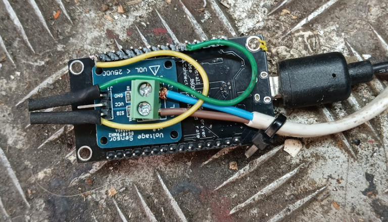
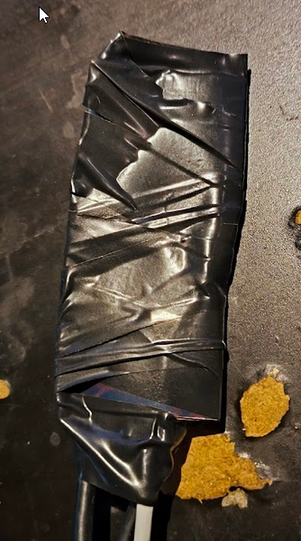
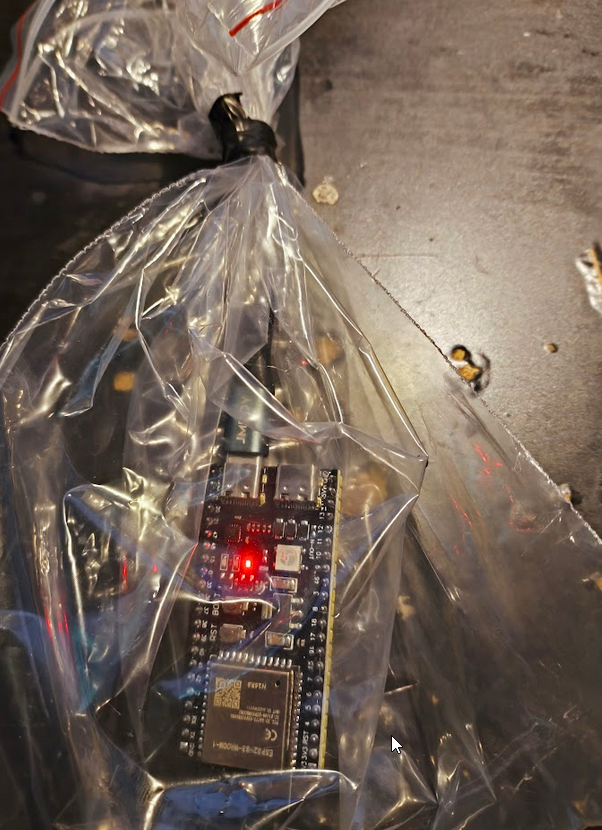
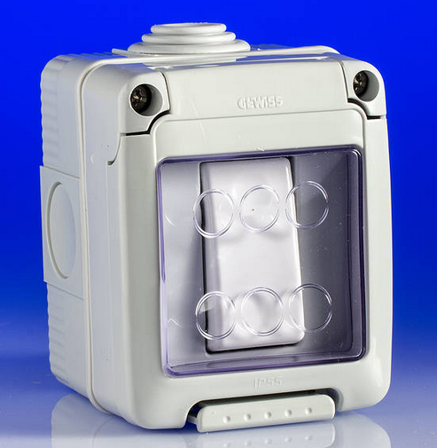
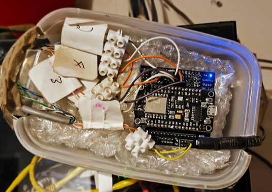
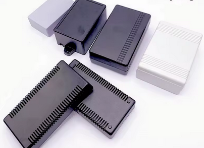
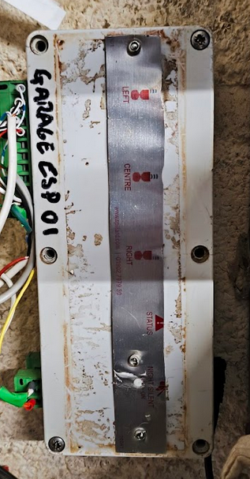

What to use once you've worked out your project and want to actually use it?

Here's some containers that I've used for various projects. This isn't so much a demonstration of how you *should* do, more a hall of shame of how *I've* done it...

## Naked ESP dangling from its USB supply

## Electrical tape wound around the ESP and connecting wires  

## A plastic bag taped closed 

## An Electrical Socket 

## An outside light switch

## A takeaway food container 

*This was actually my first "proper" ESP project! The 12v incoming supply to the breakaway board feeds power to the 12v PIRs. The cat5 brings wires connected to the zones of my old and broken home burglar alarm. Running Konnected, the esp8266 has been feeding house movement and door/window sensor information to Home Assistant for over half a decade like this!*

## Various "Project Boxes"

## The rugged aluminium speaker and electronics boxes from a heavy plant reversing system

 

*They did have a bunch of lights and buttons on the front, which is why I've rivetted some ally across the holes here.*

