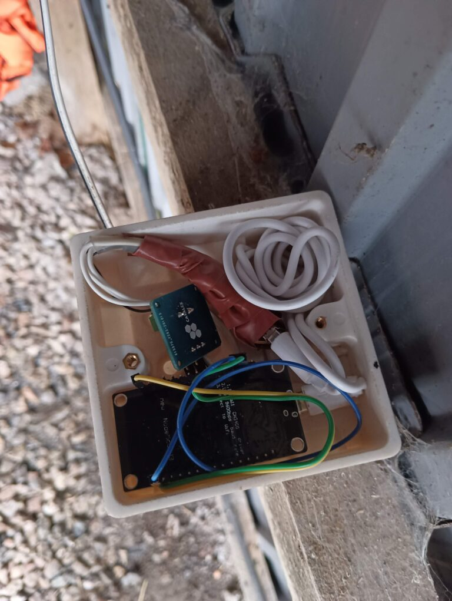
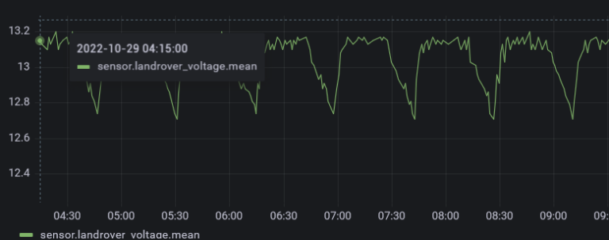

*A fun little project that has a useful function for me – wirelessly connecting a vehicle battery to Home Assistant.*

**Justification**: I wanted to be able to check my vehicle's battery was good, and automatically alert me if it wasn't.

I own a classic Land Rover that doesn't get driven enough, and I wanted to keep an eye on the battery voltage so that I knew when to put it on charge, using HA to alert me when it dropped below a certain point. That worked well for a while, but then I had much worse problems with my Motorbike which, despite two new batteries, went low enough to fail to start after only 10 days. I spent a long time trying to sort out the parasitic drain, but the general advice was “They all do that”. So I got a Optimate battery tender that trickle-charges it. The only problem was remembering to plug the thing in! So I moved my widget across to the bike shed and connected it directly to the 12v feed on the tender. Now, if I forget to plug it back in and the voltage drops below 12.6v, I get a SMS telling me I've been forgetful.

## The Hardware:

* A nodemcu ESP8266 board circuit board (Other boards will work too)
* A power shield to step the incoming ~12v voltage down to a level that the ESP8266 can accept
* A car cigarette-lighter USB adapter (To stop the 12v down to ~5v and power the ESP8266) 
* A box to keep it in (I used a standard UK wall-mount socket with blanking plate, but any box works as long as it provides some protection against knocks and the weather if it's exposed to them. I've even used Chinese Takeaway containers)



* Here's what it looks like:
    * Wrapped in red tape – the 12->5v adapter
    * Top left: The power shield to reduce 12v
    * Bottom: The ESP8266, face down.

*Notes: If you're running the ESP from a separate power supply, perhaps by measuring the voltage coming out of a trickle-charger instead of directly to the battery, you obviously won't need any 12 -> 5v adapter*        

## The Ecosystem:

* [Home Assistant](https://www.home-assistant.io/) Free open source Home Automation Platform, running in Docker on my home server
* [EspHome](https://esphome.io/) Excellent plugin for Home Assistant that programs the 8266 board
* [Grafana](https://grafana.com/) (Optional) Makes for prettier and more flexible graphs than Home Assistant does. Connecting them requires InfluxDb. [Example setup guide](https://thesmarthomejourney.com/2021/05/02/grafana-influxdb-home-assistant/)

## ESPHome code:

Esphome makes programming chips really as easy as it could be. I've always been interested in doing this, but had struggled with the thought of soldering and electronics generally. No need for any of that with this project.

I installed esphome on a little low power PC that runs Debian and connected the ESP8266 via a usb lead. I then followed their instructions for creating a new project, and wrote the following code:

```
esphome:
  name: voltage
  platform: ESP8266
  board: nodemcu

# Enable logging
logger:

# Enable Home Assistant API
api:
  password: ""

ota:
  password: ""

wifi:
  ssid: "WifiSSID"
  password: "WifiPass"

  # Enable fallback hotspot (captive portal) in case wifi connection fails
  ap:
    ssid: "Esphome Voltage Fallback Hotspot"
    password: "WifiPass"

captive_portal:

#deep_sleep:
#  run_duration: 20s
#  sleep_duration: 10min

sensor:
  - platform: adc
    pin: A0
    name: "Bike Voltage"
    update_interval: 60s
    filters:
      - multiply: 24.8
```      

## Notes about the code:

* I first used this code on my Landrover, which took power from the main battery. The deep_sleep section puts the chip into a very low power state which saved a lot of drain. As my bike is connected to the output wires from a trickle charger, I commented out this section as I no longer need it.
* The *multiply*: value of 24.8 took quite a lot of trial and error to be accurate. I used a reliable multimeter on the same voltage source on my bench and then experimented with this until it matched. The power shield steps the voltage down to below the 3.3v that the chip can accept. If you connect 12v directly to the chip, it's going to blow, so reducing it, reading it and then multiplying that value is the only way for this to work. Sounds quite hacky but it's surprising how often solutions like this exist to get around such problems.

This is then compiled by esphome and and uploaded to the chip via the usb lead and starts running.

Any future updates to this code can be done without connecting it – esphome will connect to the device over the wifi connection and, by magic, update the code remotely!

ESPHome also runs as an integration in Home Assistant, and once installed, will automatically register new devices to itself.


That entity this integration creates is then available within HA to do anything we want with. We can stick it on HA's own dashboard like so

 

And, by exporting it to Grafana, show prettier graphs of any range we like. In this one, we see the battery tender going through a cycle of topping up the battery, then sleeping for a bit, then repeating.



I also have an Automation in Home Assistant that alerts me when the voltage drops below 12.2v, or stops updating for 24h as that means my bike is going to struggle to start and I'd rather find that out before I put on all my leathers and get ready to go out! The reason is usually because I've forgotten to plug it back into the charger!

I hope you enjoyed this article and found it useful.

