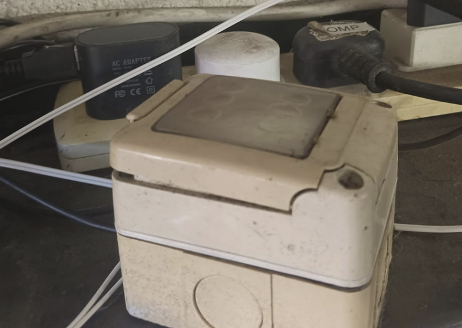
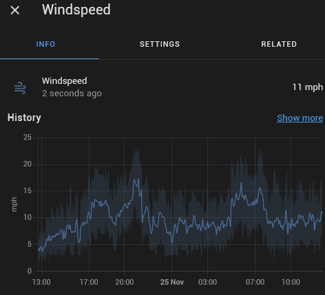

One very windy Autumn night, I wondered just how hard was the wind blowing? Spotting a cheap anenometer on Ebay, I figured it was worth trying to add this to my HA setup. It turned out to be surprisingly easy and in just an afternoon, things were up and working beautifully.


## The Physical Bits

* One Anenemeter, a HADEX WH1080.
    * Although pretty much any pulse-based meter will work.
    * It has two wires and putting a multimeter across them, I saw that one full revolution opens and closes these wires three times. Considering how fast these things can spin, that’s going to take a lot of counting!
    * I extended the wiring by soldering and heat-shrinking a 5 meter length of bell wire onto it, then tested again.
    * I mounted it on a shelf bracket with a suitable sized bolt that neatly screws into the mount, as i don’t have the full weather-station kit this unit comes with. This sits near my garage, although it’s not a great position since it’s quite sheltered. However, this is just a fun little project and I’m not too worried about its accuracy, and I won’t be sharing speeds with anyone else.
* One ESP8266 or ESP32 or similar chip.
    *I’ve used a Nodemcu chip without any additional backboarding or hats. I put it in an old light-switch box just for some protection from knocks.*



## Connecting the bits

The ESP8266 connects to HA by wifi, so it only needs a USB power supply and whatever connections we’re poking into it.

The Anenometer has two wires, and they open and close three times per revolution. It shouldn’t matter which way around they are connecting as we only care that they open and close.

I connected these to pins GND and GPIO14 next to it (which is Pin D4 on the board) – see this useful reference for the NodemCPU to figure out which pins go where.

That’s it! One micro usb connector supplying 5v and two wires.

## The ESPHome code

(I won’t cover the ‘Getting started’ bit of ESPhome – they have their own excellent documentation [here](https://esphome.io/))

Before I placed the ESP8266 in position, I connected it to a small Linux PC via USB and did this;

```
mkdir -p /opt/esphome/anenometer
cd /opt/esphome/anenomter
esphome wizard configuration anenometer.yaml
```

This creates a directory for the files and changes into it, then sets up the initial yaml file for the project. Once you’ve answered some basic questions, you’re can then edit the anenometer.yaml file with the editor of your choice. (I use vi, but you do whatever you like)

This is what my anenometer.yaml file looks like once I’ve added in some bits

```
esphome:
  name: anenometer
  platform: ESP8266
  board: nodemcu

# Enable logging
logger:

# Enable Home Assistant API
api:
  password: ""

ota:
  password: ""

wifi:
  ssid: "HOMESSID"
  password: "PASSWORD"

  # Enable fallback hotspot (captive portal) in case wifi connection fails
  ap:
    ssid: "Anenometer Fallback Hotspot"
    password: "PASSWORD"

captive_portal:

sensor:
  - platform: pulse_meter
    pin:
      number: GPIO14
      mode: INPUT_PULLUP
    name: 'Windspeed Meter'
    icon: 'mdi:weather-windy'
    id: wind_meter
    unit_of_measurement: 'mph'
    accuracy_decimals: 0
    timeout: 5s
    filters:
      - multiply: 0.0015    
      - sliding_window_moving_average:
          window_size: 100
          send_every: 100
```          

Now, to explain some of the sensor bits here that might not be self-evident:

* **Name**: What Home Assistant will call this entity.
* **filters**:
    * **multiply**: This is where the trial and error comes in. At this stage, I’m guessing as I have no other point of reference, but this seems roughly to match the Beaufort Scale over the past few days. Do experiment with this value yourself. (The fact this is less than 1 means the multiplication is actually a division)
    * **sliding_window_moving_average**: This allows us to count a bunch of pulses and then send a value every N number. Without this we would be trying to send every pulse, and as each rotate is three pulses, that might not be so good.
    * **window_size**: How many pulses to read before establishing an average number over that time. This could be much larger to eliminate gusts, but it would be much slower to update in non-windy conditions.
    * **send_every**: How many pulses are received before sending an update to HA.

Again, Esphome has better and accurate documentation on each of these items [here](https://esphome.io/components/sensor/index.html)

That’s about it! The config was first uploaded to the ESP8266 using esphome run anenometer.yaml and then choosing the right-looking USB port.

Once it’s up though, you can change this file and update the ESP8266 over the air by re-running the same command and choosing “Over the air” instead of selecting a USB port. Magic!

## One last thing!

You’ll need to know what IP address your new ESP8266 was given. I find this out by checking my router’s DHCP list, but you can also use arpwatch to look for new devices.

## Home Assistant

To add the new ESP8266 device to HA, we need to

* Go into Settings -> Devices & Services in Home Assistant
* Click Add Integration
* Select ESPHome
* Enter the IP Address of your new ESP8266 (See ‘One Last Thing!’ above) and leave the default port of 6053 as it is. Click Submit.
* Your new device should appear in the ESPhome panel on the Integrations page, and selecting it will show it has one entity – which should be called Windspeed and have the entity id of sensor.windspeed_meter
* Clicking on that entry, and into the Info tab should show some data, and after a little while, look something like this



And that’s it! You can add it to any dashboards you like.
