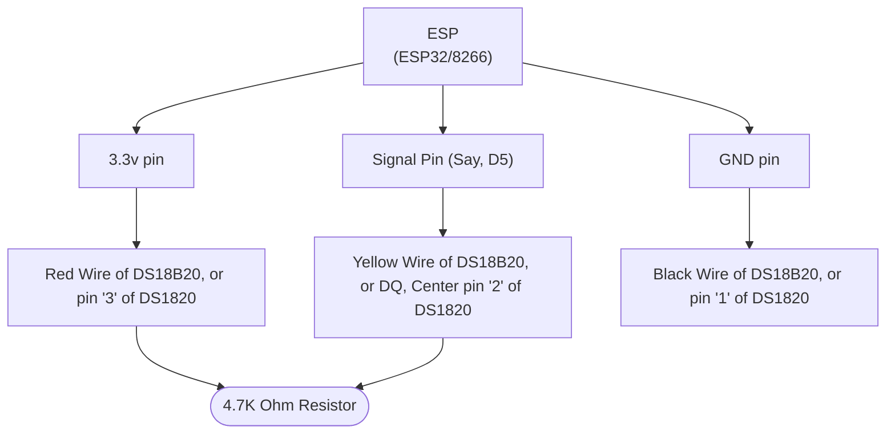
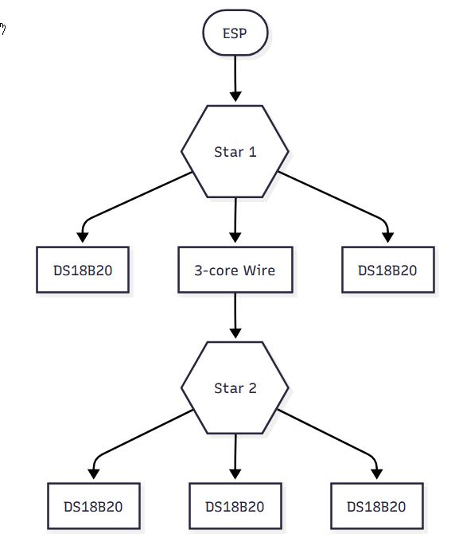

Onewire / 1wire / one wire / Dallas / Maxim is a very cheap way to deploy single or multiple temperature sensors, plus some other devices such as mini wireless buttons.

I’ve been using them at my house for around twelve years with lots of success, first connecting them to Domoticz and later, Home Assistant. There's several ways to use them and I'll explain a couple. 

# One wire with Home Assistant (ESPHome and ESP32/ESP8266 controllers, or USB)

This is my absolute favourite way of using these sensors nowadays. I find working with ESPHome a pleasure and the wiring is very simple and forgiving. There are various forms of connectors

*This guide assumes you have set up ESPHome already and have a microcontroller ready to be written*

## Step 1 - The physical wiring.

There are two main type of 1-wire temp sensors:

 * The DS1820 or DS18S20 bare sensor   
 * The DS18B20 or Waterproof   

Most people will buy the DS18B20 which is easier to assemble and still very cheap. 

#### Connections:

* Red wire of DS18B20, Pin 3 (VDD) of DS1820 should be connected to between 3 and 5v.  Both these voltages are typically available on an ESP, but 3.3 is the more commonly used. 
* Black wire of DS18B20, Pin 1 (GND) of DS1820 1 should be connected to GND on the ESP. 
* Yellow wire of DS18B20, Pin 2 (DQ) of DS1820, should be connected to the GPIO port you choose on your ESP. 

#### The Resistor

* A resistor should be placed between the Red and Yellow (Pins 1 and 3 on the DS1820) to "Pull up" the bus. This should be 4.7k ohms. However, I have tested with various resistors down to 1kohm, and even omitted it entirely and had satisfactory results. But it does seem to work best with 4.7kohms used. 
* The resistor should be connected as close to the ESP as possible, so it affects the whole bus.


Wiring Flowchart



#### Connecting multiple sensors to one bus

* References to a "Bus" in other documentation simply means the wire network this system runs on, especially when there are multiple sensors connected. 

This is simply done by creating either a single "star" where multiple sensors are fed from the same connections, or from multiple stars where connections are made from a common backbone wire. In all cases, it is simply a case of connecting all the same wires or pins together. Every red to a red, every black to a black, every yellow to a yellow - until the first connection which goes to the relevant pins on the ESP. 




###### Notes:

* Either sensor can run at between 3 and 5v dc and the red/pin3 can be connected to either. It does not affect accuracy which is used.
* Sensors have a unique ID which is reported along with their readings along the common "bus" back to the ESP or controller. This ID is how we identify which device is supplying which reading.
* It is possible to run large lengths of one-wire with many devices. I personally have run a bus of around 80 feet with 12 sensors connected to it. 
* One wire can be remarkably resilient on the type of wire it uses. There are recorded cases if people using house pipework. 
* It's reported that longer installations work best with an external 5v power supply, but I have had no problem using an ESP's 3.3v output. The current needed is tiny.
* Although it's called one wire, a good installation requires three cores. 
* That said, it is possible to create a network by connecting only two cores. This is done by connecting the red and yellow wires of the DS18B20 (The outer two, GND and VDD of a DS1820). This can work very reliably and avoids the needs of a resistor, but should only be considered if three core wire is unavailable.


## Step 2 - Ok, so the wiring’s done, what about taking readings?

There are multiple ways to get the readings into Home Assistant.

### ESPHome

Assuming you already have an ESP set up and ready to use. 

Connect the wiring as above to the ESP (Most GPIO pins can be used for the Signal/DQ/Yellow pin - we'll use GPIO5 for our example below (Pin D1 on a Nodemcu)

Add this to the ESPHome yaml;

```
# GPIO
one_wire:
  - platform: gpio
    pin: GPIO5
```
    
And run `esphome run MyESPFile.yaml` and wait until it boots and starts producing logs. 

Inside the logs, assuming the physical connection is good, ESPHome will discover all devices on the one-wire bus, like so:

```
[20:59:28][C][gpio.one_wire:022]: GPIO 1-wire bus:
[20:59:28][C][gpio.one_wire:023]:   Pin: GPIO14
[20:59:28][C][gpio.one_wire:084]:   Found devices:
[20:59:28][C][gpio.one_wire:086]:     0x9c01145eeabd4028 (DS18B20)
[20:59:28][C][gpio.one_wire:086]:     0xee012026de4a2428 (DS18B20)
[20:59:28][C][gpio.one_wire:086]:     0x0401202706051528 (DS18B20)
[20:59:28][C][captive_portal:089]: Captive Portal:

```

These provide the unique ID of each temperature sensor and the model needed. 
 
Now you have the information you need to re-edit the yaml and create the sensors properly, like so:

```
sensor:
  # Dallas
  # Repeat for each sensor on this bus
  - platform: dallas_temp
    address: 0x9c01145eeabd4028
    name: "Boiler Flow"    
    update_interval: 30s
  - platform: dallas_temp
    address: 0xee012026de4a2428
    name: "Hot Water Tank"    
    update_interval: 30s
```

#### Tips

1. The DB18B20 sensor may have the ID printed on its label and you can create the sensor config on your first go. 

2. If your Dallas bus has several sensors and you're unsure which sensor relates to which purpose, continue streaming logs after building it, and simply hold one in your hand (or mouth, or cup of ice) for a little while until its readings change. Then add a sticky label to its lead.


### Connecting the Onewire bus to a PC *(Not for ESPHome)*

You will need an adapter to connect your one-wire bus to your PC, such as  the [DS9490R](https://datasheets.maximintegrated.com/en/ds/DS9490-DS9490R.pdf)

 

This can be connected to Home Assistant directly using it's native [1-wire integration](https://www.home-assistant.io/integrations/onewire/) or, as I did (because the former wasn't available when I first set up one-wire), by using Linux's OWFS one-wire file system, and writing a script to read the values from the local file system and put them into a MariaDb database, from which HA would fetch the values. (Not a very elegant way, but it worked well for years!)


 
