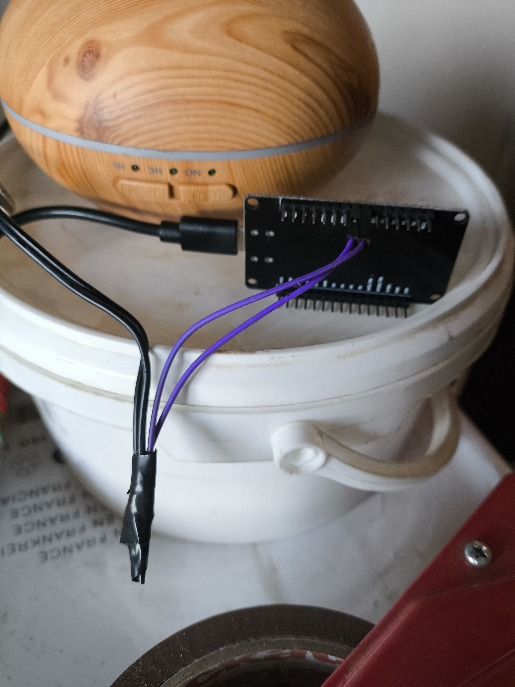
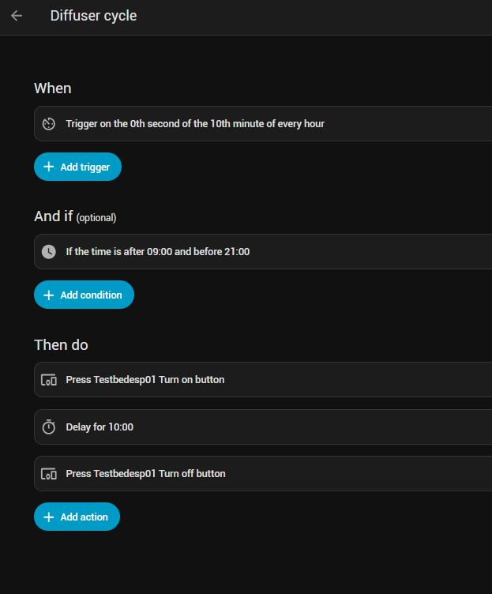

# Making a diffuser a little smarter

### Making nicer smells


I bought this bargain diffuser second-hand from Ebay last year. You fill the container with water and add a few drops of an essential oil and it makes your room smell nice. There's a little ultrasonic emitter inside that turns the liquid into a cool mist that pours forth from the tip. 

It works well enough like this. You press a button and it starts. You press the same button two more times and it stops. There are some pretty lights too. 

But it has two problems:

1. The default timer is for an hour. This is too long for me - after about twenty minutes, my eyes get irritated from the oils. 

2. It really doesn't need to run all the time. 

Clearly, what it needs is an intermittent function. On for a few minutes, then off. 

So I thought I'd see if I could add that functionality. Turns out it wasn't hard at all!


# Getting inside

Just undoing three philips screws and the entire thing opened up easily. Unplugging two wires with handy connectors, and wiggling the button panel out from its holder made it easy to split the halves apart. 


This contains a fairly simple PCB.  Key components are:

- Leftmost is the button panel. There are two momentary buttons controlling operations and three LEDs. The PCB even has nice markings showing what connects where. 

- Bottom is a 2-pin connector that brings in the power from a 32v wall-wart adapter. (I know, right? Weird voltage.)

- Righthand is a 3 pin connector that goes to a small fan mounted under the diffuser in the other half.

- The connected 2-pin with red and black wires at the top goes to the ultrasonic element mounted into the bowl itself. 

There's markings for a bell, which was never connected. Good, I don't like beeping electronics.


The just houses a fan that blows air up from cutouts in the base to the underside of the ultrasonic diffuser, and a socket for the incoming 32v power.

The button panel slides into the assembly on the left and has button caps that slide in too. 

Quite a neat and easy to work area. 

# Figuring it out


To me, the obvious way to remotely control this is to simulate pressing the button. Luckily, the button PCB in this unit is very easily accessible and has some nice big tracks. Fine soldering is not a skill I possess, but even I thought I might be able to do this. 

So I whipped out my soldering iron and connected two small wires to the back of the button which controls on/off. (The other button is mostly for turning on some pretty lights)


As you can see, I wasn't lying when I said soldering is not my skill. But it's firm and it works.

I then poked the new wires out through the back of the case and screwed everything back together. 

# Connecting the ESP

I chose an ESP8266 for this task. I use them a lot for various things around the house, all with [ESPHome](https://esphome.io/) to connect them to [Home Assistant](https://www.home-assistant.io/)

Connecting this was the easiest part - simply plug the new wires into a GPIO pin (I chose D5) and GND. 



# Writing some yaml

With the diffuser reconnected to some power, it was time to write some simple code to simulate button presses between D5 and GND. This causes a short between the two soldered connections, simulating a button press. 

Here's the code;

```yaml
# This pin will be normally open (OFF)
switch:
  - platform: gpio
    name: "Relay Output"
    id: relay_output
    pin: D5
    restore_mode: ALWAYS_ON

button:
  - platform: template
    name: "Turn on"
    on_press:
      - switch.turn_off: relay_output   
      - delay: 125ms
      - switch.turn_on: relay_output    
      - delay: 2000ms

  - platform: template
    name: "Turn off"
    on_press:
      - switch.turn_off: relay_output   
      - delay: 125ms
      - switch.turn_on: relay_output    
      - delay: 2000ms

      - switch.turn_off: relay_output   
      - delay: 125ms
      - switch.turn_on: relay_output    
      - delay: 3000ms

      - switch.turn_off: relay_output   
      - delay: 125ms
      - switch.turn_on: relay_output    
      - delay: 2000ms
```

To break this down. 

The `switch` block just creates the "relay_output" device to ESPhome and HA, and sets it to "ALWAYS ON"  This last step is important as we want a switch that is Normally Open, so that closing  closes the circuit between the soldered connections to simulat a button press.  This sounded a bit backwards to me, as "ON" = "closed", but it's how it works!

The two `button` blocks are essentially scripts that press the button for a given time and then release it. 

The first one, `Turn on` is a single press. 

Close circuit for 125 milliseconds, then release and wait at least 2 seconds before doing anything else with it. 

The second does the same, then again (with a 3s wait) and then again. This is designed to mimic the presses needed to turn the diffuser off. 

These timings took quite a bit of trial and error to get right. Too short a "press" and it wouldn't register. Too long and it interpreted the press as a "long press" which started the diffuser cycling. 

Similarly, it's very sensitive to how long after you press a button before it will acknowledge a second press - hence the 2 and 3 second pauses. 

However! Once these periods were established, it's proved very reliable.


The code was uploaded to the 8266 and off it goes!

# Intergration with Home Assistant

Anyone who has used ESPHome will know this bit is a doddle. Once the code is uploaded to a 8266, or ESP32 or other supported device, Home Assistant will immediately notice it over wifi and ask you whether you want to add it to your ESPHome integrations. Accept that and it appears, along with all the Entities such as our two buttons.


Now, pressing `Turn on` runs the single button press simulation and it's very rewarding to see the diffuser burst into light. 

And of course, `Turn off` runs the three button press simulation we coded, which results in a turned-on diffuser turning itself back off.

# Automation

But manually pressing a button on a computer is not that much better than pressing a physical button, so we create small automation to do achieve a nice smelling home.



Pretty simple, right?

1. A ten minutes past the hour between the hours of 9am and 9pm, Home Assistant runs the single button simulation and turns the diffuser on. 
2. It then waits for ten minutes doing nothing.
3. And finally, HA runs the 3-button simulation and turns it off before it starts to irritate my eyes. 


All I need to do is remember to fill up the water and oils once a week or so. The diffuser has built-in run-dry protection, so if it does run dry, it immediately turns itself off which is a nice protection. 


