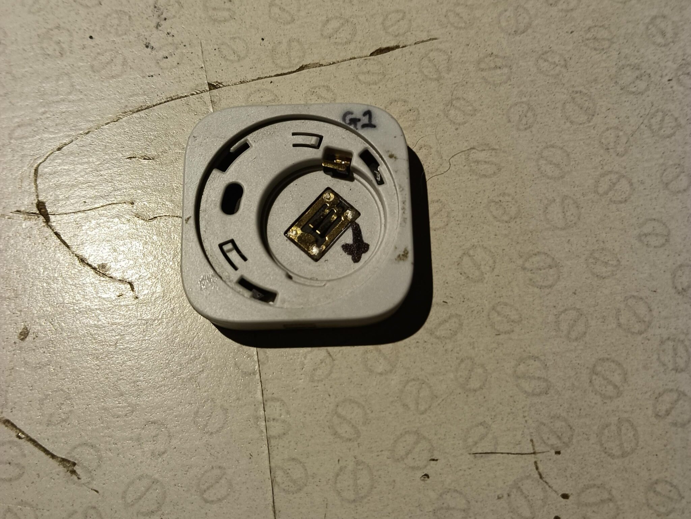
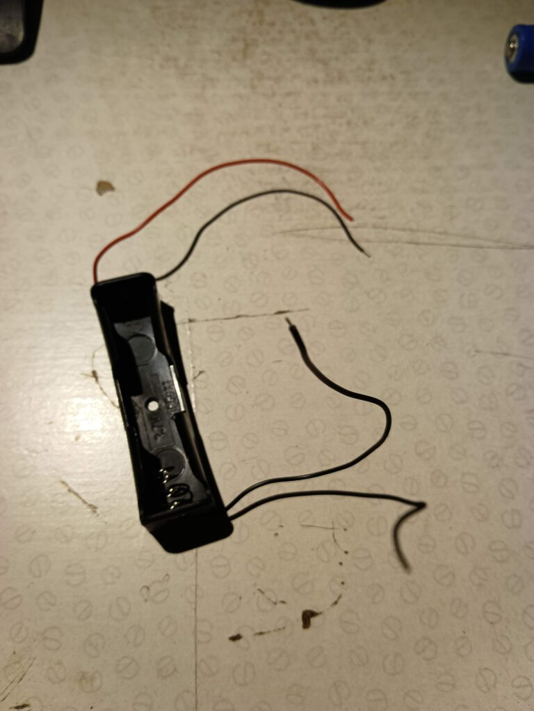
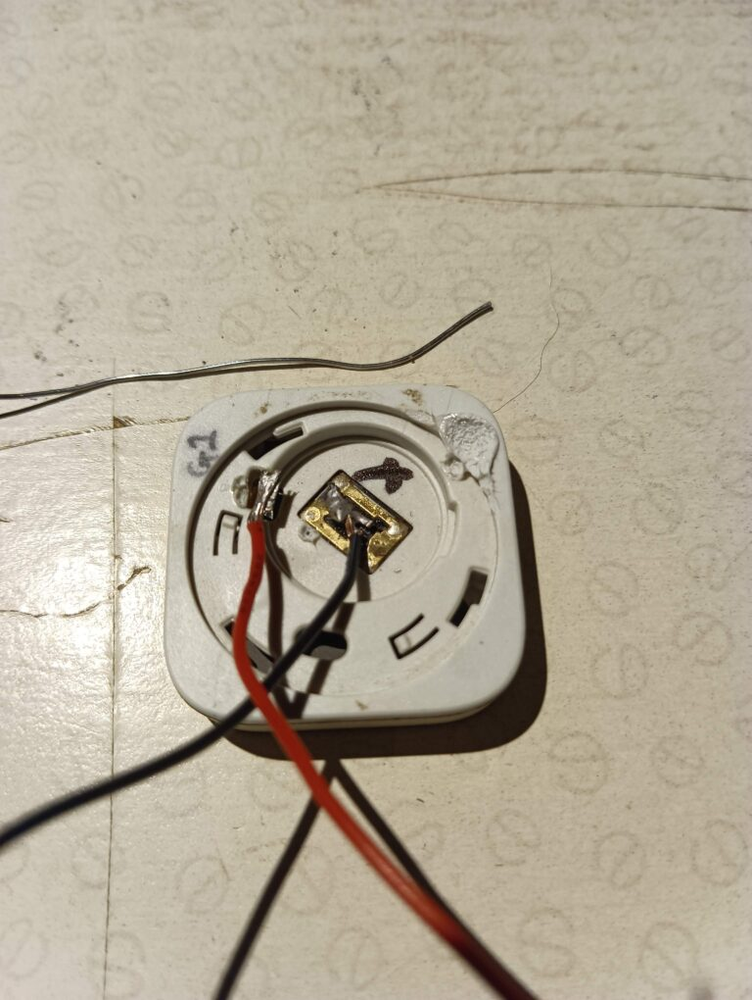
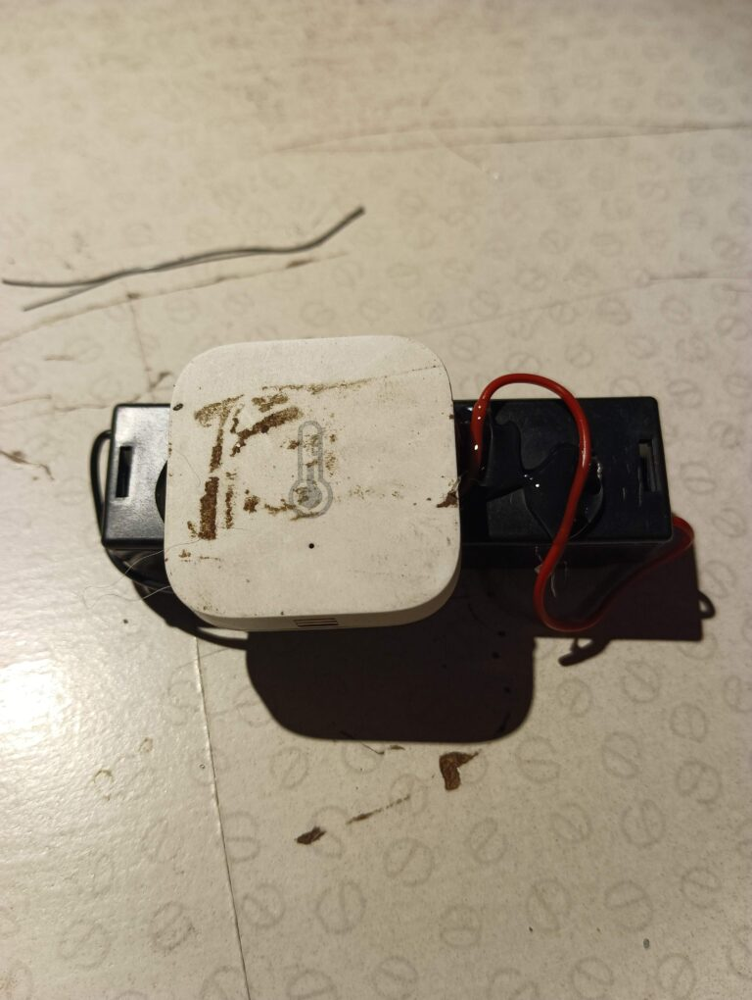
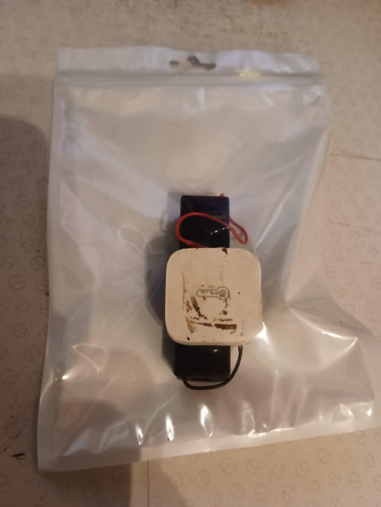

The Aqara (and other) Zigbee devices are great in almost every situation. But when using them in cold conditions, such as inside a freezer, the default CR2032 batteries don't last well, especially in subzero temperatures.  

Fortunately, it's really simple to adapt them to use the much larger and commonly available 18650 Lithium rechargable batteries. I've had several of these batteries reporting the temperature of my freezer in around -20c for over a year without needing recharging – quite remarkable!

To compare that to a CR2032, which would last just a couple of days for unbranded batteries, and even "Cold Formula" Ever-Ready batteries would give up the ghost between one week and two months, and you see why this is a modification that's worth making, if just to avoid wasting lots of CR2032 and avoiding the environmental and safety costs associated.

One solution is simply to solder an 18650 battery holder onto the sensor itself. Both being single-cell lithium batteries, the voltages are identical at a nominal 3.2v but the capacity is dramatically different. The 18650 will often read up to 4.2v when freshly charged, but I've found no issues with connecting that directly to these sensors.

This isn't restricted to Aqara or temperature sensors. Anything that takes a CR2032 or CR2016 or any other 3.2v lithium battery can usually be adapted this way.

### Things needed:

- A Zigbee/Zwave/whatever temperature/humidity/other sensor
- An 186550 single battery holder (Cost around £1-2, eg, ebay, aliexpress). You can solder directly to the battery if you prefer.
- A soldering iron and some solder.
- A hot glue gun (optional) or some tape/zip tie/whatever to hold the two things together. The wires and solder connections aren't really strong enough to take any strain.

### Process (Difficulty: Simple)

Take your sensor and uncover the battery compartment, removing the CR2032 battery.

Note the two metal contacts. The little one at the top on the edge is the **POSITIVE** contact. The larger one in the middle is the **NEGATIVE**.

If you're ever unsure about which way these go, use a multi-meter to test the CR2032 battery. The larger surface on these is positive and often marked with a `+` sign. The smaller, back face is negative.

**Now check the battery holder and if necessary strip around 5mm of plastic back from the ends of the red and black wires;**

Next, solder the black wire from the battery holder onto the middle contact, and the red to the edge contact.

That's all there is to the electric connections, and now is a good change to test it still works

Fit a battery to the holder and quickly press the button on the sensor. This should result in a blue light. If it doesn't, or you small a burning electrical smell, remove the battery quickly and check which way you've connected the wires. *(I've done this myself and surprisingly the sensors seem to survive mis-polarity for a short interval)*

If things look good, you can then try a longer press and hold to ensure it connects to your zigbee network.

If everything is good, then it's time to glue or tape the battery holder and sensor together. I love hot glue, it's messy and hurts when it gets on your skin, but very useful for stuff like this.

Because I'm placing these in a freezer, I like to put them in a small ziplock bag to protect them a little from frost condensation. This may not be strictly necessary – these small devices are remarkably robust – but it doesn't hurt.

Now you've done that, you might want to create an Automation in your Home Assistant or other monitoring program that lets you know when the temperature raises above a certain temperature, say -5c.

Automations like this have notified me when someone's left the freezer door open, or it's been unplugged by accident, and even after several hours of a power cut.

### Notes

* Freezer doors are usually made of steel and of course, this does affect the radio signal of Zigbee. However, in practice, I've found that the signal still gets through in my environment. Zigbee does benefit from a few mains-powered devices dotted through the home which add as mesh repeaters and perhaps that's helped me out.

### Alternatively

 - When I first did this, I placed the battery outside of the freezer to keep it warm, and ran the thin wires through the door seal. That worked okay, but out of curiousity I tried putting the whole thing inside and found that surprisingly, the battery lasted almost as long as being left outside in the warm. You could even use an external 3v power supply.

- You can use other types of temperature sensors. I've used both one-wire DS18B20 temperature sensors and DHT11/22's by pushing the wire through the door seal. 

