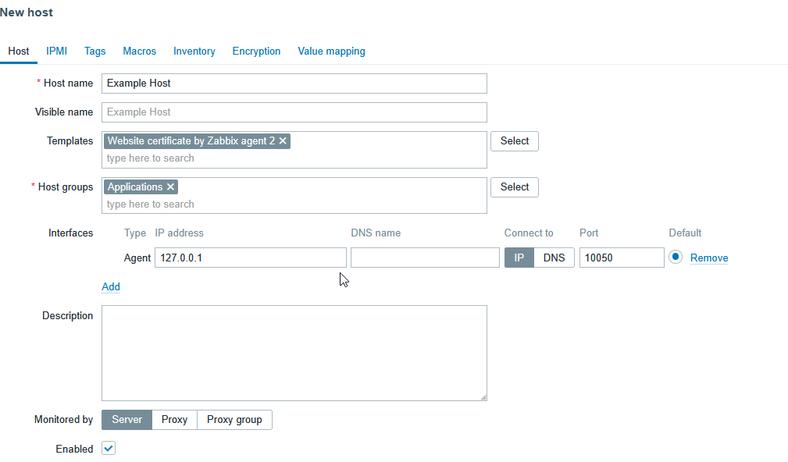
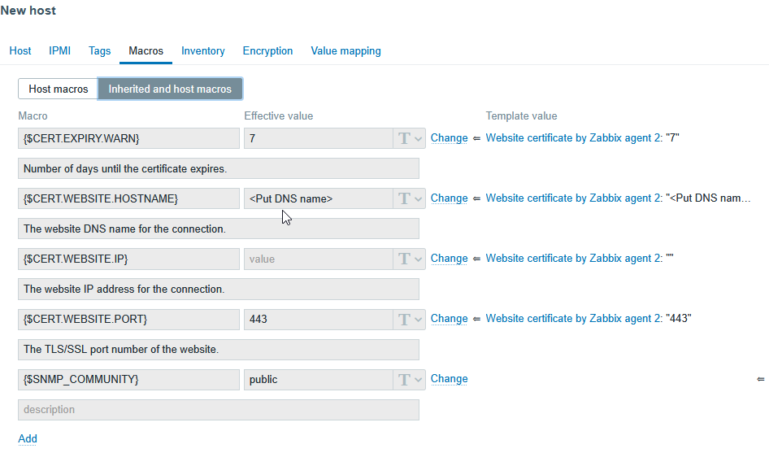

 
**The problem:** You want to use Zabbix to monitor your Website’s SSL certificates and be alerted when they’re about to expire. 

*(Note: This method does not work for hosts where you wish to monitor multiple SSH certificates – you will need to have either multiple Hosts, or use a third party template for Multiple Certificates that has a macro format of “CERT.WEBSITE.HOSTNAMEX“ where X is 1-10)*

**The answer:**

1. Edit the existing Host for the server your website is running on. (If it doesn’t exist, create one by going to Monitoring -> Hosts and click the “Create host” button in the top-right:

2. Ensure you’re using “Zabbix Agent 2” as an interface.

3. Add the `Website certificate by Zabbix agent 2` template

4. Click on the `Macros` tab and then `Inherited and Host Macros` – you will see there are some new ones that are related, like so:

5. We’ll obviously need to change at least one of these – at least `{$CERT.WEBSITE.HOSTNAME}`

(`{$CERT.WEBSITE.IP}` shouldn’t actually be needed as well) but we can’t edit them here as they’re global. So click `Change` to the right of those two, plus any others you may want to edit, such as the warning interval. This copies the Macros from `Inherited and host macros` across to `Host Macros` which makes them unique for this Host.

7. Click `Add` to add this host, or `Update` if it already existed. 

8. That’s it! Zabbix will check these certs and alert you `{$CERT.EXPIRY.WARN}` days before they expire. As ever with Zabbix, if you need to change anything about the alert, then you can click `Triggers` for the Host and search the Name field for `Cert` and you’ll find a trigger for `SSL Certificate expires soon` which can be edited.

