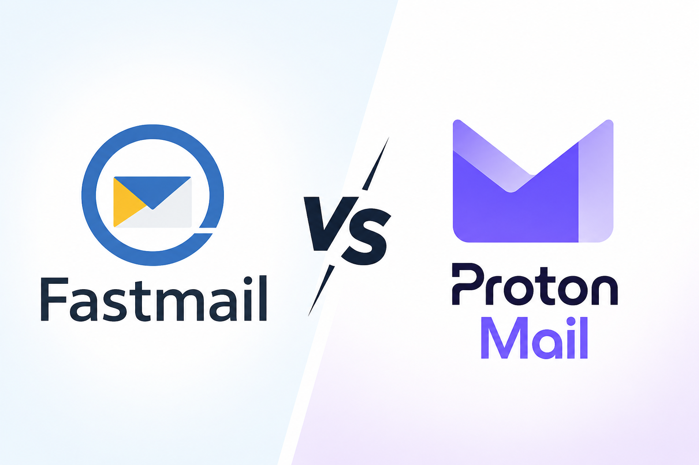

# Choosing between Fastmail and Protonmail - and how I got it wrong

A year ago I chose ProtonMail to allow me to move away from using Gmail. Here's my experience and why I'm now moving to Fastmail.

*Note: I'm a personal user who paid for both services with their own money.*

# Leaving Gmail

Like many others, I've become increasingly uneasy about Gmail reading my email. Whilst I hide most web adverts (by running Adguard Home and UBlock Origin), occasionally one would show up referencing a topic I'd discussed  by email, remind me that I was using email provided by an advert company in return for free access to everything written to and from me. Like many others, I'd ignored this intrusion into my private life in exchange for a convenient email service. This was a personal choice, and this isn't a judgement about anyone who continues to use Gmail - I get it; they're good. I created my Gmail account some time around 2006, just two years after it was launched, so that's almost two decades of use. But over time, the balance felt wrong.

Anyway, I made a decision in 2024 to not be so reliant upon Google products and looked around, reading various comparison websites and forums.

Two strong suggestions were frequent: [Fastmail](https://fastmail.com) and [ProtonMail](https://proton.me/).

A colleague also recommended Proton and that tipped the balance enough for me to give them a try, so I paid my money for a year's subscription of Mail Plus, costing a little over £38.

## What I liked about Protonmail

The claim that Protonmail is secure is no joke. Your email is not only encrypted in transit, it's encrypted at rest on their servers with a key that only you hold. They can't read your email (Well, mostly - the *headers* aren't encrypted as evidenced below - they know who sent you email, who you emailed, and what the subject was - but the body is hidden from everyone)   Further, as they're hosted in Switzerland, whose privacy culture is legendary, they cannot be coerced to hand over your details. A lot of people, including me, are deeply concerned about governments eroding privacy in a lot of insecure ways, including my own in the UK. Now I don't have much to hide, I have a very boring life, but I do value the odd principle and privacy is one.

Proton's website and service is also good. Their documentation never left me wanting, and the tools they provide are good, including full Linux support.  They have very smooth migration processes from Gmail and all my email, contacts and calendars were soon showing up. Onboarding was  quick and smooth.  I set my primary domain's MX to theirs and soon had new email flowing.

Not so quick was changing the dozens and dozens of online accounts that I'd set up to point to my Gmail account to point to my domain instead. But that's a job that only needs doing once, as now I can move my domain to new email hosts quite easily. *As an aside, this process was actually fairly painless, just tedious. Every website I use and have an account with - and there's well over a hundred - had a working facility to change my email address.  It also gave me a chance to decide **not** to update a number of accounts that I didn't want.* 

But, Protonmail and that security comes with some compromises. When asking around for recommendations, I think I got a lot of positive biased answers where people recommended what they use. I do the same, but in this case I'm prepared to admit that Proton wasn't the right choice for me, so with renewal looming, I went looking. Again, I found much the same responses, so decided to give Fastmail a try. Now all my web accounts had been updated to use my private domain, it would be much easier to move my email.
## Reasons Fastmail is better than ProtonMail (Just my opinion!)

### Speed

Loading emails via ProtonMail's webui is SLOW. I was seeing 1-4 second delay on every email between selecting an email and it displaying. The reason is by design - my emails are wholly encrypted on Proton's servers, so my client must send the key for each email, wait for it to be decrypted, and then sent back to me and displayed. It's no secret, and not much Proton can do about it - it's the nature of its extremely secure design. I just didn't fully appreciate how slow this would be.  I found this very annoying.  Fastmail's was faster - less than a second in almost all cases and often instant. 
#### Mitigation

I ended up running Thunderbird locally to make reading email bearable with Proton, which downloads my email by running Proton Mail Bridge - a piece of software that sits in front of their service and decrypts it for local clients like Thunderbird. It's good software, both Windows and Linux variants, but it's overhead a normal service just doesn't need.

One drawback of using Thunderbird however, is that any changes you make to it (such as additional mail filtering) need replicating on every client. Thunderbird can't realiably sync these changes, so as I read email on my laptop, phone, work vm and desktop, things got messy.

And of course, running a local mail client negates a lot of the benefit of an email provider. Not only do you need the bridge on every local client for it, things like mail filters set in Thunderbird don't get shared between devices, which means you need to use the webui anyway to set those if you want them consistent, but that means you can't search by message body (see below).  Plus you're still tied to the official Protonmail Android client, so that's permanently slow. 
### Searching

You cannot search message bodies on Protonmail. The message body is encrypted, so it can't searched without decrypting, which can't be done except individually. This was something I hadn't considered and losing this functionality was very limiting to me. Again, nothing Proton can do about this, it's the cost of having the most secure design.
#### Mitigation

Again, Thunderbird, once it's downloaded and decrypted all your email, does do search. It's fast too. But needs installing on every client.
### Filtering

This one completely skipped me until I needed to filter incoming messages depending on what the email actually contained. For the same reason you can't search message bodies in Protonmail, you can't automatically filter content by message body either - only by from/to and subject.

That aside, Fastmail's filtering options are somewhat more developed that Proton's, and the limit on domains and usernames is much more generous. But both filters work well.
### Simplicity

Both FM and PM have native desktop email clients that work well. But if you want something else (like Thunderbird) PM require you to install their mail bridge. This needs doing on all clients.
### Homelabbing

I run a home server running linux and selfhost. I need to send email out automatically from linux to the internet. Proton solves this by having you run the linux mail bridge on your linux server. That's another service that just isn't needed by Fastmail, which can do straight SMTP with OAUTH and App passwords, and a few lines in postfix's config sets it up permanently. Relaying email from linux servers, or an entire subnet, becomes simpler. It's no deal-breaker, and once setup, Protonmail's service ticked along nicely.

Both companies have good documentation on all aspects of their services.
### So if you're so demanding, why not self host your email?

Since I self-host so much still this may prompt the question - why didn't I self host email fully?

Well, I've done that before, and run fully selfhosted email systems for SME companies. Selfhosting email today is... not good. I know there is division on this point, and many people will say that self-hosting email is the ultimate for privacy and there's some merit in that, but email has been abused for sixty years now and there are so many layers of filters that it's near impossible to reliably send email domestically, and filtering out the malicious and spam incoming email with good effect is far from trivial for any account that's been around for a while. (My Gmail account gets around 250 spams a day). No self hoster can hope to match the resources available to large email providers, paid or free. 

Also, I have some technical limits - my rural ISP uses a CGNAT, so I can't receive incoming traffic anyway (My usual go-to for getting email in, Cloudflare Tunnels, explicitly blocks email).

But even if I could receive SMTP, I wouldn't. I used to spent a LOT of time fighting spam and it's a game that gets old very quickly, and I have no wish to keep doing that. Professional email companies are much better than I am - Gmail, Fastmail, Proton all do an excellent job at spam and malicious email blocking. They all have user bases that inform on new spam patterns that can be shared amongst other users.

And of course, any email I send would be from a residential low-trust IP and would likely get blocked anyway. The only real way around this would be to rent a VPS out on the internet which would cost about the same as a paid email provider. No thanks.
### Mobile Apps

Aside from the core limitations of Protonmail already mentioned, the apps are broadly similar. Thing "Android email client" and you know what to expect. Proton's client is slow to load each message, because it needs to decrypt it, but even so Fastmail's is a tad faster and slicker.

## Conclusion
So, which should *you* choose?

In all but a few considerations, Fastmail wins. It's faster, has more email features and just plain simpler. 

Where Protonmail beats fastmail:

1. Privacy. 
   Not only can't Proton access your email bodies, it can't be compelled to by law enforcement. Fastmail is an Australian company and hosts in Europe. Australia is a member of [Five Eyes](https://en.wikipedia.org/wiki/Five_Eyes) which means that law enforcement companies in Australia, the UK, New Zealand, Canada and the United States can legally compel Fastmail to give access to your email. 
   Fastmail, to their credit, publish a [Data Transparency Report](https://www.fastmail.com/policies/transparency-report/) which gives these numbers. The numbers are low, and Fastmail clearly want to be seen as not allowing access easily, but the fact remains that they do have to if required, and when they do give access, all your data will be handed over in plaintext. 
   So if Privacy is your main concern and you can put up with its slowness, Proton should be your choice.
2. Range of products.
   Proton offer a well respected VPN, AI, Meetings, Authenticator, Wallet, Sheets, Docs - a full and good suite of products that, depending on your account type, are all available to you. Effectively a drop-in replacement for most of what Google gives you for free, except it's private. Fastmail focus on Email. They include very basic file storage and sharing as well, but that's about it. 
3. Price. 
   This is more of an Apples and Oranges comparison, as Fastmail offer more storage and 100 domains vs Proton's 1 at their "normal" tier, whilst Proton offer all the above products. Right now, Proton Mail+ is around £38 a year, whilst Fastmail Individual weighs in at £54. 

Both are good choices. 
#### Addendum: Support experience
When I'd made my mind up to change to Fastmail I still had over two months of contract with Proton. I dropped their support a line and asked if I might have a refund. I got a human response 24h later to say unfortunately not (which wasn't a surprise, paying a year up front this is normal) but Proton did offer an extra two months contract free if I stayed with them. The support person was courteous, accurate and wasn't at all pushy, so despite me not getting the answer I wanted, I cannot fault this service. 

I have no yet had reason to contact Fastmail's support.