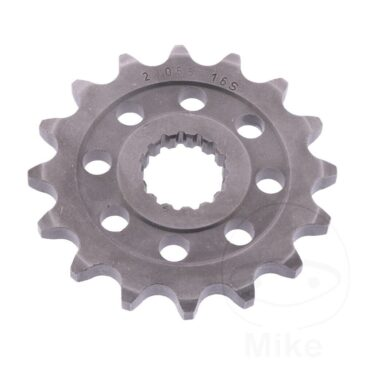

### The Reasoning

One of the most popular modifications for the Royal Enfield Himalayan is to replace the front drive sprocket which changes the gearing through all gears.

The stock Himalayan is fitted with a 15-tooth (15t) front sprocket which takes drive from the engine onto the chain. This provides reasonable gearing for the 24.5bhp for a wide variety of riding surfaces, but as the bike only has five gears, this means that top-end speed is undergeared, and to achieve motorway/highway speeds you must push the engine into the 5k to 6k range (70mph indicated = 5800rpm for my tests on stock tyres, level road). As the engine redlines at a low 6000 this means a lot of noise, vibration and engine wear to keep up with traffic.

For only £17 and an hour’s time, I was able to change this sprocket to a 16-tooth one which has resulted in a much nicer highway experience, and as I spend most of my time riding on tarmac, this was a good solution for me.

Should you do this? If you do a lot of road riding, particularly above 50mph, I would say yes, definitely. If you mostly ride on dirt, or narrow tracks, best to keep it as it was designed.

### The Process

###### Parts:

* 1x Front Sprocket: 16-tooth (16t) 525 Pitch. Item part: 29055 16s
    I bought mine here for £16.63 and it arrived in two days. It appears to be a common part between many Royal Enfield bikes, and this one was advertised for the Interceptor. It’s made by the German company ESJOT and is good quality. I think it will last just as long as the original. (Disclaimer: I receive no benefit from either company mentioned. I paid for the part as a regular customer and have no ongoing relationship with them.)

###### Tools

* A metric socket set. I also found a breaker bar useful to loosen the main sprocket nut.
* 12mm spanner to loose chain adjusters. (There’s one in the bike’s toolkit)
* A hammer and screwdriver or punch to flatten the soft metal locking tab, and reset it afterwards.

### Process

I’ll describe it here, and there are good guides by other people if you need on Youtube: by Unfastened :: By Two Wheels Ben

Note: At 1500 miles, my bike’s original chain was sufficiently run-in that the original chain worked fine. Others have reported that you may need an extra link, or 112-link chain. I would suggest trying this anyway, reverting it is easy enough if you find you do need a longer chain, and you won’t be left without a bike. You don’t need to remove or split the chain to replace this sprocket, although if you’re doing both sprockets you may find it easier, especially if also replacing the chain.

**How I did it:**

1. Put bike on centre stand

2. Loosen main rear wheel bolt, and loosen both 12mm lock nuts to adjust the chain. Slacken the chain fully and push the rear wheel forwards to give the chain as much slack as you can.

3. Remove the two 8mm bolts on the sprocket cover (Front of chain) and remove cover.

4. Using a punch or screwdriver, flatten the soft and shiny washer behind the main nut – it will have a tab folded over to stop the main nut undoing. Just unfold it enough so the nut will turn.

5. Using the correct socket, undo the main nut. (It’s a normal right-hand thread)

    Hint: To stop the wheel turning, I went to the other side of the bike and pushed down the rear brake with my foot. Then, leaning over the bike, I used an extension bar to gain the leverage to undo the nut. It’s on tight!

6. Remove the nut and soft washer, noting which way they’re facing.

7. Now remove the old sprocket. This is most easily done by sliding it out with the chain still around it. It should come off fairly easily as you’ve slackened the chain. Once off the bolt, you can unroll it from the chain.

8. Compare the old and new sprockets. The new one should be similar and fit the chain well. The writing should face towards you to help identify it once fitted, but the sprocket appears to be bi-directional. The original sprocket has a bonded plastic facing, which I think is for noise deadening, so they won’t look that similar – but it doesn’t make any difference to the fitting.

9. Fit the new sprocket into the chain and fit it over the drive bolt. This will probably be a snug fit, and you may need to use something to lever against the frame to persuade it home (don’t use anything metal or you may damage the frame and sprocket)

10. Once located, rotate the wheel to ensure the chain is well seated and turns freely, and that there is adequate slack.

11. Refit the shiny washer in the same direction it came off, and refit the nut. Tighten the nut well.

12. Using a screwdriver, bend the shiny washer up to stop the nut undoing – making it as it was before you began.

13. Refit the sprocket cover with the two 8mm bolts. Warning: Soft bolts, do not overtighten!

14. Tighten the chain to normal levels, and secure the locking nuts and main wheel bolt.

15. Have a cup of tea.

### The Results

**Normal Riding**

Not a huge amount of difference to be felt, it’s only a 7% or so ratio difference after all. I found it felt more like a normal road focused motorbike. Gear changes feel the same, no more or less vibration. The only thing I found was that I was more likely to bog the bike at low revs as I’d gotten used to changing up earlier. After just half an hour of riding, I’d got used to it though.

**Narrow lanes**

I live on Dartmoor on the UK and we have a lot of very bendy, narrow (less than 3m) tarmac roads set deep within high banks. Typical speed on these is around 20mph as visibility is low. Before, I was riding these in 2nd or 3rd and after fitting the sprocket, more often in 2nd but almost as often in 3rd, and keeping the same speed. No big difference here.

**Faster single carriageway roads (A and B classification)**

More noticable here, the Himalayan feels more normally geared. Progress is better, and overall slightly faster. There’s more of a speed difference between gear changes, perhaps I was holding on for another 5 or 10mph before changing up to 3rd or 4th. Before changing the sprocket, I would often ride these in 5th, but after I was more often in 4th, only changing up when I got about 45mph or higher. Before, I could easily leave it in 5th from 30mph onwards if riding lazily.

**Motorway / Highway (70mph legal limit, riding at 55+)**

This is where the modification really pays off and you will feel its benefits.

Earlier this week, I’d ridden back from Cornwall, which included a 90 minute stretch of the A30 which was running clear. At 60mph, there was noticeable noise and vibration and mechanical sympathy stopped me going to 70mph for more than brief overtaking spells. Even that relatively brief time left me with mild tinnitus, despite wearing earplugs and using the stock exhaust.

A test ride on the motorway after fitting this was much more relaxed, able to comfortably cruise at 65-70 with some power left in reserve for overtakes and hills, although steep hills will undoubtedly require a visit to 4th gear. I’m 6’2″ and 110kg, so it can support larger riders at this speed too. Whilst the Himalayan could do these speeds with a 15t as well, it ran out of RPMs way before it ran out of power. The bike itself is stable and comfortable at 70mph on a non-windy day.

Here’s the actual figures as I recall them.

*Note: The Himalayan speedometer over-reads by around 5% (confirmed by GPS), and these speeds are from that, so actuals will be slightly lower. However, they are consistent enough for useful comparison.*

| MPH | RPM with 15t Sprocket | RPM with 16t Sprocket |
| --- | --------------------- | --------------------- |
| 50  | 4500 | 4100 | 
| 60  | 5000 | 4400 | 
| 70  | 5800 | 5000 | 

### Pros and Cons

**Pros**

* Quieter, less vibration. Overall more comfortable cruising.
* More able to comfortably stay at 70mph.
* Less engine wear
* Better fuel economy
* Easily reversed.
* Cheap and immediately effective.

**Cons**

* A taller first gear, losing some of the Himalayan’s tractor-like crawling ability at slow speeds.
* The original lower gearing may be preferred by those who do mostly off-road, trail or mountainous riding, plus those who ride in cities as a commuter or who carry heavy loads.

###### Conclusion

Like every modification one does to a vehicle, it’s a compromise that won’t suit every use-case. Motorbike manufacturers spent a lot of time and effort making the best bike they can for the money and original equipment is often the best for most riders. But things like gearing are a compromise, and this is especially true where we riders choose to use a bike designed for climbing mountains as a daily runabout on flat 70mph tarmac, so where we can adapt it to better suit our specific needs, it can be good to do so.

For under £20 and an hour’s time, you can easily improve your Himalayan’s on-road performance. It’s not surprising that this is one of the most common modifications that Himalayan owners perform. Even if a new chain was required, I think the cost is easily justified if you do any amount of highway work.

If you are not mechanically inclined, then any workshop will be able to do this for you if you supply them with the new sprocket.
