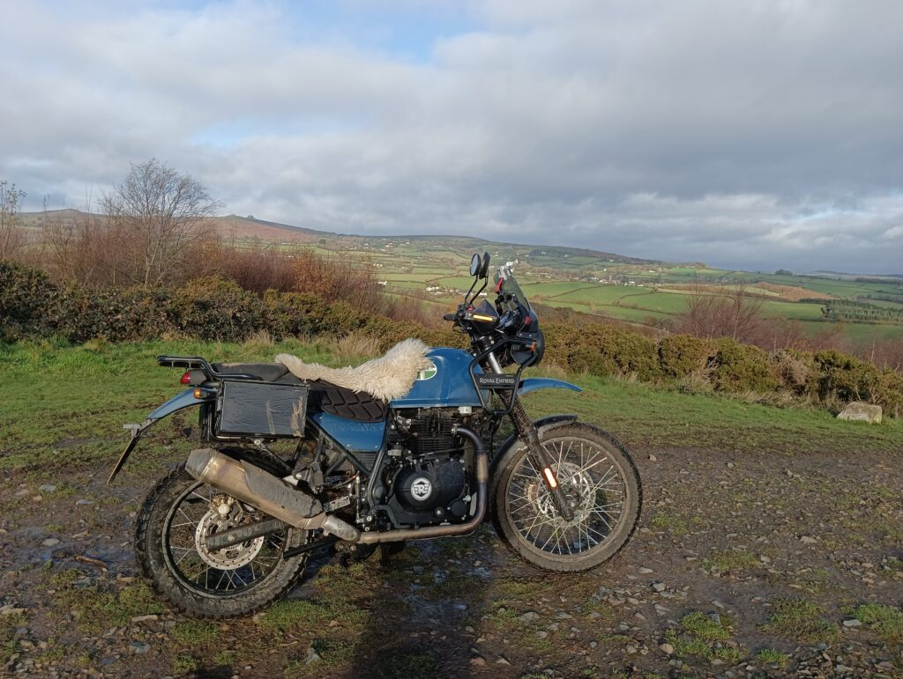
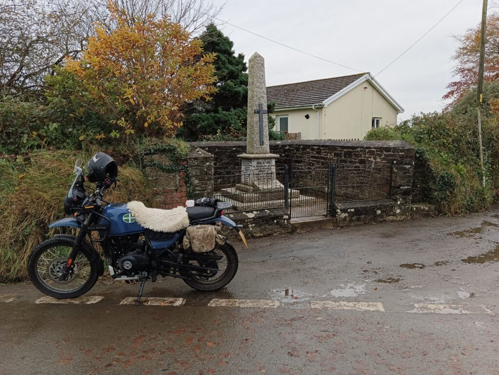
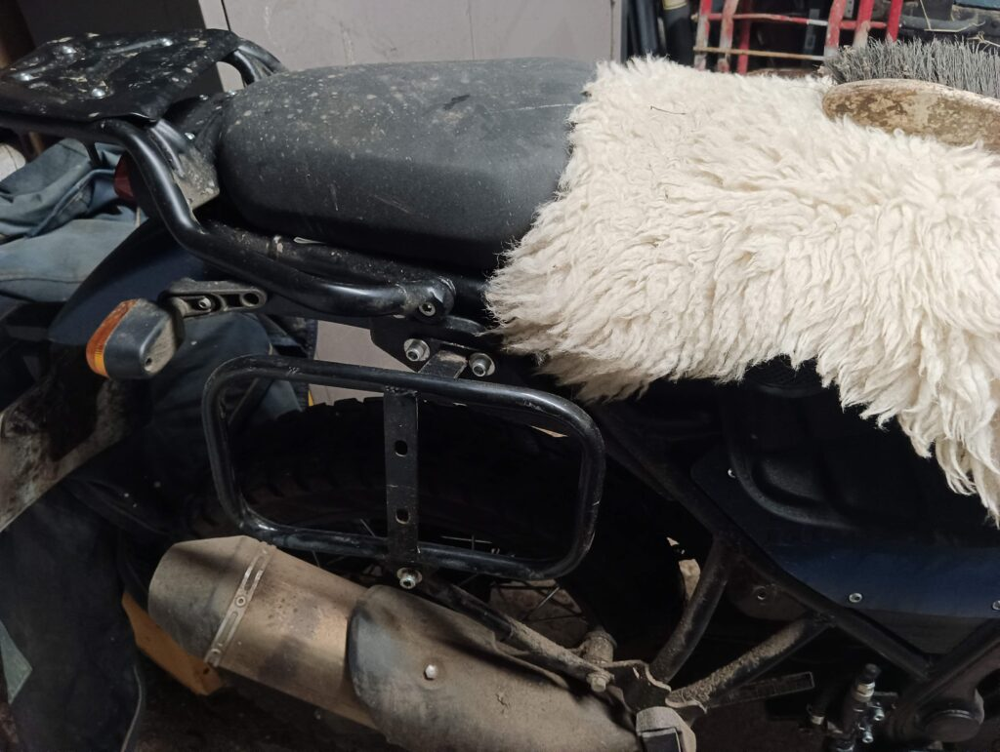
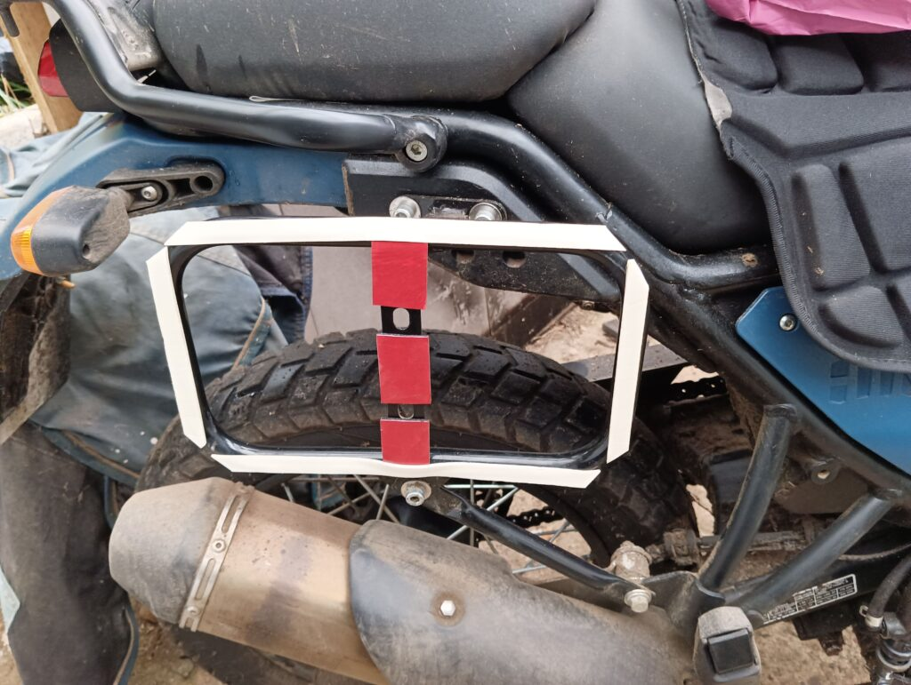
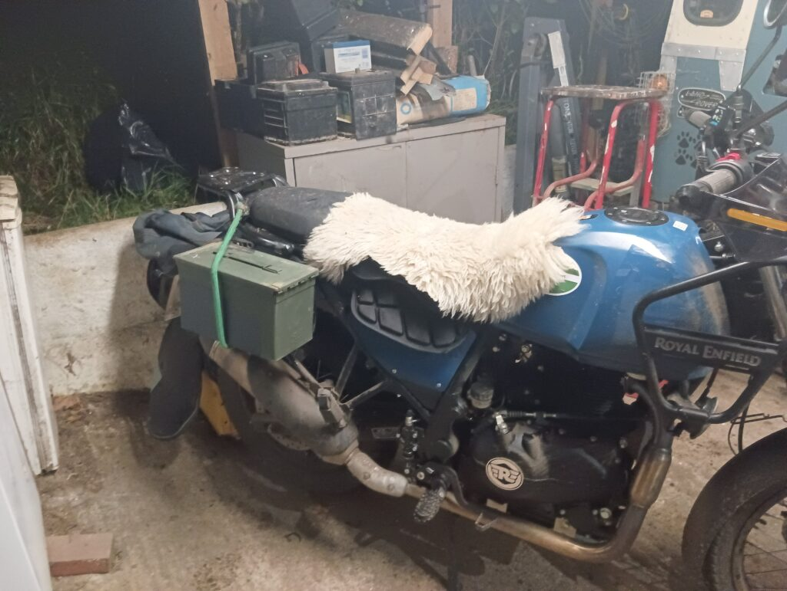
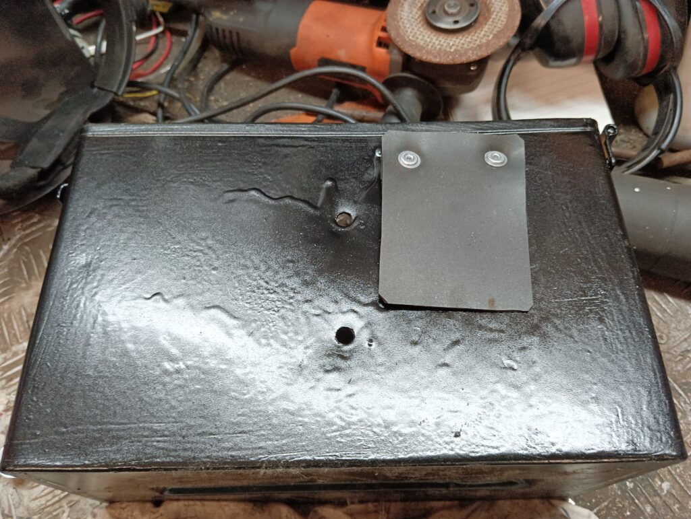
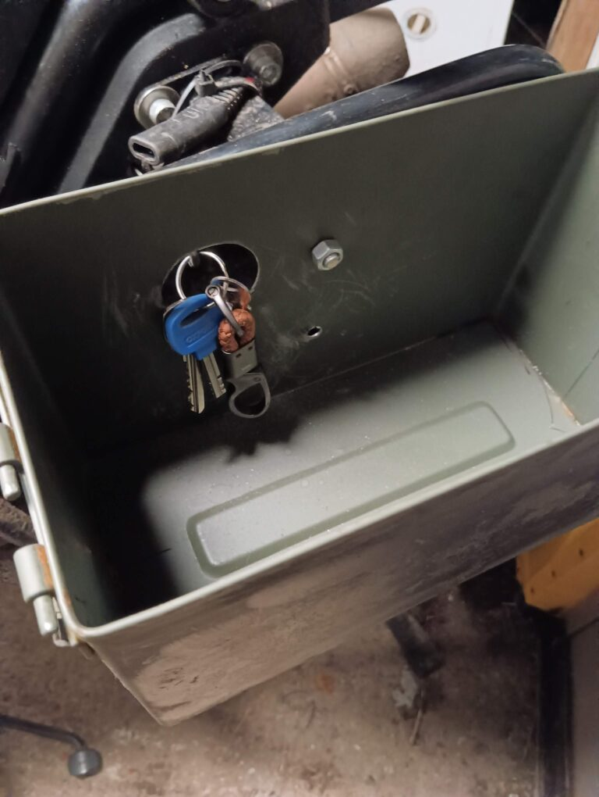
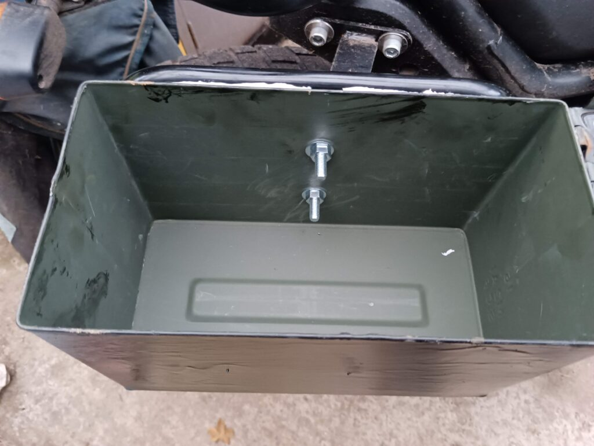
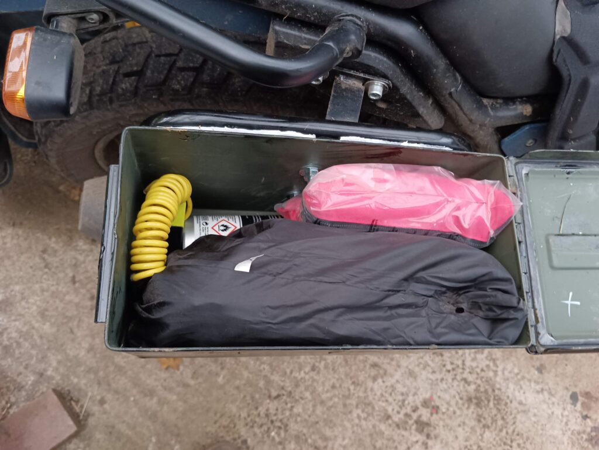
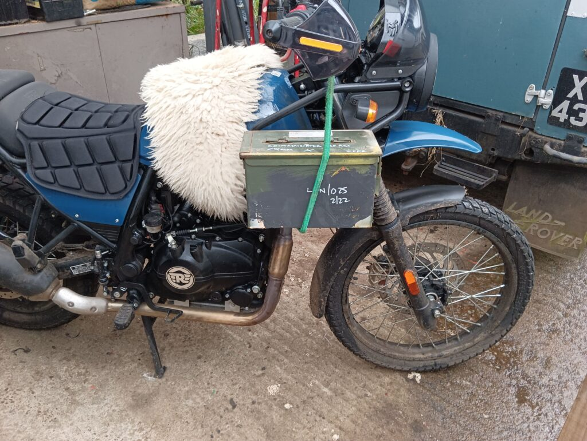

Perhaps not to everyone’s taste, but ammo boxes are cheap, strong and last forever. They’re easy to fit, too!

### Backstory

I like to carry a few things when I’m riding. Tools, a can of tyre weld, a spare litre of fuel, a couple of cereal bars and, being English, a flask of tea. So luggage was always something I needed. However, the official RE Panniers are surprisingly expensive, so originally I fitted two £10 military surplus kit bags like so:

These worked really well, quite roomy, no rattles and did well through the summer. But come the winter, the muck thrown up by the road made them very dirty and the contents wet, even when wrapped in plastic bags. They certainly weren’t unusable, but I fancied something else. 50cal ammo boxes are cheap and a good size, so I bought five for £30 off ebay, delivered. Good deal.

### Fitting Ammo Cans

**WARNING!** This was written BEFORE ONE OF THE CANS FELL OFF!  The Ebay purchased mounts shown here were sub-standard. Not only did they rust through on the lower support arms on both sides, which failed after a few months (the metal is really thing) but one day the top weld snapped and the entire can... disappeared, along with contents. 

First – I removed the old bags. I’ll use them again later for something, they are very useful and quite tough. That left the pannier mounts, which cost something like £24 – the European models don’t come with them fitted, nor with a Sari guard which is standard for the Indian market.

The boxes are 100% water and air tight (less the holes I made) and can be padlocked for security.

There’s no wind noise, no rattling (other than contents, but I put some thin rubber on the base inside to reduce that, and packed better). There’s no noticeable difference to how the bike rides. The only minor issue I had is the same for all hard panniers – pushing the bike means you will bump your thigh, and hoicking your leg over is a bit harder – as evidenced by the mud streak above.

If the storage isn’t enough, well, the front pannier mounts also have holes you can repurpose…

