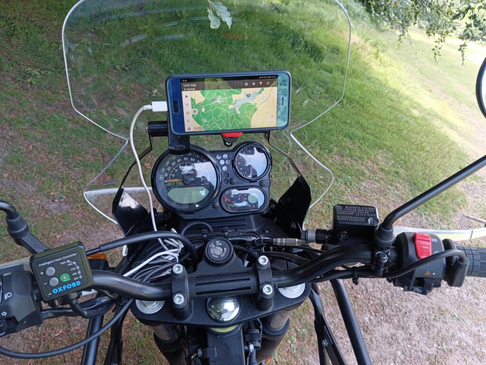
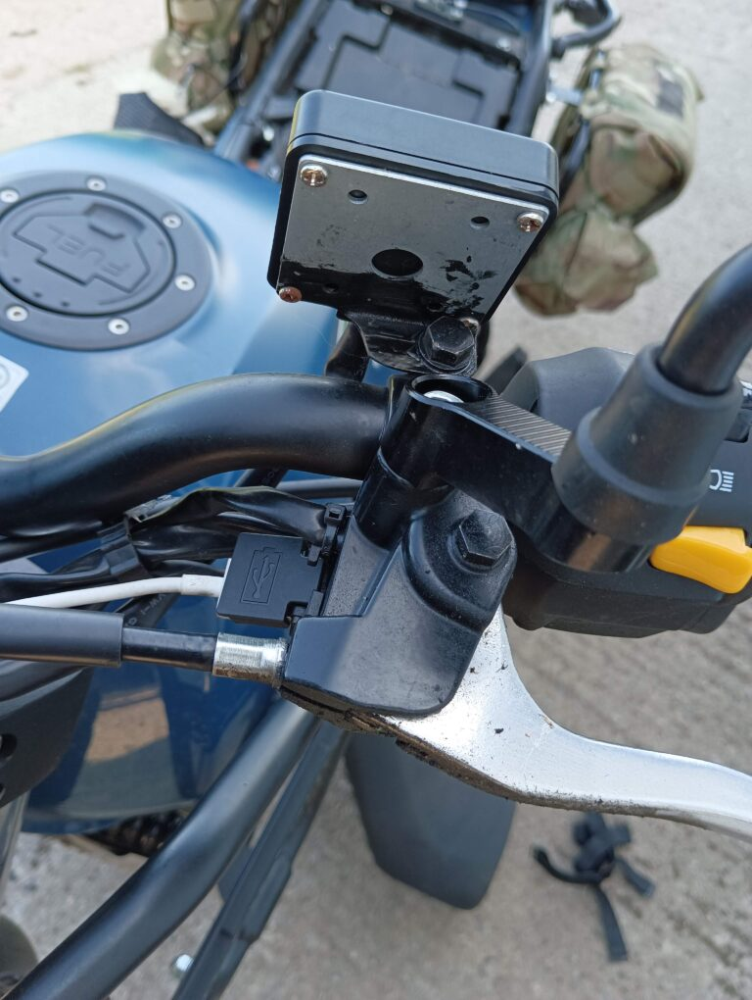
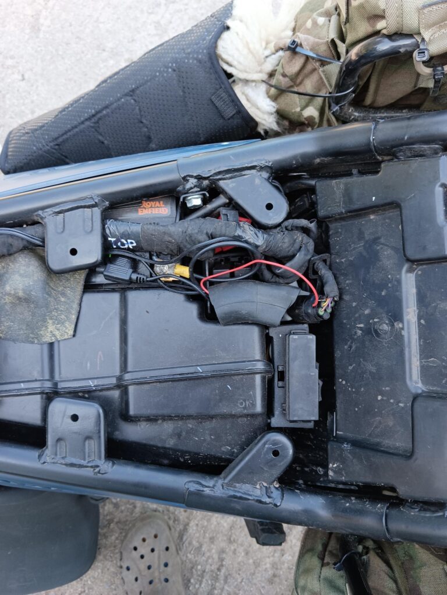
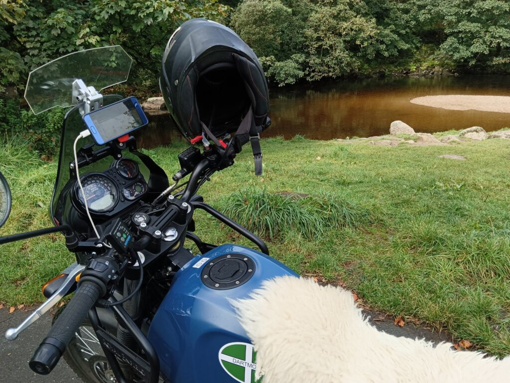

I’m a huge fan of heated grips, having discovered them on my GS. When I was learning to ride a bike, I rode through the winter on a Sinnis Cafe 125 and often got so cold I’d have to pull over and warm my hands on the engine – sometimes every 2 or 3 miles. My circulation isn’t the best thanks to beta blockers, and that also means I get vibration numbness fairly quickly when it’s cold – so I pretty much consider grips a necessity for riding in the UK 3/4 of the year.

Oxford are a well known manufacturer of self-install grips, and as my new Himalayan came without such pleasures, I bought a set of their Adventure grips for £60 in 2023 and installed them.

I bought these with my own money and I receive no benefit for this review, nor am I linked to the manufacturer in any way. This is my honest opinion.

### So, what’s the verdict?

**Overall: 9.5/10**

Very good. Strongly recommended if you ride anywhere even slightly cold.

**Value: 8/10**

£59.99 (UK, Q1 2023) for well made, robust and weatherproof grips and controller seems like a very good price to me, and that’s someone who is not afraid to scour the internet to buy cheap. I bought these from Amazon.

**Quality: 9/10**

Good to very good. The grips are a little softer than the Himalayan’s original ones, which is fine – although I imagine they will wear through within several years. They’re very grippy as a result, which is good, and you don’t need to hold them as tight.

The controller is well sealed, very clear to use (pic above, it’s the box marked ‘Oxford’) and very simple to operate with one thumb without taking your eyes off the road. At the time of writing we’re close to Winter and I’m using them most trips.

**Heat: 9/10**

They’re not immediately hot, taking perhaps 2-3 minutes to warm up enough to feel through your gloves. But once up, they keep the set temperature very smoothly and I could detect no “modulation” where they get alternatingly hot and cold. The 5 settings are well spaced and I tend to use the 40%, 50% and 75% settings most. 100% is too hot for anything above sub zero temperatures, but it’s good to know it’s there if you need it.

**Instructions: 7/10**

Fairly typical “Few sheets of paper” installation instructions. Perhaps a little light if you’re unfamiliar with electrics or working on your bike, and you might want to seek some help. I do know people who have paid mechanics to fit these and that’s definitely an option.

I did disagree quite strongly with the instructions on one item, which is that they tell you to connect these straight to the battery (they include an inline fuse). This means you need to turn them off manually every time you stop, or they’ll stay on. This obviously uses the battery power and I believe will cause you starting problems if you do leave them on, especially in cold weather. As a protection, they say these will automatically turn off when the voltage drops to 11.5v, but I think that’s far too low and some bikes will struggle to start at that voltage. I used a switched-live relay to fit mine, which turns them off with the bike. That means you need to remember to turn them back on again, but auto-off is a small price to pay to be able to start your bike! I’ll detail that further below.

**Fitting: 9/10**

The whole fitting process took me a couple of easy hours with a couple of stops for tea and pondering. It’s well within the capabilities of most people, but if you’re unsure, stop and research before continuing.

**Step 1: Removing the stock grips. **

I slit mine open with a sharp knife – they’re glued, so sliding them off didn’t work, but if you’re more patient you may succeed where I failed.

**Step 2: Fitting the new grips.*

Ensuring you use the `R` and `L` grips appropriately, fit and glue them in place. I used superglue which has held up well.
Note: Be careful how you position the throttle side cable. I know someone who broke down because his glue failed and the grip slowly rotated until each time he let go of the throttle, the cable pressed against the bike’s kill switch which, as you can see in the top photo, is very easily crossed by the cable. His bike then stopped and it took a while for him to figure out why… The positioning in my photo has worked well for me but you should experiment to find what’s best for you and your bike.

**Step 3: Fitting the controller. **

I put mine on the left hand side where I can use my left thumb, but positioning is entirely personal. You may need a little fettling to expand the supplied bracket’s holes as I did, which I’ve protected with a clumsy blob of paint as in this picture:

**Step 4: The wiring.**

Each grip connects to the controller with a nicely sealed plug and socket, and can be tidied away with zip ties, ensuring you have enough flex to turn the bars without straining anything. Then there’s just one cable to connect to your power source or relay.

**Where to connect to the power:** I strongly, STRONGLY, recommend using a fused, switched live to power these grips.

Tip: Since I fitted mine, I’ve heard of a chap who took a supply from the horn feed, which he says is switched live and fused. (I have not verified this) That would certainly be easier than my method if so, and worth you checking. It also saves a good bit of cable tidying as it’s at the right end of the bike.

I ran the cable under the tank back to the battery area under the seat. This is what it looks like after connecting things.

You can see the shiny black cable with the in-line fuse carrier on its side coming in from the left (front). That’s going to the Oxford controller.

The red wire connects from a switched live I found in the small, black six-way connector that’s there, at least in 2023 Himalayans. I probed around with a multimeter until I found a switched live, then pushed the single wire in there (with a crimped connector), and folded it back, holding it in place with some black insulation tape. I did that rather than break into wiring so that I could remove this later if needed.

The other end of the red wire goes into that piece of bicycle inner tube which is protecting a standard automative relay and connects the battery positive to the Oxford feed wire.

*For those unfamiliar with relays; A relay is simply a switch for a power feed that is controlled by a second feed. This allows high-power devices to be controlled by much smaller capacity switches. They’re widely used on all vehicles to simplify wiring. A starter solenoid is an example of a relay that prevents a very thick wire having to be run up to a very large switch controlled by a key – the key sends a small current to the solenoid which has a thick wire from the battery and allows current to flow to the starter.*

This setup has worked well for me for a couple of thousand miles and should last indefinitely, but there are many ways to connect such things.

