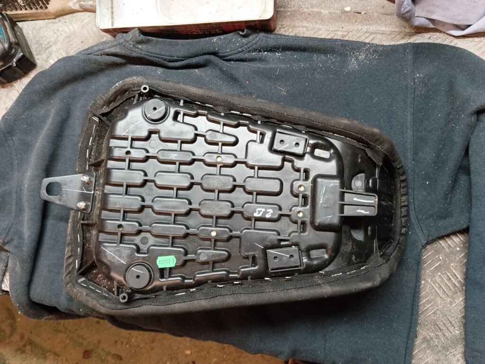
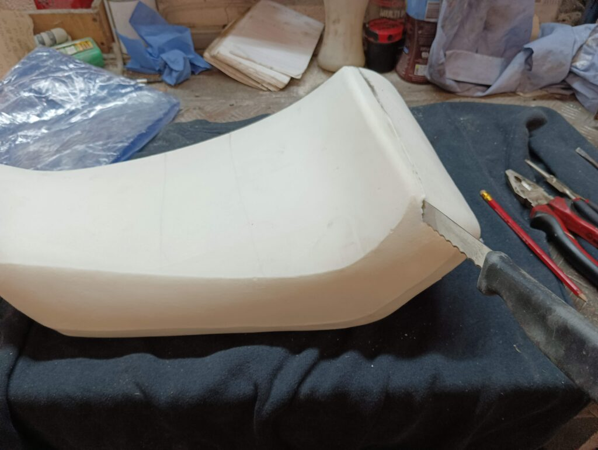
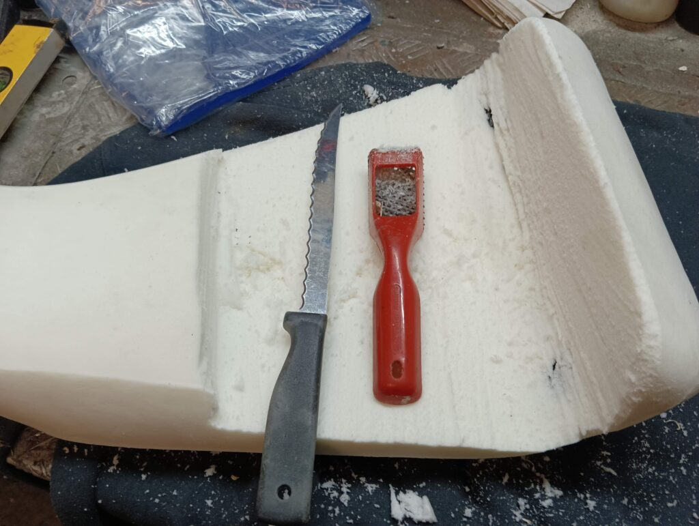
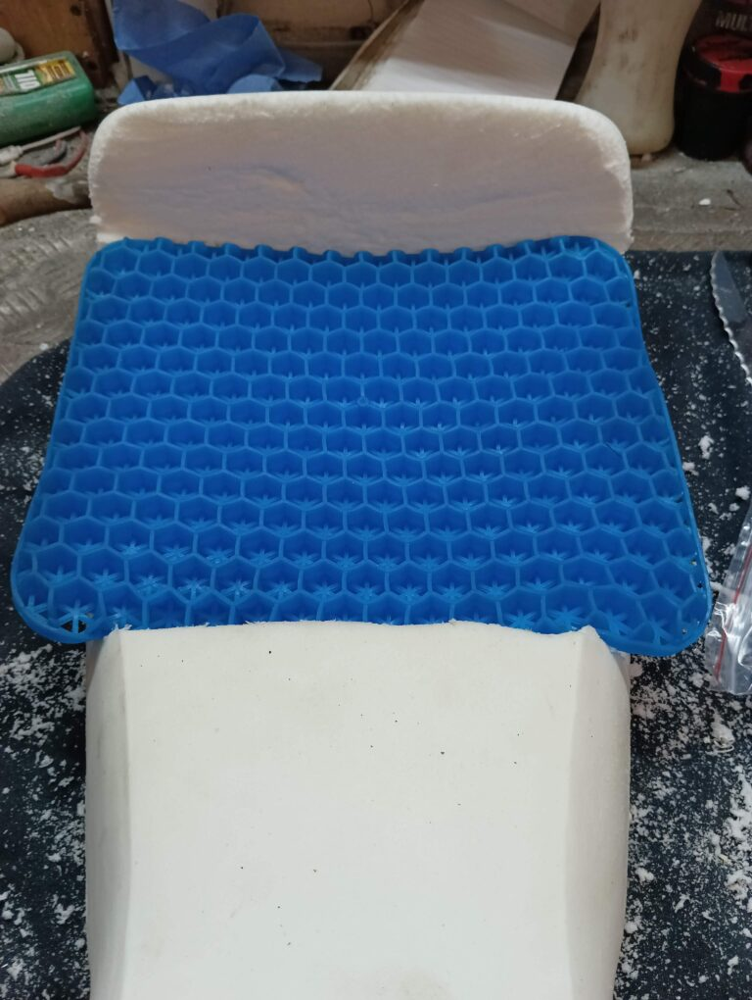
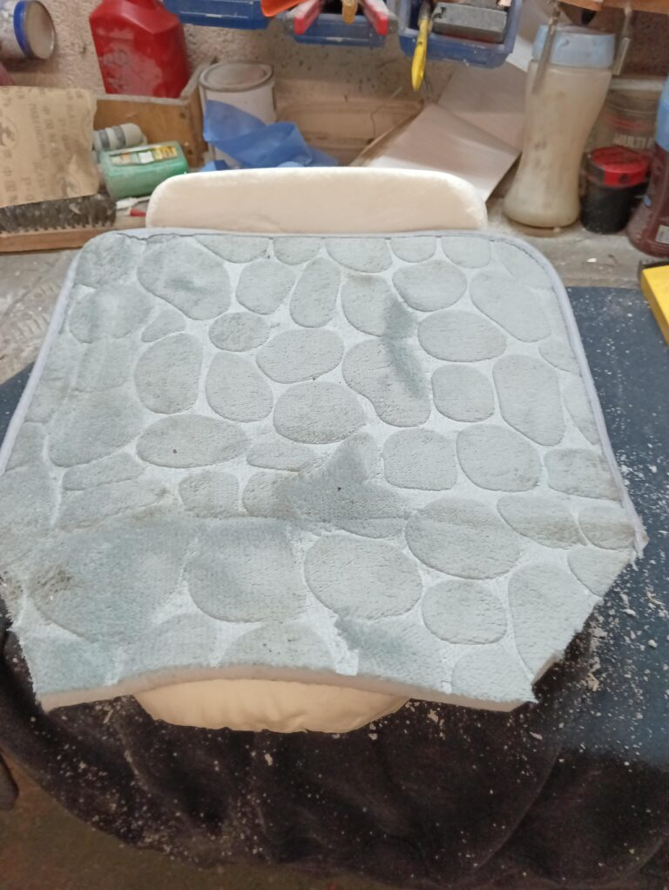
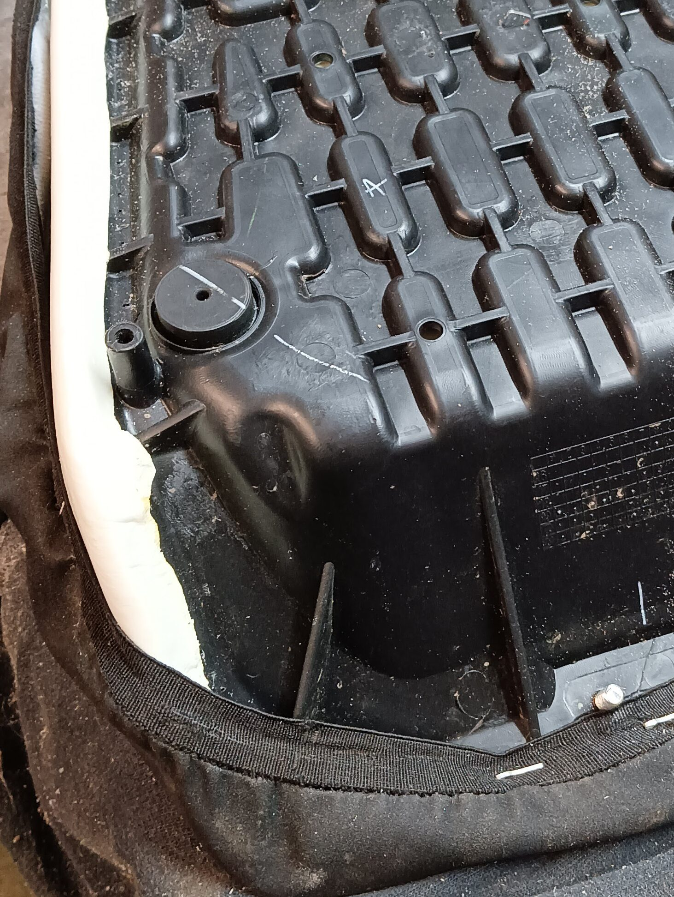
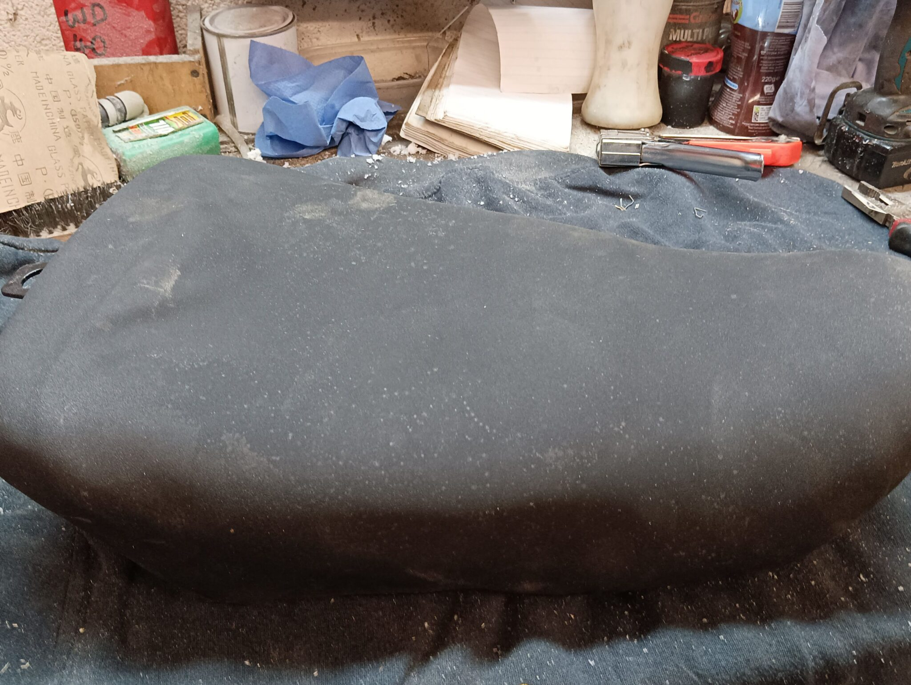

I love my Himalayan, but the seat is not its best feature. It's hard, strangely narrow and angles forwards. Not only giving you a numb and then increasingly painful rear end after a time riding, but also squishing your gentleman's equipment against the fuel tank.

My first attempt to fix this was the buy the genuine Royal Enfield “Touring seat” for £70.80. It's an easy swap – just remove the old and slip in the new. But, amazingly, I couldn't tell the difference! It felt exactly the same. It wasn't made the same; it was open underneath and there was a different mesh where it was solid in the other, but it was just as hard and uncomfortable.

I tried with various seat-toppers. That helped a bit, as did a Sheepskin, but I needed 2 or 3 before I could ride more than an hour without a break, which left me teetering on layers of unconnected foam like the Princess and the Pea.

I also tried using my bicycling underwear. That was surprisingly good. Then I heard about Moto Skiveez – basically the same thing but with pads specifically for adventure riding. I bought some of those. Those were a little bit better and well made, but absolutely NOT worth the **£62.50** I paid for them! They are good pants, but not ten times better than basic cycling padded pants, which is what they cost. I consider Moto Skiveez to be 10% good product, 90% marketing.

So, figuring I might as well hack the original seat around a bit. If I messed things up, I still had the Touring seat.

## Preparation

* I bought a 2cm thick gel pad off Amazon for £25, watched some Youtube videos, and got to work.

## Conclusion – was it worth it?

Yeeeess…? Probably? Maybe?

The seat *is* more comfortable. I'll ride a good couple of hours (I'm a heavy bloke with a skinny bum so I'll take extra padding every time). I did still wear a sheepskin over the saddle.

What would I do differently? I'm not sure the gel pad made much difference – maybe I buried it too low so its shaping qualities were lost. So perhaps if you do the same, consider your needs a little better than I did.

* **Update 2025: 2 years on**

Whilst my modification *was* better than the original, it still wasn't ideal. I stripped everything back one rainy day and set-to again, focusing on much more foam. More! More! I'd bought a waterproof seat cover for something else, and once I'd added a big square of foam (from a car seat booster cushion), the original cover would no longer fit - but the extra one did. So now I finally have a comfortable seat that I can ride for 3-4 hours without feeling uncomfortable. It doesn't look good, but I'd need professional help and a new properly fitted cover to achieve that. Upholstery is hard!

