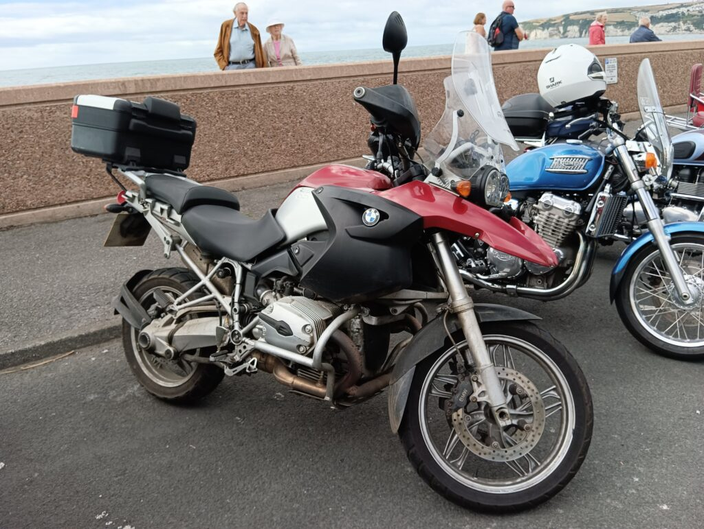
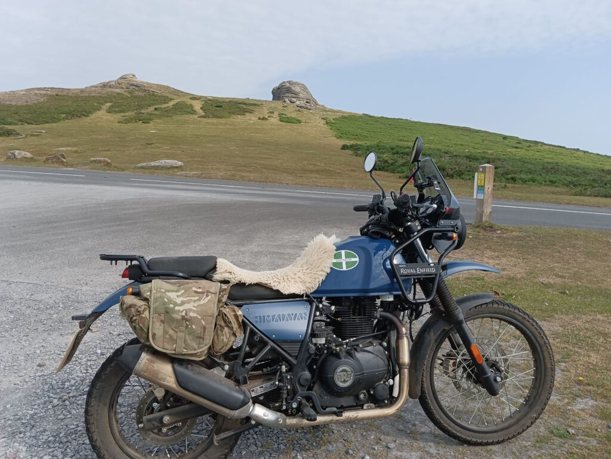

The TV Program, `Long Way Round` was what made me want a motorbike, and specifically a BMW GS. In my mid 40s and facing a mid life crisis, I decided to do bikes. I wanted to travel the world too. It looked cool, it looked fun, it looked interesting.

So I did my CBT (Uk basic test), bought a £300 Chinese 125 and rode through the winter to get some miles in. Then booked the DAS test (same as the EU bike test – it’s tough) and then went to a bike showroom and ended up buying a high-mileage 2004 BMW R1200GS with full luggage – even before I passed my test. Luckily I did pass and loved riding it.

But as I grew in experience, I began to think that it might not be the bike for me.

It was complicated. First the ABS pump died, and there’s lots of horror stories about that with the early BMWs. It knocked my confidence back a bit (as it died it fought back, releasing brakes at the wrong time, and pulsing heavily on corners. ) I had the ABS bypassed by a mechanic, and the brakes were brilliant after that. But I lived in fear of further problems. Clutch slipping? Oh no, that needs the bike splitting in half to replace! Rear bearing feel a bit sloppy? That needs a week in the workshop too. The alternator did seize, and I managed to replace that myself quite cheaply, but it was a big thing for me to do – I’m no mechanic.

But the main problem I had was – it’s too damned big and too damned heavy. I lived in fear of riding down a narrow lane and meeting a tractor. Trying to turn that lump around by myself downhill gave me sleepless nights. (Don’t tell me I could just spin the back wheel or pivot on the side-stand, I’m not that good a rider and these lanes have grass in the middle)

Then I saw the Royal Enfield Himalayan and loved its looks. I went to the local dealer and did a test ride. It was everything the GS was not – light (it’s not actually that light, but by comparison), very nimble and flickable, and is superb off road even on the stock tyres. Turning into my road there’s a patch of gravel that always made the GS slide the front wheel and tighten my sphincter. The Himmie doesn’t even notice it. I found myself driving up the middle bit of the lanes, full of mud and stones.The Enfield finds grip EVERYWHERE. So I rode back to the dealer and said " "When can I have one?" " "Three days if you pick a colour we’ve got in stock”. " "Good, let’s do that then.”

I’ve owned the Himalayan for a little over three months. I’ve put a thousand miles on it – the average annual mileage I put on the GS in the past four years. I did the first service, I adjusted the valves. I enjoy maintaining it, working on it. It’s simple honest engineering that’s designed to do a job.

I’m now searching out green lanes and exploring my local county as much as I can, really enjoying the simple pleasure of just riding along roads without a destination in mind. " "Oh, that looks like an interesting road, let’s go there”

So the GS goes on eBay and I’ve just loaded it into a van to go to its next owner. I hope they enjoy it, it really is a nice bike. On the motorway it’s excellent, and the power for overtaking is superb. But I’ve often felt like I had to apologise to it for not being a better rider. I’ve been scared of it several times, I’ve never even pinned the throttle back all the way, and been startled by corners coming up way faster than I expected. I never once went off road because I think that to handle that much weight and power away from the tarmac, you need to be a very good rider.

There’s little comparison between the two bikes. The Himalayan is a little tractor that will go absolutely anywhere, and it gives back a huge amount of confidence to the rider.

The GS is a big, powerful German who wants to run up every hill and is disappointed if you don’t want to just nip across two countries and be back in time for tea. The Himalayan is a big friendly dog that is your best childhood friend and wants to do whatever you want to. It doesn’t judge you and it doesn’t feel bad if you just want to ride at 20mph along Devon lanes for an hour or two.

For me, the joy of riding is about the ride. It’s not about getting somewhere, so who cares if it’s slower? More time to look and and appreciate the countryside.

**Update, November 2023:**

Eight months of owning the Himalayan, and I’ve put 3,000 miles on it – more than I put on the GS in four years of ownership. And those are not motorway miles – the Himalayan is no trans-continental autobahn beast, it’s a plodder. Most of those miles are done at 20-40mph in narrow lanes as I explore my county of Devon. I’ve even done quite a few green lanes by myself, and joined the TRF to learn more about trials riding. (And learned that a Himalayan is not quite the tool of choice!) It suits me and I still like it a lot.

I’ve done the first service, including valve checks. It’s a very easy bike to work on and quite simple. It’s well made – all bolts are stainless steel, the frame’s strong. Maybe the engine light has a tendency to come on at the slightest excuse but you can generally ignore it if the bike sounds ok, and it’ll turn itself back off again after a while.

The new Himalayan 452 has been launched elsewhere, and it’s an interesting bike. I can certainly see why many people are interested in the increase of power. But I’m going to stick with my 411 and it’s 24.5 hp for a while longer, I think.

** Update, June 2025**

The Himalayan is up to 7,000 miles now and I still love it. It's a well built and reliable machine. 

Problems I have had: 

* Royal Enfield Battery died. I'd had a lot of low voltage warnings and after 3 starts during a service, it refused to crank. I replaced with a cheap SLA 12AH battery costing £29 and have not had another warning light since. (I do keep it on a battery tender when not in use, which does help)
* Wouldn't start after I'd been fitting a pair of dashcams. Turns out I'd pulled a wire out of the fuel pump connector through being heavy handed. 100% my fault and I managed to repair it. 
* A puncture on the first ride after I'd replaced the rear tyre myself. Yep - my fault again. I'd pinched the inner tube!

Conclusion: Royal Enfield make good bikes that are reliable and affordable. 
