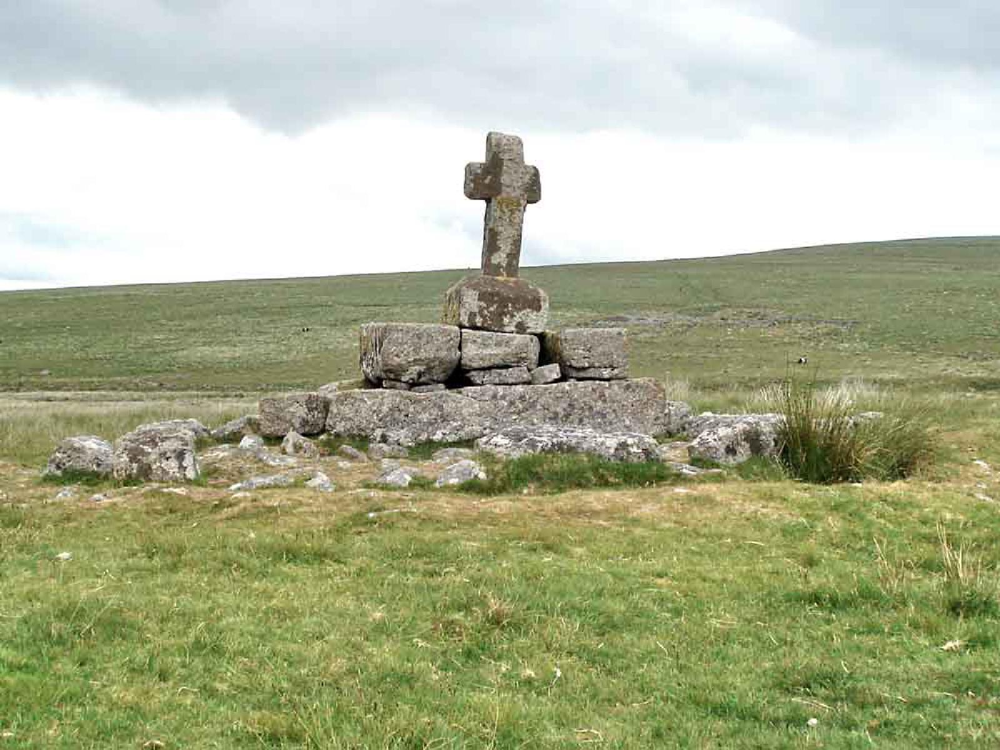

> *Dartmoor is a vast, wild, and rugged upland area in Devon, England, characterized by extensive granite tors, heather-clad moorland, and deep river valleys. It's a national park known for its dramatic landscapes, rich prehistoric archaeology including stone circles and hut circles, and unique wildlife, as well as its iconic Dartmoor ponies that roam freely. The area is steeped in history and folklore, offering diverse opportunities for walking, exploration, and experiencing a truly untamed natural environment." -- Gemini AI when asked to sum up Dartmoor. 

Dartmoor means a lot to a lot people. To me it is my freedom and my cathedral, a place to be myself and reset my mind. I've lived and worked on or near it for most of my life and it's core to who I am now. There are many beautiful places in the World, but this one means the most to me.

As years pass, some valuable Dartmoor websites have been abandoned or become at risk of being lost. I've been fortunate enough to be in a position to be able to adopt and maintain those. This isn't something I charge for, I do it simply to save the information and preserve it as best I can for as long as I can.

If you know of a Dartmoor related website that can no longer be maintained, please let me know and I'll try to arrange transfer with the owner, if they're willing.

These are the sites I'm looking after:

* [Dartmoor Walking](https://dartmoorwalking.org/)

    This site was entirely created by me, but using some of Keith Ryan's guides and pictures from his Dartmoor Cam website. The intention was to create a more accessible and modern collection of walks to help people enjoy Dartmoor.

* [The Dartmoor Letterboxing Forum](https://dartmoorletterboxing.digdilem.org/)
    *Formerly: www.dartmoorletterboxing.org, now expired*

    The original forum for Dartmoor Letterboxing, dating back well over two decades. Sadly, Letterboxing is in decline, primarily (in my view) because it's so hard for new people to get a toehold as many boxes are Word-of-mouth only, combined with the popularity of Geocaching.
    However, the historical posts are worth preserving. It was impossible to archive the forum as a functional PHPBB site and keep it secure, so I have exported the posts as static HTML pages. 

* [Dartmoor Cam](https://dartmoorcam.co.uk/)

    Created by Keith Ryan, a well known local Walker and lover of Dartmoor, this is a very rich source of walks with excellent descriptions, photos and maps.
    Sadly, Keith died in 2023 after illness. I worked with him and his Wife to migrate these pages across to preserve them.

* [Dartmoor Tick Watch](https://dartmoorticks.digdilem.org)

    A survey of ticks on Dartmoor up to 2009, organised and collated by Keith Ryan.
    The original domain expired in 2025 and I've added it as a sub-site of my domain.

* [The Cornish Pasty "The Compleat Pastypaedia"](https://cornishpasties.org.uk/)

    Simultaneously a deeply knowledgeable and humorous study of traditional Cornish cuisine, again by Keith Ryan. 
    *Cornish, not Dartmoor, but they're good neighbours*

{}

