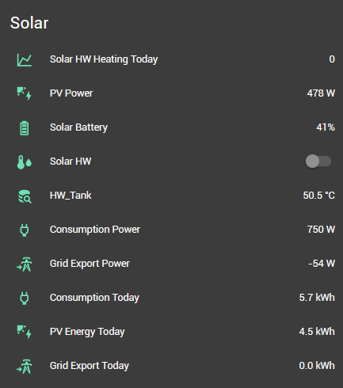

*(Free in third party energy costs, anyway)*

## Update after three years

I've not had to change or maintain **any** of this setup – everything has continued to work perfectly. Through the summer, a typical sunny day charges the 5.4kwh battery by about 11 AM, then heats the water and exports to the grid for another few hours before the hot water's heated. For our house of two, that meant the LPG boiler that normally heats the water stayed off through all of July and August, and most of June and September. Not bad for an investment of £85

## Background

I had Solar panels fitted a month ago. At the time I discussed with the engineer about using excess to heat water, directly from the inverter. But there was no immersion heater fitted to my tank at that time, and the installer wasn't keen on adding that to the job.*(And having fitted it myself now, I totally understand why, fitting the element was a tank-out pig of a job that took most of a day)*

But once the solar panels were fitted and generating power, I wasn’t entirely happy to see the excess being pushed back into the grid for nothing. (After much setting up and back and forth, I did start to be paid 5p per kwh, but as I pay them 33p for the same, I don't consider this a *great* deal)

Anyway, I scratched my head and came up with this system.

## Items:

- The Inverter and Battery and GivEnergy systems are integrated into my HA setup thanks to [cdpuk's integration 11](https://github.com/cdpuk/givenergy-local), which works perfectly. This allows me to get all the stats I need into HA, and display them like this:

- A low power 1kw 27″ top-mounted immersion element. Normal immersions are 3kw, which is more than I can generate to excess. 1kw is perfect for me. I fitted this to the tank (fiddly) and connected it to a 13a capable flex which connected to a standard UK 13a fused plug.  

   

- A TPLink MiniKasa smart socket. (wifi) The socket is rated for 13a and by choosing a low power immersion (they’re normally 3kw for fixed wiring) I’m keeping load on that around 5a at 230vac, and the switch is not getting warm. I would be more concerned about load with an unbranded or low quality switch. But even in a warm room, this is fine. 

    

- A Onewire temperature sensor on the outside of the hot water tank. Have also used Aqara sensors for this. On the picture above, that's the "HW_Tank" reading on the above screenshot.

- An existing Home Assistant setup. 

## Cost: 

- £73 for the 1kw element. 
- £12 for the MiniKasa smart socket 
- £5 for ancillaries (socket, wiring, sensor, tea)
- £7,700 for the solar install *(ahem)*

## Controlling things

This just needs two very simple automations

1. If the solar system is sending >1200 watts to the grid for more than 5 minutes and the temperature of the tank is <60c: 
    - Turn **on** socket feeding the immersion.

2. If sending <1000w to the grid for more than 3 minutes **or** temp >65c:
    - Turn **off** socket feeding the immersion. 

## Safety:

Some things to consider if you fancy doing something similar.

- This is a traditional UK Y-Plan **vented** hot water system. It's fed by an unpressurised cold water tank in the loft, so there is little risk of explosion should the water get too hot. 

- My tank didn't have space to insert the heating element in-situ, so I needed to drain and remove it. Even then, the top nut was very stiff and difficult to remove. 

- Be competent at mains wiring.

- Choose an immersion element with dual thermostats. One of these should be set by the factory, the second is where you set the target temperature. Once either is reached, it will cut power into the element regardless of the switch. This system is independent of HA and any automation - that's important.

- Build in as many safeguards as you can. For example, I have a tertiary automation that turns off the switch if it happens to be on at sunset, when there's no chance of any more free power. This is a safety precaution, but also a cost one. Electricity from the mains is expensive - I don't want that to be heating my water by accident!

It's working great. The water gets hotter

## Result

It's working great. The system satisfies my house hot water needs entirely on any sunny day (in Winter too). My LPG boiler doesn't get used in the summer, although it's still connected and will step in if the water drops too low during its own schedule.

It's hard to estimate the cost saving, but it certainly repays the investment several times a year.  (That's this project, not the whole solar install!)

