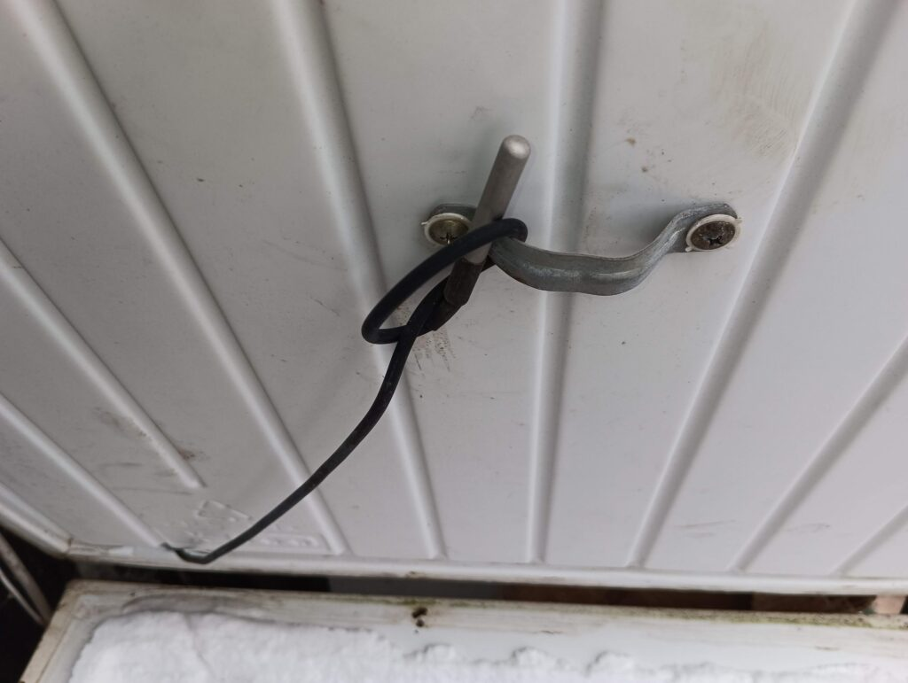
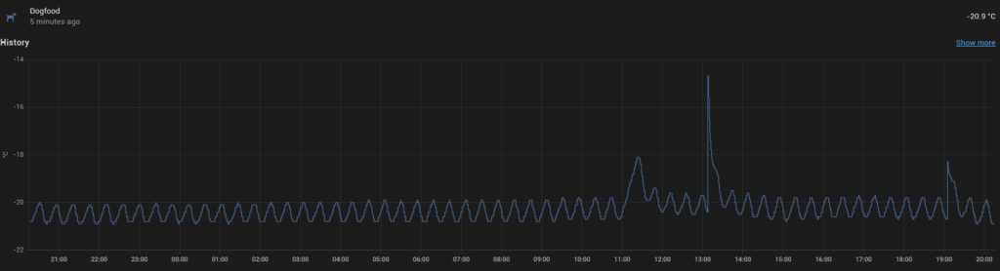
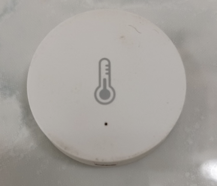
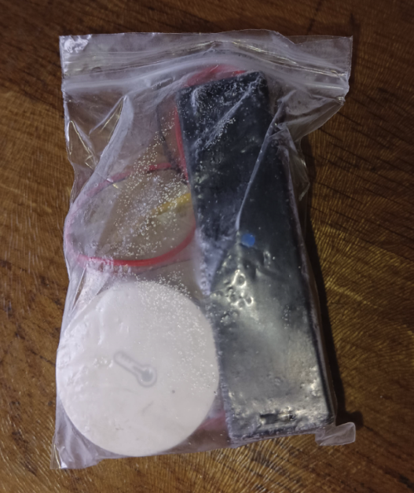
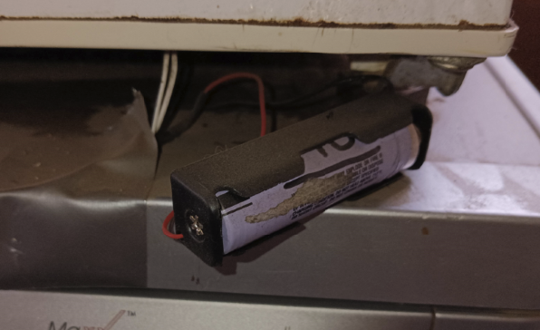

* [Please also read my article about keeping Zigbee and other battery devices running in sub-zero temperatures](/home-automation/zigbee-sensors-in-the-cold/)

*Or dealing with battery failure in minus twenty degrees.*

Some years ago, I filled one of my freezers with frozen meat for my dogs and forgot to turn it on. My dogs helpfully reminded me three weeks later when it started oozing liquid out through the door. Finding a home for 80kg of rotted meat in open plastic bags was one of the less fun jobs I’ve had, and trying to prevent this happening again drove me to start monitoring their temperatures.

I currently use two methods to measure these temperatures, and have an Automation that alerts me whenever one of the temperatures goes above -5c. This should alert me if I’ve forgotten to turn it on again, as well as freezer failure or someone leaving the door open. With the average cost of a freezer’s contents being over £100, it seems like a sensible thing to do and over the years has alerted us to several non-closed doors.

# Method 1: Onewire

One method I use is to add a Onewire sensor inside a freezer by poking a small hole in the door seal by the hinges and shoving a waterproof DS18B20 sensor inside – like this:

This does work well and produces graphs in Home Assistant like so:

### Pros and cons of onewire in this instance:

## Pros:

* No batteries to run out
* Regular readings at your own requirements.

## Cons:

* The need to poke a hole in the door seal.*(If you have some flat wire, you can avoid this by just closing the seal over it)*
* Fixed wiring. This might be unsightly and time consuming to fit. I’ve used it where I had an existing Onewire run nearby.

# Method 2: Zigbee Temperature Sensors

Wireless temperature sensors like the Aqara are cheap, reasonably accurate and small. If you have Zigbee already, then I would suggest using these.

These use CR2032 button batteries. In normal, room-temperature, situations these last for up to a year. However, in a freezer at -20, I’ve had good, branded batteries fail after 3 days!

To overcome this, I’ve modified my sensors to use 18650 rechargable batteries by connecting wires to the battery compartment in the Aqara that go to a battery holder. That can be in the freezer with the sensor, making a very portable little unit – or, with longer wires, outside of the freezer to stay warmer.

Whilst the room-temperature version should last longer, in practice I have found little difference in lifespan. Both last at least six months before needing recharging.

Incidentally, it’s no big surprise that range is affected in these low-power sensors by putting them inside a big metal box! However, they still reach across my house to my Slae.sh Zigbee usb stick and reliability has been excellent.

## Pros:

* Neater and quicker to install.

## Cons:

* Less regular updates – these sensors only send a reading when the temperature changes. However, in practice this is a non-problem since the freezer is always cycling and updates are adequate.
* Still a need to replace batteries.
* Potential range issues when inside a freezer.

# Alerting to a problem

Below is my automation in Home Assistant.

If any of my five sensors go above -5c, then send myself a message over Telegram and run a Shell command (This plays a .wav file to a speaker that tells the house that a freezer is over temperature)

And finally – apparently having five freezers is unusual! I have been told this!

