*Cooling servers using household plumbing*

> "How to water cool computers using household plumbing equipment"

I like peace and quiet. Most water cooling rigs available for home PCs are anything but – they only use water to move the heat away from the CPU and GPU to a finned radiator, then blast it with fans. I thought that radiant cooling would work and not need any fans, so I built a water cooling system. It worked perfectly for a linux server and my gaming windows PC for three years, until I had to free up space and instead focussed on sound proofing a cupboard and using air cooling. This was back in 2010 but there's no reason why it wouldn't work today.

* Note: *This was a project I did around 2010. Prices have increased since then.*

## The plan

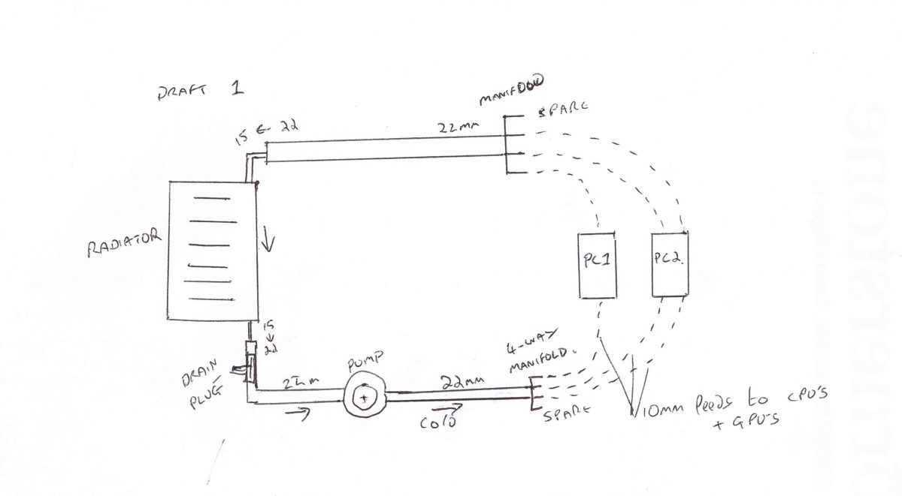

This shows the initial plan of using a 22mm to 10mm 4-way adapter. In practice, my piping leaked here, so I used a flow and return circuit of 22mm copper, reducing to 15mm and then onto flexible pipe

## The Equipment

I had most of this lying around after fixing various household heating problems. All standard UK wet central heating equipment. 

The only non-standard bit were the CPU and GPU water heatsinks. They cost around £10 each, second hand from ebay.

Total additional cost was about £95 – this was for the radiator, pipe and the heatsinks.

* The pump is a standard UK central heating pump. These are ceramic and designed to run 24/7 pumping water up to 80'c and use around 25 watts at speed setting 1 of 3.
* The radiator is a small standard single pane radiator. This barely ran above room temperature (whgich is 15-30c), so oversized was it. It could have coped with at least six CPUs and GPUs. Bear in mind that all the piping is also radiating away heat, so by the time it gets to the rad it's already dropped a few degrees.

## Test fitting it in the garage

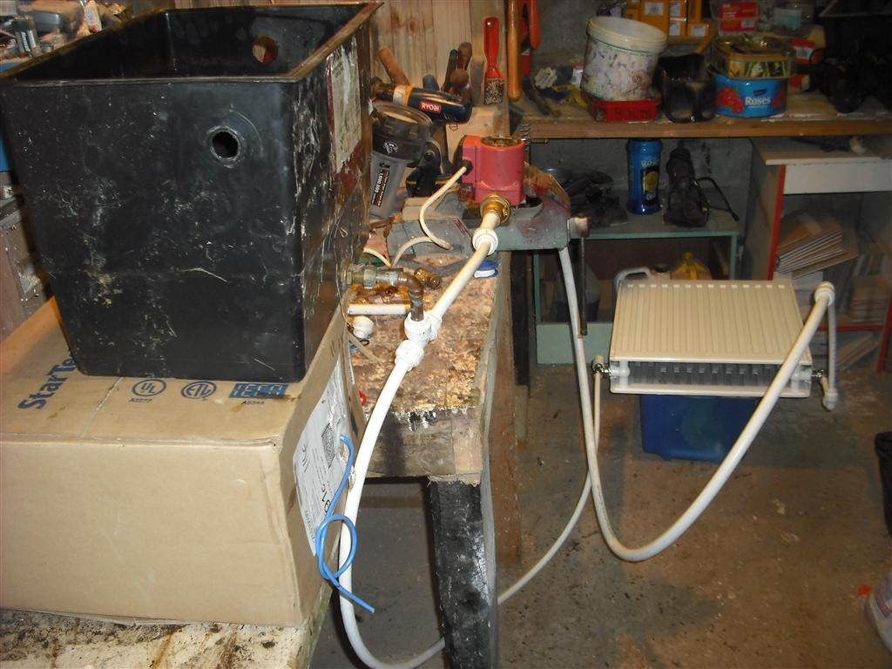

To explain this: The black plastic tank is the "header", containing water to fill the white pipe and allows and air in the system to vent. Fresh tap water contains a surprising amount of air which takes time to settle out. This tank needn't be as big as this – but I had this spare.

Then water flows **IN** to the red central heating pump. Having the air vent before this allows much of the air to escape before hitting the pump. This causes about the only noise this system creates and lowers efficiency of the pumping, since the bubbles act as little pressure-absorbers. Handbooks will tell you about cavitation risk here, which might damage the impeller as well as creating noise, but I consider this risk very small given the speed and low temperature of this water. But it's still good to avoid anyway.

After the pump, the water would go to the "Cold" side of the 15mm copper manifold (not shown here), and after passing through the heatsinks, would go ito the "Hot" manifold which then led to the Radiator.

Both inlet and outlet of this rad is on the bottom, so some air will collect at the top and can be bled away with a normal radiator key. (Once running for a while, the water loses its air content and no further bleeding will be needed until you introduce fresh water – just like a wet central heating system)

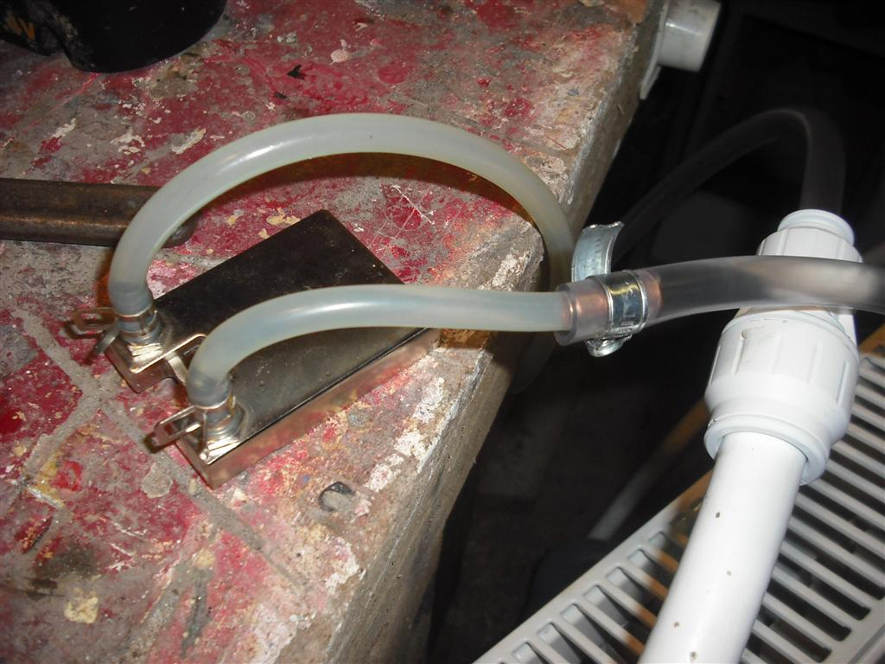

This shows one of the heat sinks being tested for pressure and stepping down in pipe sizes. Note the metal sleeves inside the joint – this worked well as the pressure really is very small. Warming up the pipe ends in a cup of hot water allowed them to soften enough to form a snug fit.

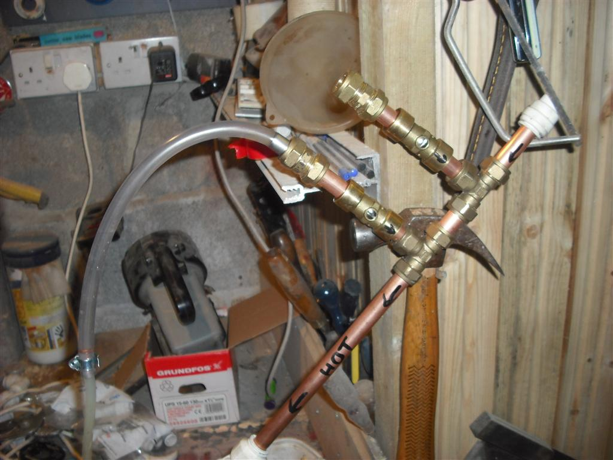

This shows one manifold created for two computers. Then the return flow speed from one block. It's not much, but doesn't need to be.

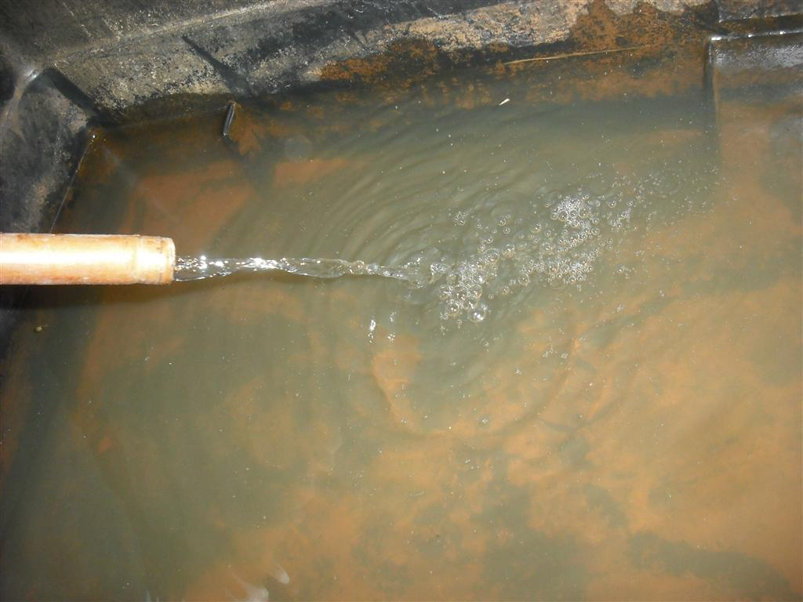

Overall these tests in a safe place were very useful to gain an understanding of how best to get this running together.
Fitting it together in place

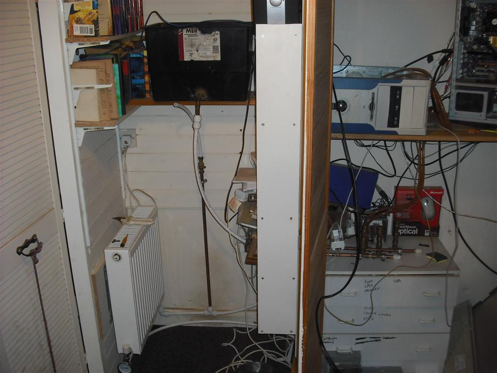

This shows the header tank and radiator in position, and the manifolds present on the lower right hand side inside a cupboard. You can see the clear pipes leading up from them to the computers above. (Stained red from a relatively small amount of rust in the system. This didn't affect operation and turned out just to be a thin coating on the pipes, with clear water after a few days)

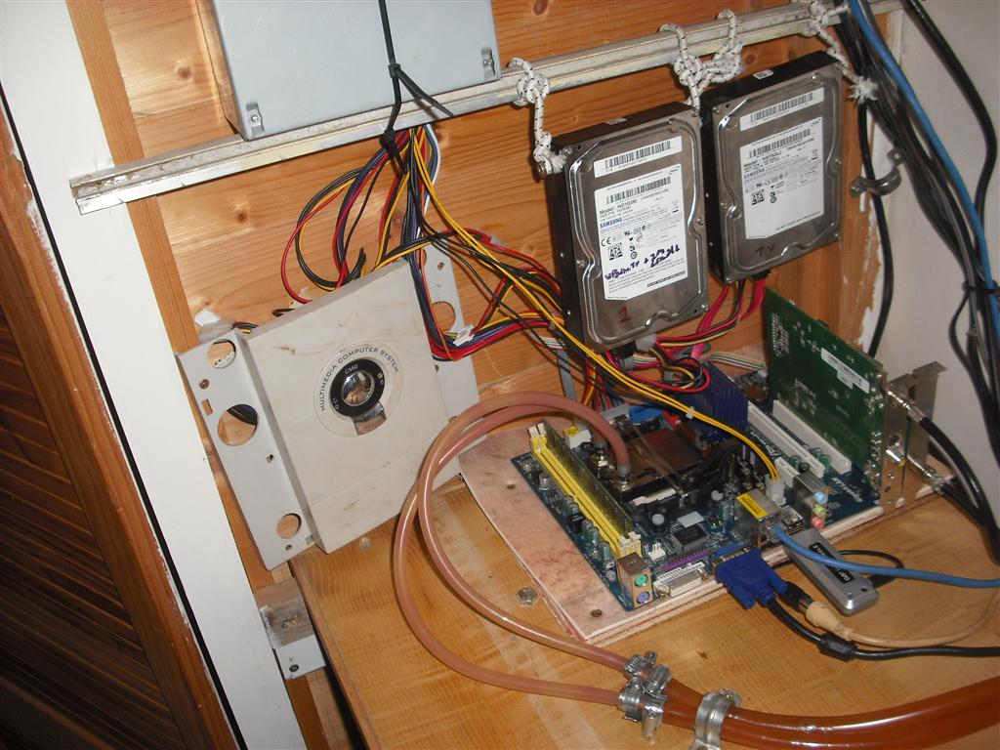

This is my linux server running very naked. You can see the flexible pipe coming into the cpu block. The hdd's are on elastic to reduce vibration noise. I still run naked machines nowadays, even with cpu fans, as I have a nice soundproof place to put them. Cases aren't needed if you can limit physical access, and this removes the need for a case fan entirely, as non-hotspot sources of heat radiate upwards naturally.

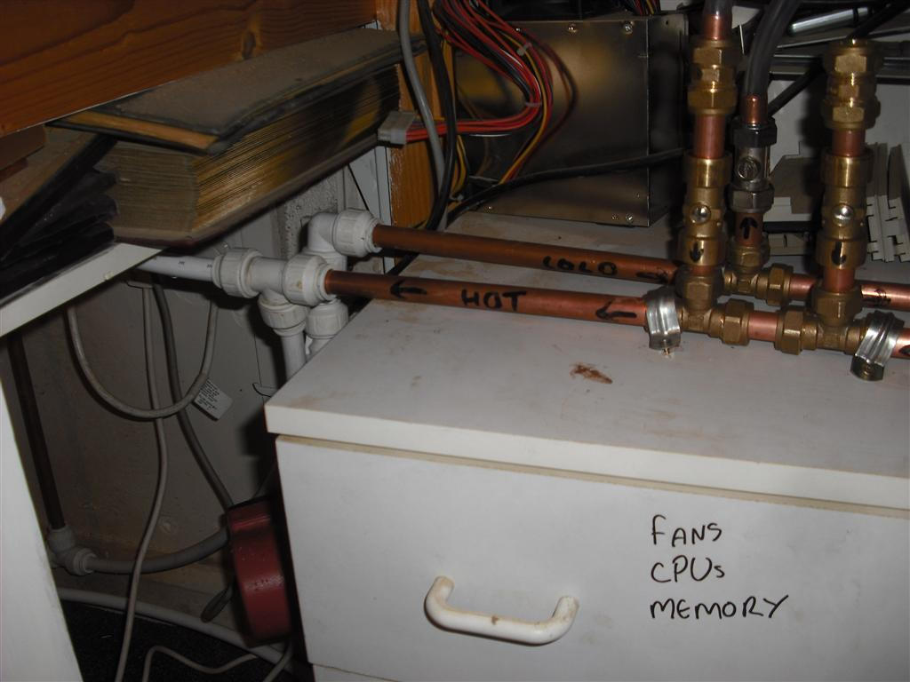

A close-up of the manifolds. Cold comes in from the radiator, Hot leaves to the pump. Each vertical section has a service valve that allows you to isolate supply entirely for one computer without affecting the other.

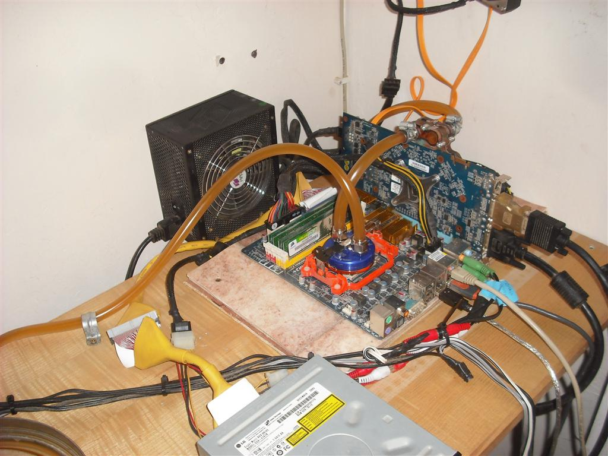

This was my windows PC, a gaming computer. Here the Cold supply comes into the blue CPU heatsink and then leaves to feed the GPU heatsink before returning to the Cold manifold. My view was that it's more important to cool the cpu first, but in reality the flow was enough so that it didn't really matter. The GPU didn't run much hotter than the CPU.

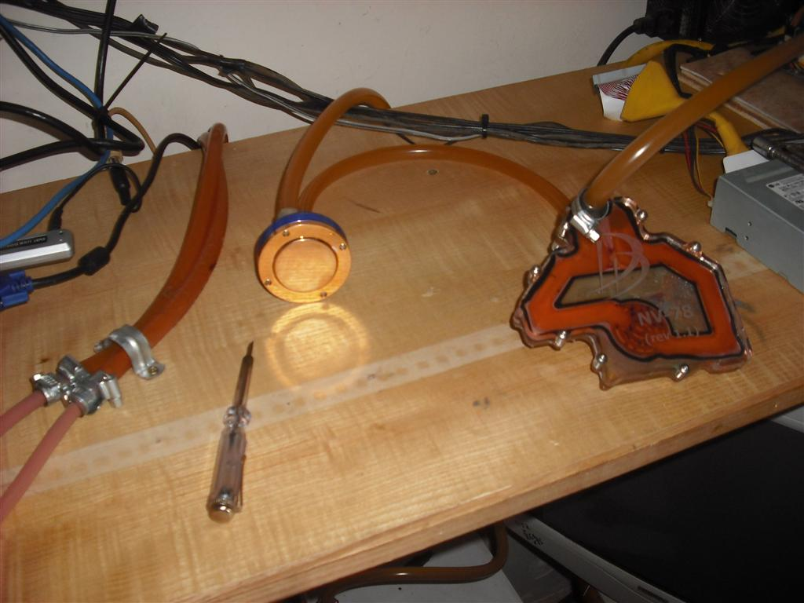

This shows the same heatsinks before fitting them, so I could test for leaks and flow.

## Results

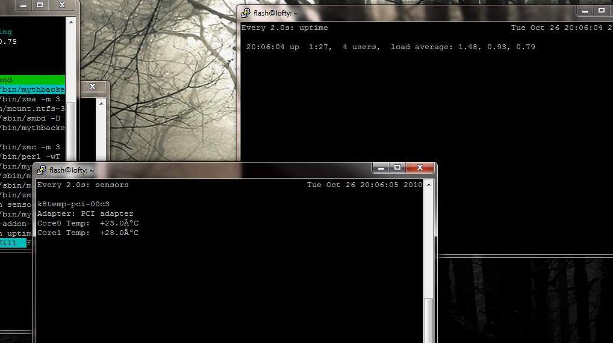

And some test results. This was a 2-core CPU running 'stress' to give some load, and as you can see the cpu temps are barely above ambient. I don't think this machine ever went above 30'c cpu temp during the several years of this operation. *This machine would normally run at 50-60c when aircooled*

## Thoughts

I enjoyed this project and the benefits it brought for several years. The pump never failed and was almost silent in operation (except for air bubbles and the very faintest hum). I never had a leak nor had any failures whatsoever, but obviously that is a risk with any wet system. The biggest noise was the PSU fan, but with 120mm fans and choosing 'quiet' models I deemed it acceptable. 

Eventually I upgraded the GPU on my gaming PC and I couldn't find a compatible water block for it (remember this was before water cooling was as popular as it is now) and so I regretfully removed the kit. I replaced the linux server with an HP ML110 which went in an outbuilding, so that was no longer a noise source.

I still run my desktop in this cupboard without a case, finding it runs cooler than being in a metal box. There's now a 120mm fan fixed to the wall exhausting warm air to the outside, and the doors are lined with soft foam and thus the noise issue has been solved in a another way. My actual desk is on the other side of the room, with 5m extension leads to a USB hub and the monitors.
