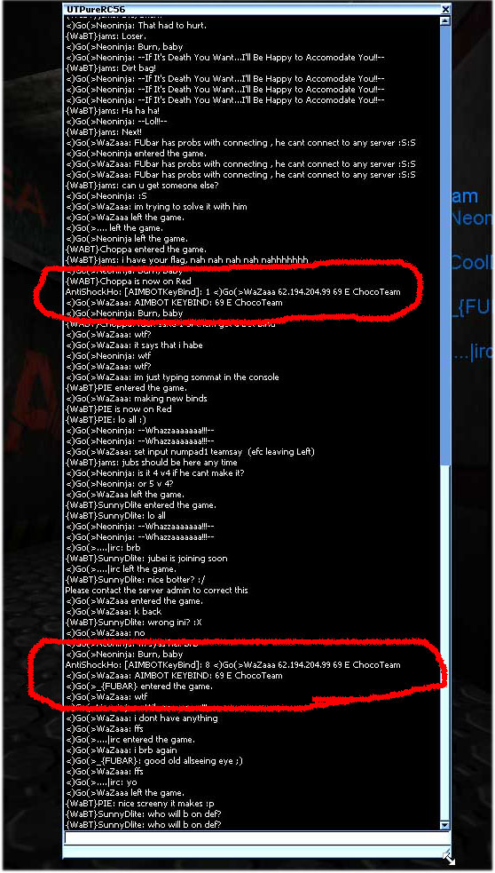
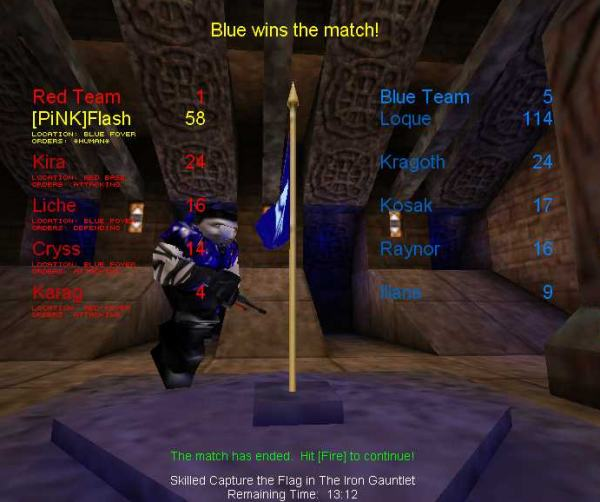
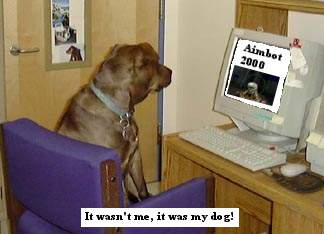
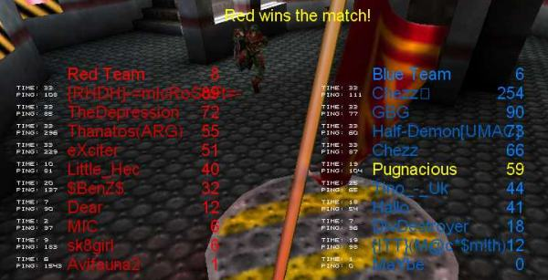
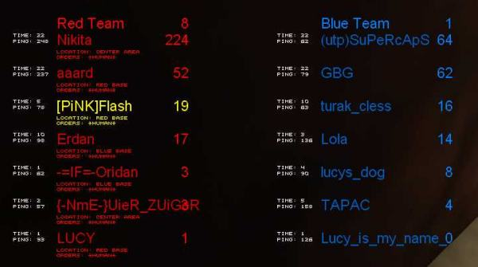

# Flash's Aimbot FAQ
------------------

***Please note - I wrote this over two decades ago when I was trying to make UT an equal playing field. I've no idea if any of it is relevant to other games! -- Flash, 2025***

* And other Unreal-Tournament related cheaty bits
* Don't ask me about UT2K3, MOHAA, MW or any other game - I only play UT! Suffice to say that if you can aim a weapon in a first-person-shooter, then there is a cheat for it. Most FPS cheats have similar properties to the below, so this may still be of some use.
* ~~In-depth info about ASH, by \[PiNK\]Bunny (Outdated)~~
* ~~Catchers CTF have a list of ASH binds too~~

### Update October, 2005: Added pic of brightskin for the curious. Some parts of this faq are seriously outdated.  
Update April, 2005: I did some more checking to see what was out there now. From what I'm hearing, most of the UT cheat writers have now left UT alone and moved up to UT2k4, but one or two still exist. Private cheats (the hardest to block) are rumoured to still be in existence, but the likes of Pure, UTDCC, qValidate etc apparently now kill all, or almost all, publically available cheats

However, servers without top-rate anticheat are still vulnerable and the bots are much more sophisticated than when this FAQ was first written. For example, feature lists now boast that rockets will automatically aim at enemies feet instead of body/head, automatic disabling for grenade and redeemer, stops tracking enemies at the far end of the map that are out of weapon range of your current weapon etc. I think this makes checking for cheating increasingly difficult by merely watching a demo.

"Tweaks" such as brightskins are still very much in evidence amongst high ranking players. Clanbase this month alone results in Mastertimer catches (A timer that tells you when shieldbelt etc is available) and things like high-contast skins that make a player glow with their associated skin colour. Radar users are still being caught. While these aren't as bad as aimbots and triggers, they still give an unfair advantage and clanbase will deal strongly with clans found to be using players with such things.  
Update November, 2007: Still plenty of aimbots in the wild and anti-cheat development has slowed down to only one realistic choice - UTDC. More evidence of at least one increasingly sophisticated aimbot which is much harder to identify from spec. It can adjust the rate of accuracy - sometimes identifiably through "hit/miss/hit/miss" with instant hit weapons. Tracking is much smoother and seems to have added randomness. It also switches targets by more factors than merely "closest". It works also with rockets, flak and other weapons, not just hitscan ones. To identify - well, I'm not going to give all the tells since I know aimbot writers have been using this FAQ to find ways around it, so sorry! Suffice to say that an experienced demo watcher or speccer will know something's not right.  
UT3 beta demo reportedly had an aimbot released for it within six hours of release. I cannot say whether that is accurate, but aimbots certainly were proved in the wild within a week. The beta demo has NO anticheat, no scripting support and no useful admin tools so it's pretty much a wipeout as far as keeping cheats out is concerned.

### What's an aimbot?

It's a mod for UT that assists with aiming. To put it bluntly, it aims for you with 100% accuracy. You cannot miss. Every sniper round is a headshot, four shots with the enforcer will take out someone with full health. It allows someone with no skill to dominate the game. When used with server-side mods like Instagib it disrupts the game so much there is no point in having a game. Some bots are incredibly sophisticated and offer a whole range of other additions like radar, enhanced HUD and so on.

### Sounds 1334!!!11 Wh373 d0 1 g3t 1?!!11!!!!oneoneon

Not telling you. See below. And learn to write properly.

### Why are aimbots bad?

Ever played against Loque on godlike? Try it. Died a lot, didn't you? Now try it with instagib. Bet you never killed him once did you? That's because the stock UT bot, Loque, has an aiming efficiency of 100%. Loque is using an aimbot. As soon as you are within line of sight he locks onto you and hits you perfectly every time. Someone using an aimbot is basically using the same code as Loque does.  

Games are about skill, someone using an aimbot is not using any skill. There is no point in playing a game against a perfect bot. Forget any idea that you're playing against the cheater, you're not. You're simply putting your own skill against a script that's 100% perfect, and what's the skill in standing in one place holding down the fire button? It's no fun, and why play games when there's no fun?  
UT has been _devastated_ by aimbots. Not just because they're used, but because it's made people paranoid. Does your opponent seem good? Perhaps too good? Maybe he's using a bot? Could be. Or it could be he's just good. See the problem?

People who use aimbots and other cheats have no respect for any other player.

### Do I have an aimbot?

If you're asking, then probably not. You know when you are because you don't have to aim. You'll also have had to download and install the aimbot.

### How common are aimbots?

It seems to depend where you play and at what time. For myself I don't see many bots, but it comes in waves. I play only on a few servers I know well, usually against people I know. Some people say they see bots daily, but mostly it's not nearly as common as the paranoia - fuelled accusations. Don't assume someone is using a bot because another player has said they are. It's not unknown for somebody to be accused by another player because they're simply better and the other player is having a tantrum and wants them kicked.  
I've seen the most bots during the school holidays, weekends and usually during the day and early evening. I can't remember seeing a single bot being played after midnight, which I think my Profile (below) explains.

### I'm fed up with bots and want an _honest_ game!

It's possible. If you encounter a cheat more than once on a server, avoid that server for a while. Play at different times, late at night usually results in better players and fewer cheats, and the pings are better too. Also consider joining a clan. Clan matches are run by a set of rules and if a cheater is proved then that clan will run a very real risk of not only forfeiting the game but possibly getting a stiff penalty or even resulting in the player or clan being banned completely. Clanbase doesn't prevent cheating from happening, but at least you get some satisfaction knowing they will act if there is proof.

See ~~www.clanbase.com~~ for details on clans and leagues.

### I run a server, how do I stop people cheating?

There are mods that help prevent cheating. CSHP is the most famous but is no longer being developed and has been compromised badly by several bots. CSHP is no longer a valid option.

UTPure _is_ being developed but it has a cost. With Pure you cannot run many extra mods on your server because Pure insists on a "pure client". At the time of writing, some versions of Pure have been compromised so ensure you're always running the latest.

Clan Vikings have a list of CSHP and PURE mods, past and present, ~~[here](http://www.clanvikings.org/download/cshp/).~~

~~Read Bunny's article about ASH also.~~

Anti-Shock-Ho is a nice little mod that has rudimentary anti-cheating that has caught a LOT of high profile clan players recently. Amongst other things it checks UT's ini for common cheating keybinds, and reacts in a variety of ways, like forcing the cheater to say "I'm a cheater!" and kicking him when he tries to use it. 




Update Oct05: ModMenuChecker, UTDC and others are being used with good success.

Update Nov07: A late version UTDC, combined with Pure/ModMenuChecker.  
Anthchecker has some good points, but used alone isn't very reliable as it's outdated.

### There's a cheating on my server, what can I do?

Firstly make sure he is cheating. See paranoia above. One persons' word ain't enough. Logs, demos if available and multiple complaints are all good stuff. ASH warnings and UTPure logs are considered proof. However - it is your server and if you don't want somebody there for any reason, keep 'em out. Unless you're sure, best not to accuse them of cheating though. It'll hurt your own reputation.

###  Upgrade your anti-cheat protection (i.e.. Pure).

Check logs to find the IP of the cheater and ban it. Unfortunately because many people use DHCP or dynamic addresses they may be back. There is no easy solution to this other than the drastic step of banning an entire subnet and possibly denying non-cheating players access also. A short-term subnet ban may discourage the cheater. There is, in fact, a better solution to this - but I can't reveal it or it would instantly become worthless.  
One method I've used which I can describe about is to hostmask specific ISP's or hostmask ranges. This is more effective than simple subnetting which can be hugely unreliable (some people get multiple top level ranges which can't be blocked without significant collateral damage). Exactly how I do this I can't be specific (sorry) but it involves a perl script and Net::DNS.

I don't know of any network of admins who share cheater IP's but I think it would be a good thing. If you know of one please ~~tell me~~ so I can update this site.

There has been suggested a "Hall of Shame" where cheaters nicks are made public, but I don't think that's a good thing. For one, it's too easy to blacklist someone you don't like, and for another the cheater just changes their nick or worse, even uses someone else's nick - it's not like Half-Life , UT2k4 where each CD has a unique key that ID's the player. The anti-cheat community maintains their own private lists of known and suspected cheats.

One server is running an irc channel (irc.quakenet.org - #antibottersinc) which reports known cheaters as and when they're caught in-game by ASH. Also view #anti-cheat for reports from several server clusters (Jolt, Truffs, GS etc)

~~Jolt forums quite often list high profile cheaters found on Jolt servers.~~

### I got kicked by a server that said it had detected a bot!

Have you got one? Then good...

If you aren't then try again. Pure especially occasionally takes exception at something in your setup. If you get repeatedly kicked then it's time to reinstall UT in a new directory. (Reinstalling over itself won't work) Also note that with UTPG's 451 patch there is a known problem with older servers not running the latest Pure which can result in result in persistent false positives. Either downgrade or keep two installs of UT, one for unpatched 436 servers and one for new 451 servers.

One way around this is to keep a minimal install of UT separate for online play. Fewer mods means fewer false alarms. UT runs faster and smoother too.

### I think someone's using one, what do I do?

The best way is to disconnect from the game and reconnect as a spectator (tick the spec box in player setup). Click your way through the players until you find your suspect.  
Open console and type "behindview 0" and you should have a players-eye view.  
Also a good idea to type "demorec suspectcheat" to record a demo and gain some proof. (Will create the file "suspectcheat.dem" in your unreal/system directory which can be viewed later by typing "demoplay suspectcheat")  
Now sit back and watch for telltales.

If watching a pre-recorded demo, opening console and type "slomo .5" (yes, _point_ five) reduces the gamespeed by half and makes it much easier to spot telltales. Return to full speed with "slomo 1". Note this won't work if you're using Demomanager to start a game with ?timebased as that forces a consistent game speed.

If the crosshair jerks rapidly from one target to the other, instantly locking on then there is little doubt that he is cheating. Note that the more sophisticated bots will smooth the aiming to make it harder to detect and now even introduce wobble and overshoot.  
If you're new to UT then you probably won't have the experience to tell a good player from a cheater using a sophisticated bot. If in doubt, ask someone else to view your demo or send it to the admin for his opinion.

Some players have custom skins that make speccing difficult - they plonk the weapon in the middle of the screen so you can't see what they're aiming at. If this happens, amend your own setup so "Weapon hand" is set to "Hidden" as you spec or when you watch the demo. Such a skin isn't proof of cheating on its own, but is sometimes used by cheaters.

If they only use instant-hit weapons be more suspect. Aimbots don't work too well with rockets, flak, slime or razor, though I have heard of an alt-flak bot, and even primary flak is far more effective with a bot close-up. Rockets are most effective when fired at an enemies feet - so someone doing this is not using a bot (unless they've temporarily disabled it). 

_Update April, 2005: Bots can now aim rockets at enemies feet. Instant rocket fire enabled, automatically turns off for grenades and redeemeer, senses max range of weapon and doesn't track/fire at enemies beyond the range of the weapon._

It is difficult to judge fairly. The more canny botters will switch to different weapons, or switch off the bot if they think they're being spectated.

If the player doesn't _play_ like a great player but still scores highly, be more suspect. A good player will work the map, usually dodge a great deal and play both offensively and defensively. Yer average aimbotter (see profile below) is a newbie who hasn't got the skills to fully play the game and so uses a bot to gain what he thinks is respect.

Because of the way UT works, where you aim is where you're facing. If your suspect is running along a gantry and suddenly locks onto a target and continues running off the gantry, or falls into slime or lava, we've either got a complete muppet (who will have a crap score) or a botter (who has a high score).

If a player is wearing a clantag give them more respect if it is a genuine clan. Clan play is the highest level of UT skill and if you normally only play offline or even on public servers you simply will not believe how good some people can be without cheating. Someone wearing a clan tag is also wearing his reputation and if it's worth anything he will not risk it by being caught cheating. This isn't proof on its own however, it's not unknown for somebody to wear someone else's nick and tag. There are ways of reconciling the name a botter uses and what their real identity is using irc. However - there are at least two aimbot clans who wear tags: \[DD\] / \[D2\] and \*69\* - Anyone using those tags is almost guaranteed to be cheating.

### Someone accused me of using a bot!

If you're not, well done. It means you're a skilled player. Take it as a compliment. If the accuser keeps on going on about it, just ignore him. If he gets other players wound up and they kick you, just move onto another server. Players who willingly believe aimbot accusations with no other proof are probably newbies and not worth your time anyway. You could be being lame simply by playing amongst lower skilled players. Find someone worthy to fight.

### Why didn't Epic make cheating harder?

Ask them. They didn't take the reports of cheating particularly seriously and did nothing to make it harder for cheats. They are also failing to release certain sections of the source code even four years later to allow the anti-cheat writers more freedom.  
Update: Epic have released the source code to UT to a voluntary development group who aim to fix some of the loopholes in UT's code to make cheating harder, and also to fix various other bugs. Learn more at the [UTPG](http://www.utpg.org/) site. Nice one, Epic.  
Update 07: UTPG released a couple of buggy patches which introduced quite a few problems whilst solving others but haven't done any work for over three years. I think it's safe to assume dev for UT99 is dead.

### Loque

Loque is a standard UT bot. His accuracy is 100%. When playing at most skill levels this accuracy is modifed by UT to a lesser degree, but play him at Godlike level and he will never fail to hit you with an instant hit weapon. Loque is an aimbot user. He uses the same code that aimbots use. Because UT has single-player support it has routines for the bots to identify and aim at targets. Aimbots use this very code. If Epic had made it impossible for this code and similar code to target an enemy or aim during multiplayer games then aimbots would probably not exist for UT, or at least, not in the numbers they do.



### You're talking crap, I use one and think it's great!

Then you're a very sad person. Read the profile below. You're also confirming to yourself that you lack the skill to compete with other players. You're not competing, you're not playing the game, you're just laming. Got no pride?

One thing you may not be aware of is the security risks you're taking. Think you're 7334? Ever looked at the source code to some of these bots? Might surprise you to see the amount of backdoors some of these bots have and what they can do. If you're truly elite you will know about backdoors and trojans and will take the precaution of checking the code to see what it can do - it's not good for the image to get 0wn3d by someone else's bot. If you don't know how to do this, you're just another wannabe. This isn't bluff, I've downloaded and disassembled perhaps a dozen different bots. Six had droppers in the installer. Seven were unusable in any circumstances on any server using any version of CSHP/Pure. ALL of the ones I checked could be caught by ASH, even if you hadn't turned it on.

Think you can avoid being caught by using someone else's nick? Yeah, quite a few players thought that too - until they were caught, their IP was traced to their irc nick/website/computer/IM etc and their real identities revealed.

Oh, and if you do get caught, please try to be more original in your excuses. "It was my brother/sister/friend/dog/cat" just doesn't work. Or in the case of ASH finding known binds in your ini, PLEASE try to think of something better than "_Well, I tried it once but it's been deleted now..._" Yah, right.



### But I suck! And you guys are so good I don't stand a chance!

We all sucked at first. Good players have put a great deal of time into learning the skills required to stay alive in UT. That is the point of a game. Games are about pitting your skills against another player, nothing else. _Learn!  
_You will get more respect from other players if you try. Acting like a little kid by shouting abuse and/or cheating won't get you any. It's like walking into a premier league football match and expecting to be able to score a goal against professionals, and believe me, there are players that treat UT like a full-time job.  

### I'm curious and want to try one!

I shan't tell you where to get one, but if you merely want to see how they work, feel free to get one and try it offline. Nobody cares what cheats you use offline because you're not hurting anyone. Please fight the temptation to take it online though, and it's safer to install it on a separate install of UT - otherwise you may find yourself caught by ASH and Pure and labelled as a cheater. You will lose all respect from your fellow players, probably get kicked from your clan, your clan may get kicked from any leagues it is in and basically your life in the UT Community will be hell. Be safe, don't take it or that copy of UT online. In fact, disable internet access for that install - backdoors and trojans being what they are. If you find one that only works online against servers running cshp or pure, don't risk it.  
_(Note - this is probably unsafe now as some anticheat software will scan directories outside of UnrealTournament's and if you have a known bot anywhere on your computer it might end up with a ban.)_

### Instagib

Instagib is a popular mod that has only one weapon - the Enhanced Shock Rifle (ESR) that kills with one hit. Aimbots seem to be most popular on insta-servers because it's so instantly effective. It's also pretty obvious - but again, you need to temper your suspicion to begin with. Some players, even me, have runs where everything works and it seems like you can't miss. Demos (never willingly released by a true botter) and specs are the only way to be sure - as above, look for sudden changes in direction, running off gantries and so on.

----------

### Other cheats

### ASMD combo

The ASMD combo occurs when the secondary plasma ball is hit by the primary beam, resulting in a large radius and high damage explosion. There is a cheat that will allow the user to always hit his secondary ball which is a very difficult manoeuvre to make when not cheating. Easy to detect though; Their crosshair will follow the secondary throughout it's path. A good player will usually move his crosshair to where he wants the explosion to occur and then shoot the ball when it arrives. Also watch when an ASMD whore gets caught in close-up fighting where it's not effective and goes into alt-fire spam mode. If the cursor is still tracking the alt-fire balls it's almost certainly a cheat.

### Spec cheat

There is a bug in UT that allows somebody to connect to a server as a spectator yet still interact with the map. Normally they just fly around and can't touch anything. With this cheat they can collect a flag and fly it from one end of the map to the other without being seen and without the flag being seen - all you will see is the flag colour glow when it passes next to walls. They can also park themselves under a lift and prevent that lift from being lowered - this is devastating in CTF-Command at blue base where nobody can get up with the other flag. They can also select the impact hammer and use it.  
Because they are a spectator they cannot be killed. At all. Totally invulnerable. Their name does not appear in the scores list either, nor do they score points. However, if you pass your crosshair over where they are then sometimes their name appears onscreen. People using this cheat are doing it simply to disrupt the game. It is a deliberate exploit of a bug, it can't happen by accident.

As a player there is nothing you can do other than log the time and notify the server admin (address gained by pressing F2). Then tell the other players and leave the server to find an honest game. If the admin doesn't fix his server, vote with your feet.

### Shieldbelt cheat

A bug in UT allows a player to gain the shieldbelt when it respawns even when they're nowhere near it. As far as I've been able to tell this is a genuine bug and hasn't been exploited by a cheater, it simply happens to a random player. Never seen it myself so can't give much detail, sorry.

### Invis and skin-cheats

Within a week of UT being released there was a skin cheat that made the player truly invisible. (Not like the invis powerup). I've not seen it in the wild, and the author claimed not to have released it - but it's pretty obvious when it happens. The only way you'll know someone is there is from sound, weaponfire or their name coming up when you pass your cursor over them. Other skin cheats include all-black skins and rainbow skins. These by themselves aren't a great problem, but they're often used with other cheats and in my experience suggest the player's a muppet and potential cheat - it's a way of saying "I'm better than you - look at me!" which is the mentality that seeks aimbots.  
Today (12 July, 2002) I discovered a new DM/LMS variant on the publics. The chameleon skin. It changed the player team of the user rapidly from red, blue, gold and green. It also used the name-hack that scrolled the name (rapid setname adding and subtracting the letters of the name). This player wasn't using an aimbot (I specced him and then went on to beat him), just being lame and annoying. He was actually a pretty good player, but suffered from the "look at me" syndrome.

> Freakscene has this to say: _I used to run the Jamison/Gold CTF server during the first year after UT's release. I saw this invisibility cheat in action while I was playing on Coret one night. The player was totally invisible, but the playername (which I have forgotten) showed up when the crosshairs passed over him._
> 
> "That guy's in my team, but he's in the other teams' colours! WTF?" Xan-II skin colour bug. Known and that's why that skin is banned in league play despite it being a standard one. Only seems to happen in certain maps (CTF-Andaction certainly, but others too).
> 
> "That guy's carrying a flag when I know he's not!" This is a genuine bug in UT. Can appear to carry either flag but doesn't have the associated glow of a true flag carrier. Most weird. Again, happens a lot in CTF-Andaction and worse when things are laggy. Nearly always seen with the high details skin like Xan\]\[.
> 
> "Things seem laggier when this guy appears in my view!" Some skins, like the high detail Nali skin, can cause lag to other players if their computer isn't too fast. Not a cheat, but using these skins at clan level is often considered lame. But it's easy for someone to turn them off - just tick "Mods" -> "Use default actors" in UT and you'll never see another Nali or stupid Cow.
> 
> Here is a recent (September 05) screenshot from a player taken in game using UTDC's automatic screenshot grabber (players don't know when screens are being taken and sent to server). It shows clearly a brightskin cheat in use. The other player is glowing with their team colour and obviously this gains a huge advantage in identifying and locating targets.
 


### Triggerbot

Far more subtle than the aimbot. It doesn't aim. Instead it waits until the target passes under the crosshair and then fires the weapon for you. Very difficult to confirm. Used mainly in instagib games. I've seen demos of this in operation but never encountered, or at least been able to prove, this online myself. Some say this is far more common than aimbots, but is so difficult to prove most people won't realise. To test for, go into 1st person spec. Player often waves their mouse around a lot faster than normal. Big give-away with the most common trigger bot is that it's colour-triggered; if an enemy wearing a particular colour is under the cursor it fires. It also fires if scenery of that same colour is under the trigger! Take Ctf-Dreary, the team banners, or some other maps where the walls have decorations in strong blue or red colours. I've just watched a high-profile demo (iD.Pain caught, his whole clan removed from the cup and not allowed to enter any more cups on Clanbase). The player would suddenly fire at the wall for no good reason other than it was the same colour. A good human player wouldn't do that, they know the maps. The trigger bot thinks "I've been set to fire at Blue targets, there's some blue under my cursor, let's fire."

### Radar

Some mods allow a small display onscreen that shows the positions of other players nearby. Nearly impossible to prove but if somebody _always_ has a shock-combo or full load or rockets waiting for you as you come around a corner it can make you suspicious that they know you're coming. However - do not assume this; there are other clues for a good player to know you're coming such as sound, you're playing too predictably (always coming the same way, for example) or they're just spamming like mad.  
_Note: This is not like in Tactical Ops where a radar is part of an official mod, not an add-on for a game type where it was never intended._

### Timers

Basically an addition to the HUD that works out when certain items will respawn, like the Shield belt, Keg, armour etc. Difficult to prove, although ASH can catch some common ones.

### Sound hacks

I don't know of any in UT, but they probably exist given that they do for other FPS games. A script takes the information supplied by ESP/3d sound to pinpoint the location of a nearby player, then plots their position on a HUD radar.

### See-through walls, AKA "Wallhack"

A certain graphics card manufacturer released drivers for its card that boasted that it would enable the player to see other players through walls in some 3d games. They hurriedly tried to cover it up but the damage was done and other drivers for different cards have now appeared that give the same results. I once had this happen to me innocently in Quake where a broken driver setup allowed me to see other players coming, most odd. Test as radar.

### Lag-cheat

Unusual, of specialised use yet used in the field quite widely. What basically happens is the player changes his netspeed frequently, from very low (1000) to very high (10,000). This messes up his connection and he lags. Why do this? Because hitting a lagging person is more difficult. It's used mostly for flag carriers. They won't be able to hit a damned thing, but it makes them much harder to hit themselves because they're not where they appear to others. (Especially in insta or when using non-splash weapons). This has been used in clan games, but cheaters beware - the server logs netspeed changes so the admin WILL know you've done it, and clan ladders are now aware of this situation and will disqualify your team. (One recent game showed a player changing netspeed several hundred times in one game) Note that the Pure 56+ will kick a player if his netspeed changes more than 10 times in one game. Also the utpg 451 patch will disallow netspeed changes quicker than 15 seconds.

### Sliding Players

Not a cheat, really - but some think it is so worthy of a mention here. It's a bug with UT when you install the "Compressed Textures" from CD-2. If the server doesn't run them, or there is a conflict, then other players slide about instead of moving, and when dead still stand upright (until gibbed). It's a problem with \*your\* setup, just remove the textures (Control Panel -> Add/Remove -> UnrealTournament -> Compressed textures)

### Hitbox / Hard to kill

Lots of rumour, little fact. Apparently there is a way you can adjust your hitbox that makes you harder to hurt in normal weapon games. Quite possibly the same as "stone skin" cheats that make you harder to hurt. This could simply be a lag / packet loss / tickrate issue, or it could be a cheat - I simply don't know.

### Message Hacks

Not seen much now - beaten by most anti-cheat mods. Allowed a user to "Super Say" messages right across the screen when not logged in as admin. Very annoying.

### Feign Death Cheat

Note, this is not the "trick" whereby you can charge the GES, feign death and then release the goo.  
I haven't personally encountered this, but a couple of folks from [alt.games.unreal.tournament](nntp://alt.games.unreal.tournament) have. I'll let them speak now:

> DragonAsh: _Dunno how it was done, but it definitely messed with the the hit zone of the model. Also, he used it with a speed hack. Basically, the person was feigning death while moving. Couldn't hit him for shit_
> 
> GoPostal: _It's kind of hard to explain, flash. The dude I saw was hitting the ground so fast there were only a couple of frames where he was falling down, and then he would pop back up just as fast. It wasn't the "swimming" posture that fly invokes, but a lying down form. He would do this back and forth and I think it moved the kill box so fast that most hits wouldn't register. Never could get any blood to show from hitting him. It was really aggravating...._

> As I say, I haven't seen this myself so can't vouch for it existing or not being caused by a bug. One possibility, raised by Archangel is that this is only seen by people with the 2nd-CD compressed textures installed ("Sliding Players", above), which kinda makes sense. If that is the case, it ain't a cheat....

### Dodge Bind

Since UT was released people have been trying to write a keybind that lets them dodge with one key. As far as I know, this hasn't been achieved - except possibly with some programmable controllers (like keypads etc). Without cheating some players can dodge frequently and repeatedly, so don't think of it as a cheat. The server controls the pause between dodges too, and if you see someone dodging too quickly, it's probably a dodge-jump-dodge combo. Some might not even consider this a cheat anyway, given that the Hammer-Jump bind is so accepted in Assault.  
Update 13/4/03: It's been confirmed and in use. By addressing the windows API directly the cheat can dodge continually - usually forward in insta-ctf/dom to gain speed.

### That guy's nicked my name!

At least one aimbot package, and at least one standalone script have the ability to steal your name, or the name of any other player in the game, changing it slightly or adding an invisible space so that it looks the same. Doesn't necessarily mean he's using a bot, but it is pretty damned lame. Often used at end-game by aimbotters to brag.

Other Cheats

There are lots of little things that are pretty obvious - like a player firing 3 redeemers in rapid succession (unless the redeemer-arena mod is enabled, you can only carry two deemers). Or when a player dies, two relics appear - including one you're already carrying. (Note some mods like Pinata can alter this kind of stuff, so check first.) _(Thx to Sixdarts for info on these)._

There are also cheats that:  

* Change cheaters' name constantly.  
* Steals your name (adding invis character to make it different and harder to kick)  
* Bypass Antibv (stops players using Behindview)  
* Stops view shaking when hit.  
* Removes the sound of players footsteps.  
* Shows enemies health in HUD.  
* Bypass Anticv (centre view).  
* Changes max distance before you get someone's info on-screen.  
* Shows enemies locations in scoreboard (like for your own team).  
* Remove rocket smoke.  
* Constant taunts (typically Xan ones)  
* Zoom with any weapon.  
* Constant suicides. (For ruining your teams score in TDM)  
* Constant skin changer.

And more... Some of these may seem fairly trivial, but to my way of thinking they are ALL cheats and if found (many of these can be) in a multiplayer game you WILL be treated as a cheater. Don't use these things if you have any honour at all.

-------

### Some fallacies about cheats

> "Ping kills aimbots"

First generation bots would suffer online because they couldn't compensate for a medium-high ping the way a human can. Modern bots can and do - automatically checking your ping and adjusting in front or behind the target. It's still not perfect, and a high-pinger will still have problems using a bot.

> "He shot rockets out of his ass!"

Aimbots don't allow you to do this. If someone appears to be shooting in a direction other than they are facing, it's probably down to lag at your end, his or the server. And because of the way UT firing works, someone doing that probably isn't using one - if they can load a few rockets facing one way, then flip, fire, and flip back - that's skill.

> "Ducking stops an aimbot from hitting me!"

Actually, semi-true. If the bot is configured to only go for headshots, it will miss you if you duck since you then don't have a "head target" visible. But newer ones go for body sometimes anyway to reduce tell-tales and some will deliberately miss to make them harder to track. This did work for me against a insta-bot user in command. I simply crawled right up to his feet with him shooting over my head. Note that if you're lower or higher than the bot, or if ping is altering the bot's use, you may get hit anyway. Newer bots can be configured to go only for bodyshots or a combination.

> "They're moving too fast!"

So far as I know, there is no way a client-side hack can alter speed of movement. Good players dodge all the time and move through the map efficiently and effectively. I've been playing UT for 2 years and thought I'd seen it all, yet last night I went up against a player who seemed to be _everywhere_ and moved superbly. No cheats, just skill.  
Some server side mods like Relics can alter speed so take that into account.  
Update 07: Speed-hack is proven and UTDC will catch it. Unfortunately, it is quite often done unintentionally with modern power saving CPU modes (speed-stepping). UT checks the CPU speed on startup - sometimes the CPU is in low power mode and reports it's current speed instead of maximum speed. As UT runs, the CPU hops out of power saving and gives full speed resulting in UT running too fast. In most games this isn't a problem - the server caps their speed. _However_ - with some mods like Strangelove the speed is controlled by a mutator which doesn't check for abuse resulting that someone using a Speedhack, either deliberately or accidentally - will fly a rocket much faster than anyone else.  

UTDC Logs speedhacks and will report deliberate hacks seperately, so you can tell when somebody's trying to gain an advantage this 
way.  

If you run SLV or similar mods, I recommend telling UTDC to kick speedhackers rather than the default Log only.

To force UT to run at the maximum speed of your processor - use the commandline "-cpuspeed=1800" where 1800 is the maximum Mhz.

> "They're loading rockets too fast!"

Again, this is server-controlled. It cannot be changed by a bot. If you hear a player loading rockets and it sounds too fast, it's probably lag affecting you, him or the server and your client trying to catch up.

> "He shot me right across the map - that's impossible!"

No, it's not. Many gamers have high-spec machines, run huge monitors, low world detail and high res. Such shots can and are made on skill alone.

> "That cheater made my computer crash!"

So far as I know, that's impossible. Using a bot yourself may do that, but remotely - unless your system is wide open anyway (Hint: Use a decent firewall at all times) and you have backdoors running, they can't touch you or your computer. Normal computer housekeeping will keep you safe (running anti-virus and anti-spyware scans)

> "My connection died - it's all his fault!"

Well, maybe. I used to think this was highly unlikely, but a CTF cup match run by Clanbase suffered a DDOS (Distributed Denial of Service) attack during a game recently that affected several players (from different countries and ISPs) from one team AND the admin, so badly they couldn't play or even connect. It's widely known that "Zombies" running on multiple machines (why don't people use firewalls and anti-virus software?) allow their connections to repeatedly ping a specific IP. Now, does this affect you? When you're playing UT online, your IP address is not known to the other players. It IS known to the admin, so a hacked server could give this information. It can also show up clearly if you're connected to IRC at the same time (probably what happened in the above). This isn't an aimbot issue, but it definitely is a cheating one - although maybe not by anyone playing.

> "He shot me through the bloody wall!"

Not a cheat, it's a bug in some of UT's maps. Sometimes the textures of wall joints don't line up properly, leaving an invisible but relevant gap. Weapons with big splash damage (flak, rocket, shock, GES) can damage you if you're next to such a bug. Because of this, and some other bugs in maps, some servers run "CE" (Clan Edition) versions of the same maps that fix these bugs and maybe, as in the case of CTF-November-CE, the inequality of the bases. Do be aware that lag may show you to be in one place (say, safely behind a wall) but the server thinks you're somewhere else - so this may also be the problem.

> "He slid into a wall and I couldn't kill him!"

It's lag. The player has either just lost his connection or is about to. The server is trying to show you where it thinks he is, but doesn't know so won't register your kill. Can be a sign of the lag-cheat above, but generally it means they're about to say goodbye.

> "He caused my server to crash!"

Yes, possible. One good thing UTPG did do with v451 was fix a massive hole that allowed a malicious player to crash a server on join. (Bug exploit)  
However - such exploits still exist and are in use. IP or subnet ban your best defence.  
Note: Under UK law this constitutes a "Denial of service attack" and is a criminal offence.

-----

### Why do you know so much about it?

No, I don't cheat online. I never have and never will. If I can't win fairly then I would rather not win. _(In fact, I demonstrate my skill at not winning regularly. :))_  

I know a lot about cheats because they have affected how I play the game. I have had games spoiled by them and I've made it my business to learn as much as possible about the tools they use so I can fight against them. This means lurking in cheating and anti-cheating forums, hex editing and decompiling scripts and bots to see how they work. You may be amused to learn that quite a lot of the cheating stuff I've downloaded has been infected with viruses and trojans, and several of the most well-known bots have backdoors coded into them, so using a bot is risky not just to the reputation.

I've been a public UT server admin for about four years now, helping first Truff's and now Multiplay's public UT, UT2k4 and UT3 servers. Banning cheats is much of what I do. "Know thy enemy"

I've also run a UT server on my LAN to test these things to see how they work, and if they work against current anti-cheat software.

I repeat, I have NEVER used a bot online, never gone online with a copy of UT that had been tainted. You will not catch me, because I have nothing to catch! Nice feeling, that. I may suck, I might get beaten, but I have righteousness on my side. I respect those who beat me fairly and I respect those who can lose without whining. I still enjoy most games of UT. I still enjoy annoying and shaming cheaters.

### Profile of a cheater

So who cheats? Who are these faceless people who enjoy spoiling the games of others?

Mostly kids, is what. Pubescent boys (always boys, as far as I can tell) who spend too much time with their computers and have little or no social skills. No, I don't think I'm just belittling them because they're "the enemy", I'm pretty sure that's the truth. I've talked with a few and played against a few. They normally have short attention spans, have a huge desire for 'respect' from others that is born of their real life inadequacies, have problems forming relationships, are inarticulate and near-illiterate and are incredibly selfish. I stress that last because it is truly selfish to spoil the games of others for your own pleasure.

There are exceptions to this. I had an enlightening conversation with an intelligent and articulate 23 year old cheater. He understood totally why he cheated and made no apologies. He knew he was being annoying and simply did not care. The older cheaters seem to do it to get a reaction, rather than for "respect". As computer games go on, more older cheaters exist because they've become so dependant on cheating that they cannot enjoy a game without an unfair advantage. It can get to be a genuine addiction for some. Instead of enjoying and learning a new game, they immediately seek cheats for it.

They seem to have a big hole in their logic, too. Presumably someone with such a desire for respect has some pride. What's the pride in knowing your skill is so weak you must rely on artificial aids? What happens when you're caught cheating, what price respect then? How will it feel when your mates learn you feel so badly about your own abilities that you cheated against them? How will it feel when you're kicked from your clan and nobody will ever want you in theirs again?

A skilled UT player normally doesn't cheat. They may use lame tactics occasionally (spawnkilling, spamming, camping) but to become a skilled player in UT you need to be able to learn from other better players, and to me the biggest thrill and the best games I've ever had have been when I've been up against a great player and managed to beat them, or even come close. That is a feeling a cheater will never experience because they are not pitting themselves against the other, just their software. It's like getting a new game and immediately looking for the cheats for it. What's the point?

And that is why a cheater is a sad person. Their lives are hollow and meaningless. They crave attention and gain it by the cheapest means possible.

It's not the winning that matters, it is the taking part. If you cheat you are not a part of _the game_.

-------

### Pictures



A picture of a match I played yesterday (02-Nov-2002). Note high-scorer on Blue. Was playing insta-ctf as Elvis (badly) until near the end when he suddenly went godlike. Note aimbot brag where it was taking other players names and setnaming itself - fairly common. I know the bot used, but won't name it here.



Another recent one. Note score. Ok, fair enough, mostly newbies on that server, but that score just ain't realistic; and botters using the same name as stock UT bots are kinda giving you a hint. Ignore high ping - this was end-game and people taking screenies will upset normal ping ratings - Nikita had a sub-100 ping during game.


------

### Other links

*Note - most of these links are now dead*
  
Clanbase catches a high-profile cheater, [ID:Pain](http://www.clanbase.com/news_league.php?lid=671&mid=0&nid=68256)  
Clanbase catches another cheater, [BB:Satan](http://www.clanbase.com/warrep_show.php?wid=1399435&cid=216760)

Comments, bitches, corrections, additions etc - (Guestbook disabled due to muppets)[](/code/gb/ardguest.php)  
Contact me via the forum please, I don't want to continue getting aimbot requests via email.

Inspired by Money for Nothing, Dire Straits, /Brothers in arms/ 1985  
Original lyrics by Mark Knopfler & Sting  
Copyright this parody : [XandreX](mailto:email-redacted) , 2003.09.14

\*Frags for nothing\*

I want my UT pure.........

```
Now look at them yoyos, that's the way you do it  
You keep hiding while on L.M.S.  
That ain't playing, that's the way you do it  
Frags for nothing and your flag for free

Now that ain't working, that's the way you do it  
Lemme tell you, them guys ain't dumb  
Maybe get a blister on your little finger  
Maybe get a carpal tunnel on your wrist

\[CHORUS\]  
We gotta capture the enemy's flag  
Custom assault, with sniper rifle  
We gotta take these little health vials  
We gotta kill those damn other m8

The little camper with the earing and the make-up  
Yeah buddy, that's his 0\\/\\/N n1ck.  
The little type-killer's got his own strangelove  
That little cheater, he's owning the DOM !

I should have learned to use the hammer  
I should have learned to translocate  
Look at that female she's got it stickin' on the control point,  
Maybe we can have some fun.

And who's up there, what's that ? Xan Mark II skin ?  
Headshotting on the spawning newbies like a godlike player  
Oh that ain't playing, that's the way you do it,  
Frags for nothing and your flag for free

I want my, I want my, I want my UT pure
```

Now almost exclusively: Flash

Previously... \[TrufF\]Flash, _AKA_ \[PiNK\]Flash, \[3am\]Flash, Flasheart, \[3am\]Flasheart, Flash, MonkeySpanker, Spam\_Monkey, Tents\_R\_Us, Dangerous\_Brian, Techno\_Womble, (AGUT)Tight\_Elastic, Exploding\_Nali, Ramper\_Camper, Zanzibar, Pugnacious, Grimwold, Teddy-Bear.
 

> * * *
> 
> ###### Updated Saturday, November 10, 2007 11:56
> (Converted to markdown, June 2025)
