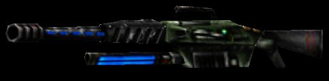

<html>

<head>
<title>UT BIBLE by ocr*flocutus - News</title>
<link href="ocrana.css" rel="stylesheet" type="text/css">

</head>

<body topmargin="2" leftmargin="2">

<table border="0" cellspacing="1" width="650">
  <tr>
    <td height="62"></td>
  </tr>
  <tr>
    <td id="tablehead">Weapons - Shock Rifle</td>
  </tr>
  <tr>
    <td id="wg" width="650">
    
 
      <table align="ceter" id="tablehead" border="0" cellpadding="0" cellspacing="0">
        <tr>
          <td>Damage/hit:&nbsp;&nbsp; </td>
          <td>60h</td>
          <td>primary</td>
        </tr>
        <tr>
          <td></td>
          <td>82.5h</td>
          <td>secondary</td>
        </tr>
        <tr>
          <td></td>
          <td>247.5h</td>
          <td>combo</td>
        </tr>
        <tr>
          <td>Rate:</td>
          <td>1,4/s</td>
          <td>primary</td>
        </tr>
        <tr>
          <td></td>
          <td>2,1/s</td>
          <td>secondary</td>
        </tr>
        <tr>
          <td></td>
          <td>0,85/s</td>
          <td>combo</td>
        </tr>
        <tr>
          <td>Splash radius:&nbsp;&nbsp; </td>
          <td>70uu</td>
          <td>secondary</td>
        </tr>
        <tr>
          <td></td>
          <td>250</td>
          <td>combo</td>
        </tr>
        <tr>
          <td>Damage/s:</td>
          <td>84h</td>
          <td>primary</td>
        </tr>
        <tr>
          <td></td>
          <td>172h</td>
          <td>secondary</td>
        </tr>
        <tr>
          <td></td>
          <td>210h</td>
          <td>combo</td>
        </tr>
      </table>
    

    
The ASMD is a great all around weapon. It doesn´t really have any decent weaknesses,
    but it also isn´t specialised on anything, so the specialised weapons are usually the
    better choice. 
    In long range fights you can use it´s primary mode just like you would use the sniper
    rifle, but it´s by far not as good as the sniper rifle, because it inflicts only a bit
    more damage/second than the enforcer and the rifle has twice the rate of fire. It`s big
    knockback is the only advantage in long range. 
    In mid-range combats the ASMD is a much better choice, especially when using combos, but
    in mid range RL, Flak, Pulse and the minigun are superior in most situations. 
    When fighting close range you can use the secondary fire, which is often even better than
    rockets, especially when retreating, because of it´s fire rate, but can´t match a flak,
    minigun or pulse. 
     
    When it comes to prediction though the ASMD really excells. You can make a combo anywhere
    you want, no matter if your opponent is on a platform above you or about to come around a
    corner. Of course a rocket sixpack does more damage, but it also takes much longer to
    prepare, whereas The ASMD is always ready to fire a combo and you can fire 2 combos in
    quick succession, which is something that can´t be done with multirockets. If it is close
    enough to the player a combo is even sufficient to kill someone with 100 armor. 
    While doing combos you are often very vulnerable though, because the most easy way to do a
    combo is to only move towards the secondary fire ball or away from it and that makes you
    very predictable, as you usually shoot the secondary fire ball in the direction of your
    opponent. 
    A really cool advantage of the ASMD is that you won´t have lots of ammo problems. Because
    of the 20 shock cores that come with the ASMD you just have to drop the weapon and pick it
    up again if you are low on ammo. 20 ammo should last a while if you don´t combo too often
    (a combo consumes 4 ammo). 
     
      
    </td>
  </tr>
  <tr>
    <td id="tablehead">
<a href="javascript:history.back()">&lt;&lt;&lt; back</a>
    | <a href="#top">top</a> | <a href="weapons_pulse_gun.htm">next &gt;&gt;&gt;</a></td>
  </tr>
  <tr>
    <td>&nbsp;&nbsp;&nbsp;&nbsp;&nbsp;&nbsp; </td>
  </tr>
  <tr>
    <td>
<small><small>Unreal
    Tournament and the stylized &quot;U&quot; are trademarks of Epic Games, Inc. 
    </small></small>All other
    tradmarks are the property of their respective companies.<small> 
    <small>© 2000/2001 - Florian Blümm</small></small></td>
  </tr>
</table>

</body>
</html>
