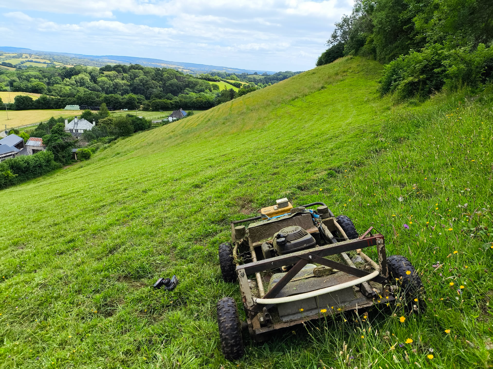

Meet Shawn, my Remote Controlled Lawn Mower.

### About Shawn

We own this steep 5-acre field on Dartmoor where we graze our horses. As horses are not very good at grazing off weeds, it needs topping twice a year to keep the grass in good condition. When we bought the land, it was very neglected, with a lot of high bramble growth and bracken which took weeks to clear. As it's too steep for tractors (Most of it is about 30', with parts up to 45') my wife and I did this ourselves using petrol strimmers. It took months of work to get it in a state good enough to call the fencers in, and they too struggled with the grade. 

After a few years of struggling to strim it, I went to the Royal Cornwall Agricultural Show in 2016 and they had a very shiny remote-controlled bank mower on show. I saw this amazing machine and was very excited! But it cost £45,000 so was obviously out of the question. After spending a few months thinking about this, I started to plan building my own. This has led to a project now around a decade long made up of many variations. 

Today, there are a great many more options available, with small versions flooding the market from China for around £2,000. I'm sure these are great, and anything is better than manually strimming this steep ground, especially as one gets older.

### Specifications

The current version of Shawn that I'm using to mow the field has these key points:

* A Honda 5.5hp engine from an Alko self-propelled mower, which cost £45 off ebay. 
* Four wheelchair motors in two pairs. 
* A chassis made mostly from the frame of a home treadmill, reinforced with bits and bobs - like some angle iron, wooden 4x2's, a strimmer shaft, some plate steel, the handle of the original mower and some water pipe.
* Batteries are similarly mismatched:
    * 2x ordinary car batteries. (Now quiet weak)
    * 2x Deep cycle electric wheelchair batteries. 
    * A 24v pack made up of 12x deep cycle 10AH 12v batteries from a UPS that was replaced.

    These three "packs" each produce 24v which is combined in a junction box, and connected to the control box with Anderson plugs.
* A Sabretooth motor controller. 
* A cheap remote controller. 

A full tank of petrol lasts about 90 minutes, which is about the same time it takes for the batteries to drop below 24v on this steep ground. It's conveniently the time it takes for me to need a cup of tea. The Batteries take around 6 hours to recharge, so it's one session a day. 

The whole field takes around 

### Mistakes made

There are many - this has been a long process of learning. 

* **A big "Stop Button"**

Burned out on the third day of use. Despite claiming to be able to handle 100 Amps, it melted way before then.

* **Ungeared 500w motors connected with chains**

Using mini-moto parts to connect a 500w motor above each wheel connected with chain and sprocket. I just couldn't get the chains to stay on - my engineering skills weren't up to making everything align well enough or robust enough to survive. 

Similarly, using a motorbike chain and sprockets to a single large wheelchair motor to power two wheels on one side didn't work either. Getting everything to stay aligned proved impossible for more than a few hours.

* **Single front wheel**

On flat ground, this worked well. Two wheelchair motors at the back and a big castor wheel at the front. But on any kind of rough ground it started to struggle, and taking it onto the steep ground proved it useless. Constantly struggling for torque and the front constantly steering sharply downhill.

* **Large wheels** 

I made large wheels (24") entirely from metal with spade lugs. These shook themselves apart!

I then made wooden wheels out of fence rails and gave them angle-iron tyres with bolts screwed in for grip. Again, these worked okay on flat ground, but were not workable on the steep. 

* **Keeping the original mower deck**

The first few generations meant trying to fix wheels and motors and controls onto the cast aluminium mower deck. This was really hard as the angles were all over the place. I don't know why I didn't think of it before, but removing the engine and putting it on a flat piece of steel, and that onto a rectangular chassis, made life so much easier!
