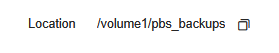
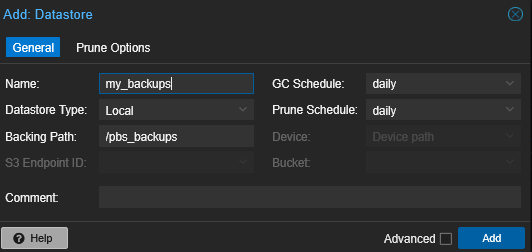
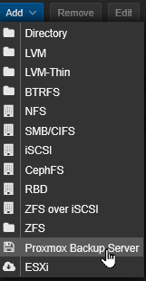
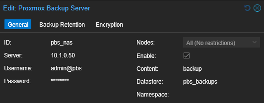

I'm a recent convert to [Proxmox](https://www.proxmox.com/en/), the Virtualisation Environment. I'm running it on my homelab and find it excellent.

Although Proxmox comes with its own backup system that is perfectly functional and reliably makes backups of my virtual machines on any schedule you like, I wanted to explore the free partner to it, [Proxmox Backup Server](https://www.proxmox.com/en/products/proxmox-backup-server/overview)  And, having a new NAS that can run things on, I thought I'd try to get PBS running on there. Although I was already saving my backups to the NAS via a normal file share, it made sense to have PBS running directly on it rather than on the machine that might fail in the name of separation in case of hardware failure or disaster.

This is how I did it, and I'm very pleased I did. I now have enterprise level backups for my homelab at a grand cost of £0.00

* *Why not just continue to use Proxmox to save its own backups?*

Although Proxmox's internal backups are good, they're not particular *smart*. PBS has a number of advantages that make taking backups faster and quicker and allow things like instant file recovery without needing to recover the entire VM. Also, backups are fast and take up a **lot** less disk space.

#### Here's some key advantages of PBS

1. Global Deduplication

This is the single most significant advantage of PBS. Proxmox VE's built-in backup creates a new, complete backup file for each job. PBS, on the other hand, performs global deduplication across all backups stored in a datastore. This means that if you have multiple virtual machines (VMs) or containers with the same operating system files, PBS only stores those identical data chunks once. This drastically reduces the amount of disk space required for your backups.

2. Incremental Backups

PBS uses a "forever-incremental" backup model. After the initial full backup, all subsequent backups only transfer and store the new or changed data blocks. This makes your daily backup jobs much faster and less resource-intensive, both on the source PVE host and on the network.

3. Data Integrity and Security

PBS includes several features to ensure your backup data is safe and consistent.

* Built-in Checksums: It uses SHA-256 checksums to verify the integrity of every data chunk. This helps to detect silent data corruption, also known as "bit rot," a major risk for long-term data storage.

* Client-Side Encryption: Data is encrypted on the source Proxmox VE host before it's sent to the PBS, ensuring your data is secure during transit and at rest on the backup server.

4. Advanced Features and Management

PBS provides a centralized, dedicated interface for managing all your backup jobs, with features that PVE's basic backup utility lacks.

* File-Level Restore: You can browse the contents of a backup and restore individual files directly from the PBS, without having to restore the entire VM.

* Live-Restore: This feature allows you to start a VM from a backup almost instantly. The VM can boot while the data is still being restored in the background, minimizing downtime.

* Remote Synchronization: PBS can synchronize datastores to a secondary, remote PBS instance, providing an easy and efficient way to create off-site backup copies for disaster recovery.Built-in Checksums: It uses SHA-256 checksums to verify the integrity of every data chunk. This helps to detect silent data corruption, also known as "bit rot," a major risk for long-term data storage.

Client-Side Encryption: Data is encrypted on the source Proxmox VE host before it's sent to the PBS, ensuring your data is secure during transit and at rest on the backup server.

4. Advanced Features and Management

* PBS provides a centralized, dedicated interface for managing all your backup jobs, with features that PVE's basic backup utility lacks.

* File-Level Restore: You can browse the contents of a backup and restore individual files directly from the PBS, without having to restore the entire VM.

* Live-Restore: This feature allows you to start a VM from a backup almost instantly. The VM can boot while the data is still being restored in the background, minimizing downtime.

* Remote Synchronization: PBS can synchronize datastores to a secondary, remote PBS instance, providing an easy and efficient way to create off-site backup copies for disaster recovery.

---

### Installing PBS

*If you're not using a Ugreen NAS, most of these functions will also apply to any system that uses Docker compose*

* Create a new `Shared Folder` in the `Files` app for your Proxmox backups. This has to be large enough to hold your expected backups for obvious reasons.  When you've created it, right-click the folder and copy down the `location` by clicking the copy symbol. We'll need this later.



* Start by going to your Ugreen NAS and use the `App Center` to install `Docker`. This will create a new icon on your NAS' desktop called Docker. 

When Docker is installed, open it. 

* Go to `Project` and click `Create`


Name: Something like 'proxmox-backup-server'

Storage Path: This is where the Docker project stores its information for the container, not the where the backups are - but they can be the same if you wish.

Compose Configuration: This is where you paste your `docker-compose.yml` file. 

#### The docker-compose.yml file

I used the image and compose file created by `ayufan` [here](https://github.com/ayufan/pve-backup-server-dockerfiles/blob/main/docker-compose.yml) 

This is my version. There's a few changes:

* We need to replace the variables in the image. I replaced them with those given by ayufan elsewhere in his [documentation](https://github.com/ayufan/pve-backup-server-dockerfiles/tree/main)
* The volumes are different, and start with a `./` to keep them relative to the above `Storage Path`
* I removed the separate Volumes below, and I added a **new** volume which connects the `Shared Folder` we created

```
services:
  pbs:
    image: ayufan/proxmox-backup-server:latest
    container_name: proxmox_backup_server
    ports:
      - 8007:8007
    volumes:
      - ./pbs_etc:/etc/proxmox-backup
      - ./pbs_logs:/var/log/proxmox-backup
      - ./pbs_lib:/var/lib/proxmox-backup
      - /volume1/pbs_backups:/pbs_backups
    restart: unless-stopped
    tmpfs:
      - /run
    stop_signal: SIGHUP
    cap_add:
      - SYS_RAWIO # smartctl support    
    mem_limit: 2G      
```

When ready, go ahead and click `Deploy`. If all goes well, Docker will download the PBS image and create the container and launch PBS!

When it completes, you'll find it running in the `Container` tab in Docker's menu.

### Configuring Proxmox Backup Server

PBS should now be available on port 8007 of your NAS's ip. Go open it at `https://IP_ADDRESS:8007`

The initial credentials are: `user` **admin@pbs** and `password` **pbspbs** and chang the `Realm` to **Proxmox Backup authentication Server**

Once in PBS, the first thing you'll want to do is add the storage to it. 

* In the PBS menu, select `+ Add Datastore`



Name: Something useful, but note that it will only accept certain characters.

Datastore Type: Local   (Because we've mounted the Location into the container as a volume)

Backing Path:  Enter in `/pbs_backups` or whatever name you used in the right-hand (local) side of the volume in your `docker-compose.yml`

You can also set the *Global* defaults for the `Prune Options` tab here, although you can change those later, or by job, if you wish.

Once you're happy, click Add and PBS will connect to the Datastore and start creating its file structure.

### Connecting Proxmox to PBS

The backup schedules and jobs are controlled, not on PBS, but on the Proxmox Server or Cluster itself, so we've some work to do there too.

* Open up your Proxmox Server and visit `Datacenter` then `Storage`

* Click on `Add` and choose `Proxmox Backup Server`



Enter in the details of your new PBS server something like this;



**Note!**  The first time you connect, it will fail with an error about fingerprints;

```
create storage failed: pbs_nas: error fetching datastores - fingerprint '8A:7B:19:A6:7C:2C:F4:BB:48:64:1B:3D:<redacted>'' not verified, abort! (500)
```

The fix for this is fairly straightforward. Copy the long STRING between the ' quotes and paste it into the Fingerprints field, and retry. This time it should be happier, and the new storage will show up in Proxmox.

### Scheduling a backup

Once the storage is showing up, you can create a new Backup schedule

* `Datacenter` then `Backup` and `Add`

Fill this up as you would for a normal backup job, but change `Storage` to your new `pbs_nas` storage (Or whatever you named it above). 


*Info: If you have an existing backup job, you can just change the Storage to this without recreating everything*

Complete your new schedule and test it by clicking `Run Now` with it selected. 

All going well, Proxmox should connect to PBS and start the job. The first time will take around the same time as a normal Proxmox vm backup, but subsequent ones will be much faster as it will only copy the changes to each vm.

As well as seeing the backup job in Proxmox, it will also show up in PBS's Dashboard - useful if you're backing up from multiple sources.

### Restoring a backup

This is done from your Proxmox server - in fact, you won't need to revisit PBS again unless you need to change any settings as all management is done from Proxmox.

* In the left menu, select your `Proxmox Node` and then your new `pbs_nas` Storage. Select `Backups` from there and you should see all the backups that now reside on your NAS.
* Note that as well as your usual `Restore` button, there is a `File Restore` button too. This allows you to download *individual files* from a backup nearly instantly.


### Problems

If PBS isn't working right, the first thing to do is to read the container logs. Do this by clicking on `Docker` -> `Container` and `proxmox_basic_server`. Then click the `Log` tab.

* If you get permission problems when PBS first tries to create chunks, then the Shared folder likely needs less restrictive permissions. This can't be done through the web apps, only through the Docker container's terminal. 

    * In the `Docker App`, click the `Container` menu item, then the `proxmox_backup_server` entry and then the `Terminal` tab. 

    * If prompted, create a new shell using `/bin/bash/` (As it suggests)

    * Give the *backup directory* full write permissions. 

    ```
    chmod 777 /backups
    ```
    
    * Stop the container (`Basic Information` tab, then the stop/start button) and then after a few seconds, start it again. 


