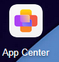
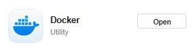
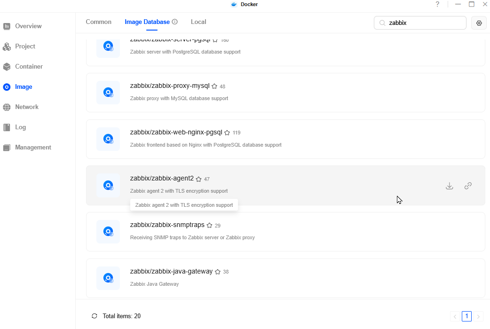
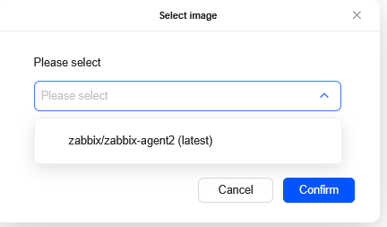
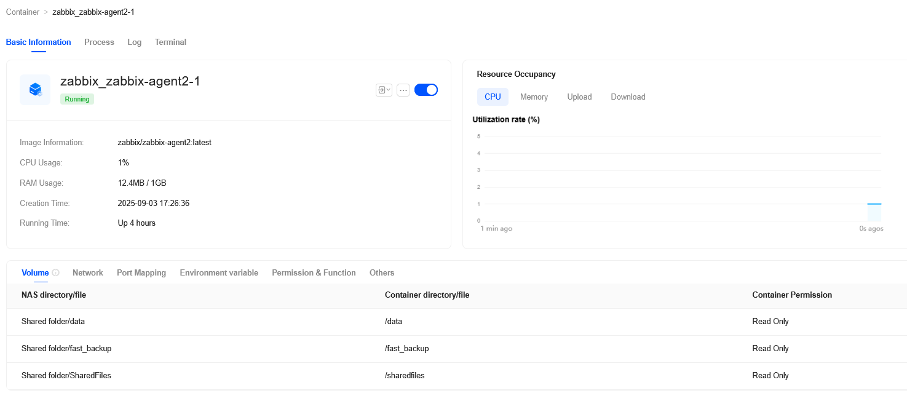

I recently got a new NAS, a UGreen DXP2800, and wanted to add it to me existing Zabbix Server to monitor disk space and get alerts when I was running low.   I couldn't find much information about how to do this, so I wrote this for those who follow after.

Whilst you can mount in each network share into an existing machine that already has a Zabbix Agent running, I wanted to run the agent on the NAS itself - it is just a linux server, after all.  

There are probably several ways to do this, but I did it by installing docker, then using that to create a container running Zabbix-Agent2. Here's how. 

* Difficulty: Medium
* Time: 20-40 minutes
* You will need an existing Zabbix Server set up

### Installing Docker and Zabbix Agent 2

1. Visit your NAS's web interface - usually at `http://IP-ADDRESS:9999/` and log in

2. Open the App Center

3. Locate the Docker app and install it. 

4. You should now have a new Docker icon on the desktop. Open it. 

5. Click on `Image` and then choose the `Image Database` tab. 

6. Type in `ZABBIX` in the search box and hit enter.

7. The image you probably want is `zabbix/zabbix-agent2`. Click on the `Download` icon on the right as you hover over it. 

8. Once the image has downloaded you are ready to create the container with Zabbix-agent2 inside it.

9. Click on `Container` in the menu and then `New Container` - you should be able to select `zabbix-agent2` like so

10. Here's where you configure the container. Most of the values have sensible defaults and you don't need to change them, but feel free to if you wish.

11. You will need to add one environment variable:

    `ZBX_SERVER_HOST` which contains the IP address of your Zabbix server. 

    

12. For each disk/volume of your Nas you want to monitor, under `Volume` Add them to a descripting Container/Directory. This mounts them inside the container that the agent runs in, and it can then find them during discovery and ready their sizes. Here's one of mine. 

        

13. Set the `Network configuration` -> `Network Mode` to `Host` which allows Zabbix server to reach the agent.  *Alternatively, you can do some Port mapping in this section - just make a note what external port maps to 10050, as that's what the server needs to connect to.*

14. You might also want to change some other optional values. I like to limit the CPUs and Ram, change the `Container Name` and enable `Auto Restart`

15. When you're happy, click Confirm and leave the tickbox ticked. 

16. Hopefully this will build your container, and pretty quickly it will be running. You can click the 3-dots here

And get a useful context menu. 

Clicking `Settings` on that menu brings you here, where you can monitor it, open a terminal inside the container and so on. It should look something like so

### Configuring Zabbix Server

This is very similar to adding any normal linux host. 

a. Data Collect -> Hosts -> Create Hosts

b. Enter in the Hostname (Cosmetic only)

c. Add the `Linux by Zabbix Agent` template. 

d. Assign to whatever Hostgroups you think appropriate.

e. Interfaces should contain the IP address of your NAS, and either 10050 (if you chose Host mode networking), or the **NAS mapped port for 10050** if you didn't. *See point 13 above*

f) Creating this server should now allow Zabbix server to find the Agent running on the NAS and start its Discovery search. It should automatically find the volumes you mounted back in step 12 and start recording their size, along with the container's memory, cpu usage and so on.

After some time, Clicking on Monitoring -> Hosts -> YourNas -> Dashboards should give you some useful information.

Zabbix should now alert you when the disks get up using the default 80% and 90% trigger limits for the `Linux by Agent` template, or however you've configured these triggers to be. You will need to have set up notifications in Zabbix to know about it though!

