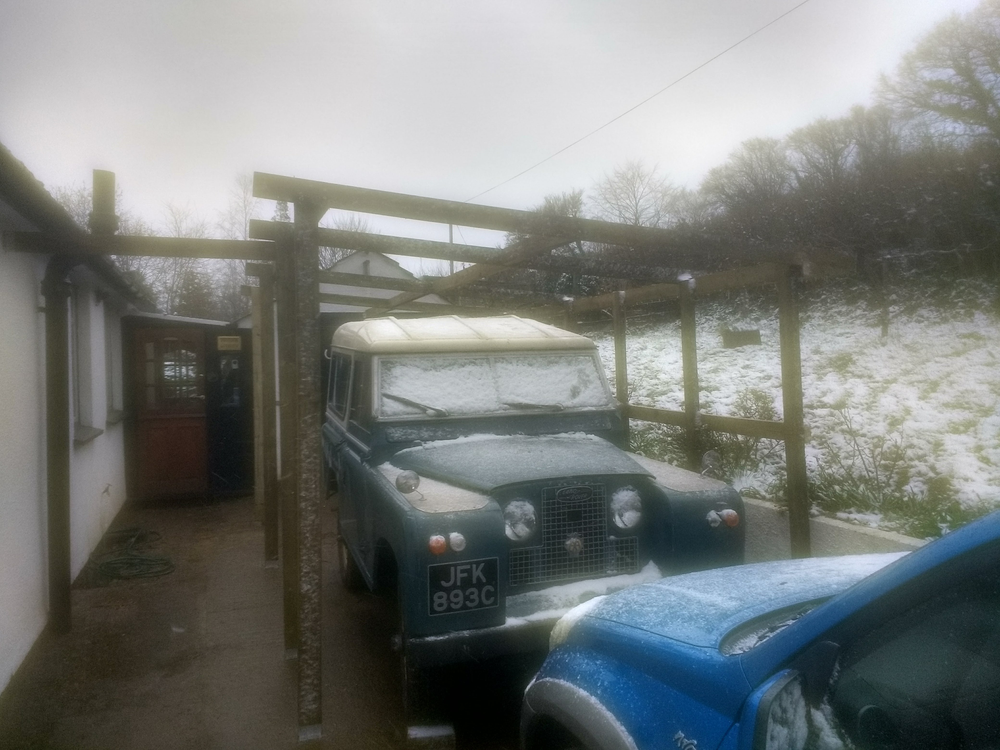
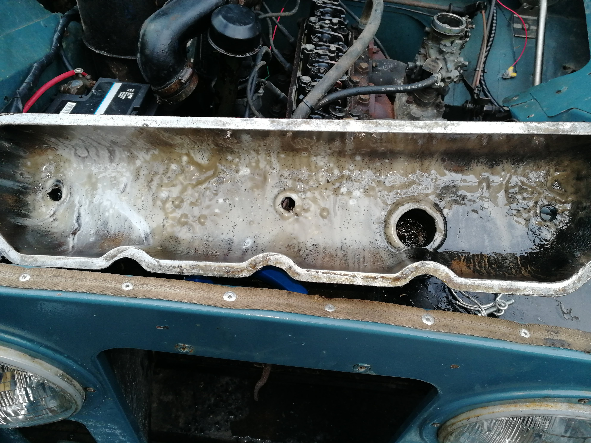
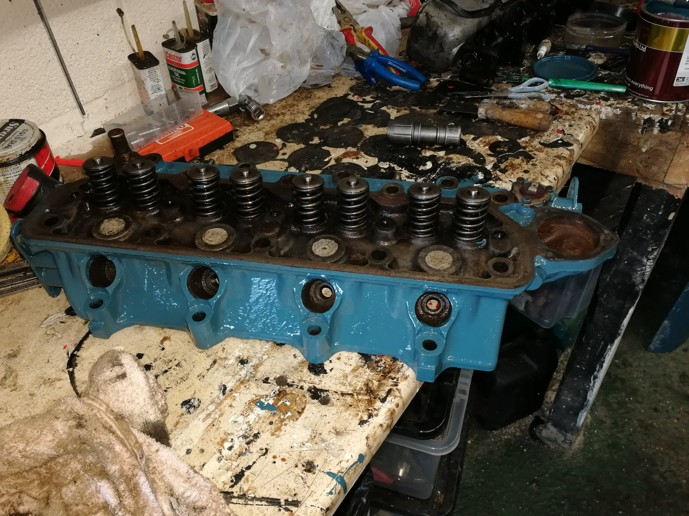
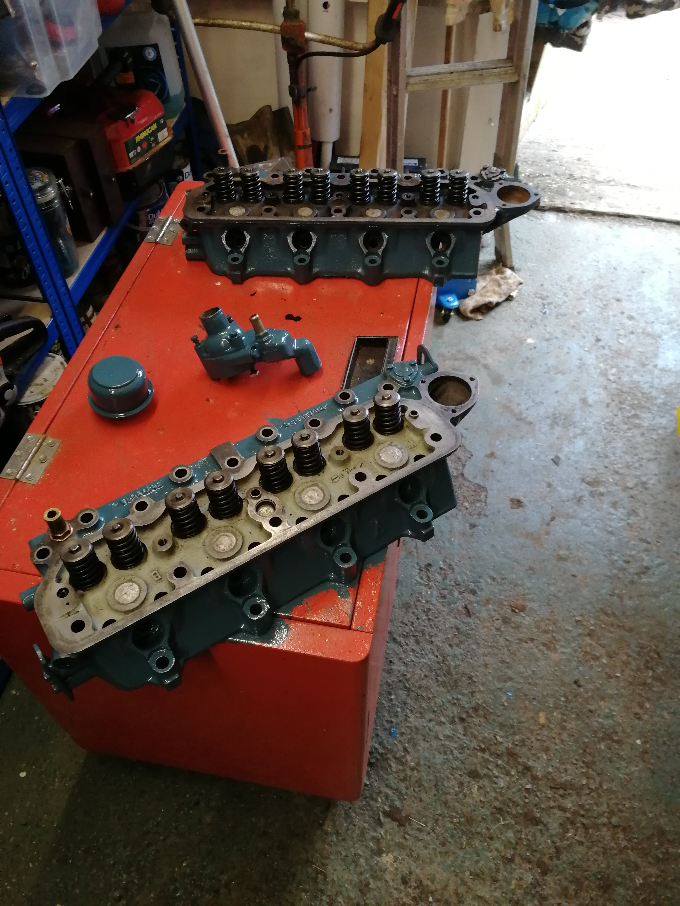
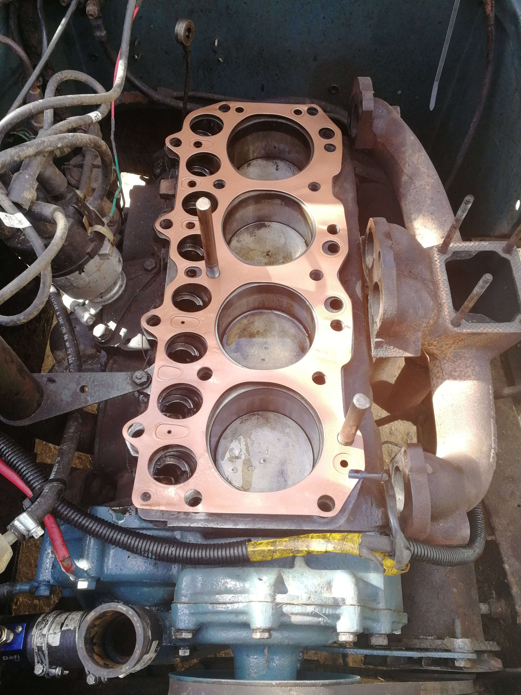
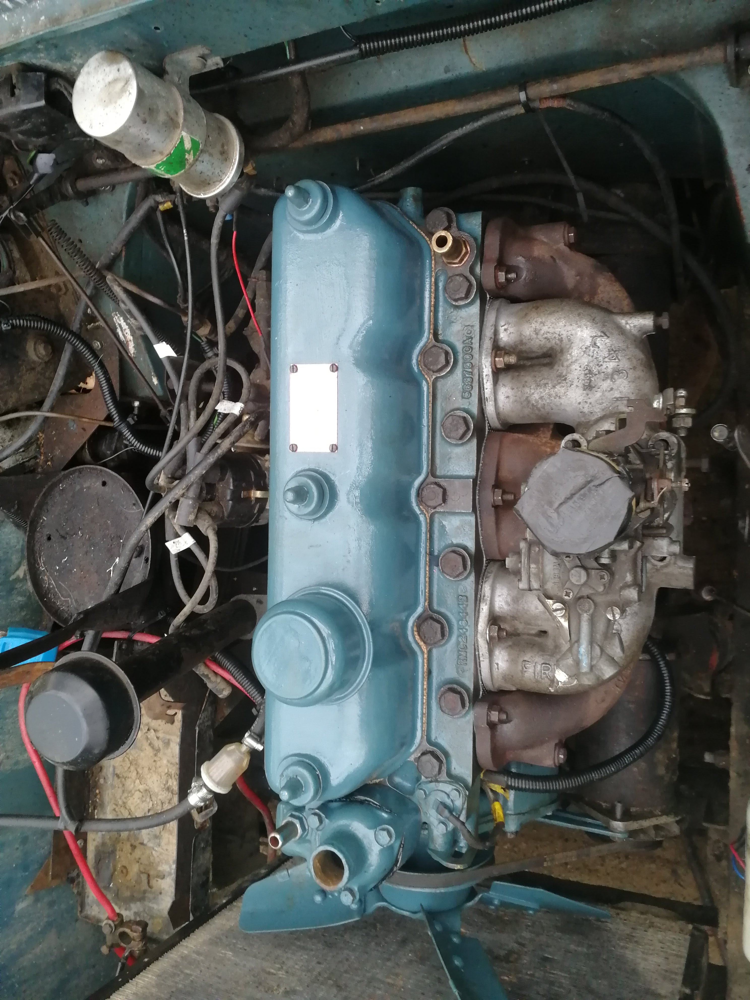

# Landy #1 &#8211; JFK 893C  

I saw a beautiful Series 2a on the original 1965 registration plates advertised on Ebay and “Locked on”. I checked with the wife to ensure that my thinking wasn’t too off-par. One of the side effects of depression is of course that it undermines your confidence in every way – and especially that you’re making good decisions. She told me that if I wanted it, I should have it!

So a phone call later and I was at a nice property 40 minutes away. The chap seemed to like the idea of owning a land rover, but wasn’t too pleased with the reality. He struggled to get behind the wheel (I did notice the seats were deeper than the original) and he had a poorly hip, so preferred to use his Porsche 4×4. I took a good look around and liked what I saw and promptly offered the full asking price if he had it delivered. Things were pointed out like the “Wiring needs fixing up” (Turned out to need a front-end rewire), Chassis is okay (it wasn’t bad and didn’t need any work) and that the Bulkhead had been replaced.

#### Lessons from this were:

* When the oil is clean and the battery is flat so it can’t be started, be suspicious. It turned out the head gasket was blown and the first time I ran it the oil turned to milk. Quite naughty, that.
* The staining under the Landy turned out to be a leaking fuel tank that needed replacing. 
* "Finishing the wiring is a five minute job". Of course it wasn’t. If it was, wouldn’t the owner have done it before trying to sell?

Of course, I rationalised the purchase first in that if I was going to learn how to repair vehicles, this was a perfect example. The value of Series Land Rovers is appreciating quickly and I was hoping not to lose money as I learned. Truthfully, this was an emotional decision. Now this project is nearly complete, I don’t regret a moment of it. Even though I eventually left my job after 22 years, being able to switch off from it and focus on the Land Rover undoubtedly helped my recovery. It’s also taught me some very useful skills and given me the confidence with Vehicles to repair my Toyota Yaris as well as the Wife’s Shogun, saving many hundreds of pounds of labour.

# Arrival  

First things first, I had to built Harry a home. I wasn’t going to leave him outside to get ruined. I’d made this mistake with a kit car previously, a very pretty JBA Falcon. Even a tarpaulin “Tunnel garage” wasn’t much better, causing condensation. I roughed up some plans and built a car port outside of my garage/workshop.

# Starting work  

Now that I had ‘Harry’ home, I set to getting it running. Charging the battery got it started quite easily, but it ran rough.

After turning it off, I checked the oil and… Found it white and foamy. Only really one thing that can be – a blown head gasket. Bugger!

Having had a few cars sent to the scrapyard for just this problem, I was quite alarmed!

Despondent, I muttered for a while, then watched a few youtube videos and wondered just how hard it might be to do this. Everything seemed surprisingly simple, and that the Land Rover Series engine was about as easy to work on as any. So I decided to give it a go and, following the trusty Haynes manual, removed the rocker cover to be greeted with the classic grey sludge.

Then came the head, and I spent a few hours cleaning it up and painting it;

It was at this point that I noticed a tiny crack leading out from one of the ports. I asked around and was given the name of an engine specialist in Totnes and on ringing him, he said to “bring it down for a look”. I happened to be going that way the next day so I stopped by (complete with a car full of work colleagues) and I was told, firmly but kindly, that “It’s scrap. I could weld it, but it’ll never hold in that place.” Bugger again!

It turned out that one of my work colleagues knew someone who knew someone who might have a spare cylinder head, so I was given a number and sure enough, this chap thought he had one. I met him the next day (he only lived a couple of miles away) and sure enough, he’d removed the head from a Series 3 engine that was identical (An Ex SWEP cherry picker). This new head had been lying on its side in the weather for a few years, which made separating the manifolds a major effort (about four hours worth!) and the the ports were full of crud and the valve stems had rotted out. Fortunately, I could use the manifolds from my old head.

Several more hours and I’d succeeded in cleaning up the ‘new’ head fairly well, including polishing all the ports. I lapped in the original valves using the handy rubber-hose-and-cordless-drill technique which worked very nicely, broke a new set of valve spring compressors.

Job done! The feeling of going through this, as a novice, and actually getting a working engine again was brilliant. I needed to re-adjust the tappets a bit but the new head proved good and I did a few hundred miles without any further problems.

I also replaced quite a few parts - radiator, fuel tank, full service, greased, oiled and painted everything I could, including a full repaint of the exterior. (Landies are one of the few vehicles which don’t need a professional paint booth to look good - at least in my opinion!)

It was around then that I saw a 1974 Series 3 Land Rover for sale nearby, and I made the decision to sell the Series 2. It duly sold and went to a nice chap in Japan where I believe it still is today, being loved and used.

# Timothy,the Series 3  

This turned into another long affair. This one came from a chap who had sadly died but who loved it. He had just fitted a reconditioned engine but health had prevented him finishing the job. I still have this Landy today and enjoy tinkering with it.

 
