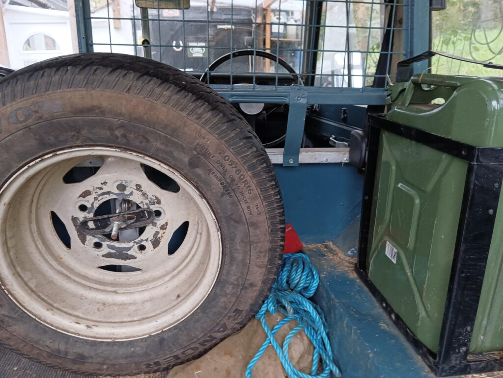
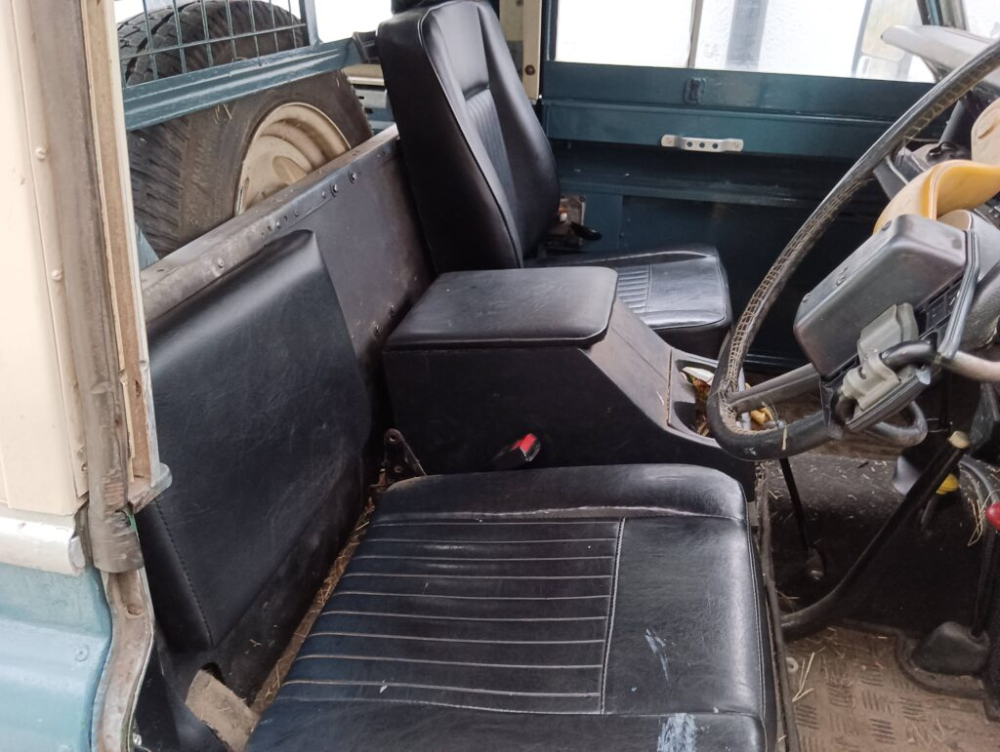

One problem taller people often have in old Land Rovers is they can be really uncomfortable to drive. I’m 6’2″ and with the standard seats, I would start to get bad cramp in my ankle and legs after only 15 minutes or so. The adjustment in the seat is very limited because of the cross bulkhead immediately behind the seat.

There is a relatively simple modification which gives you an inch or two extra space that doesn’t seem to be widely used, however, and is cheap and quick to do. It’s also fully reversible!

**Remove the back of the seat!**

By then fixing a cushion directly onto the bulkhead, it is just as comfortable as the original seat on the back.

Here’s mine:

The new cushion is simply one of the rear bench seat cushions cut in half and tidied over. It’s a close match to the standard Series 3 seat covering.

## Stage 1: Remove the seat back.

There’s an upright hinge either side with a small bolt that allows the seat back to hinge forwards. See the first picture, the triangular metal section. (One partly hidden by the seatbelt).

## Stage 2: Fix your new cushion.

These seat cushions are simply a piece of hardboard, foam and covering. I drilled four small holes through the bulkhead and fixed the cushion on place with some short self-tapping screws. This has held well for me for four years, but you could also use screws, or self-adhesive velcro if you didn’t want to make holes.

The next picture shows one of the screws from the rear, painted over and barely noticable.

