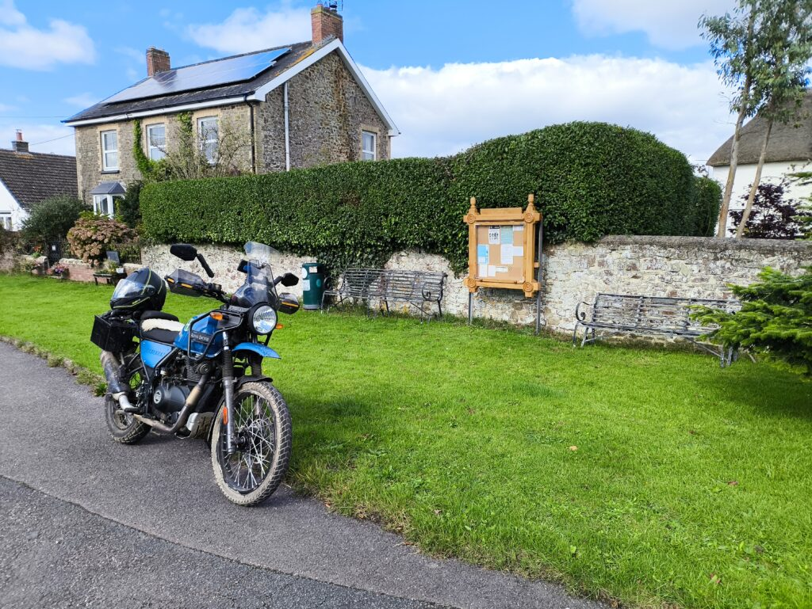

I like to ride for pleasure at least once a week, but have been getting a bit bored with riding the same roads and lanes. I’m fortunate to have some beautiful countryside nearby (Dartmoor – I’m in England) but even so, it’s a bit repetitive eventually.

My solution to this ‘problem’ is to set myself a target – to take my Himalayan to every Village in my home county of Devon.

I’ve been doing this for a few weeks now – and about 40 villages. It’s going to take a while as there’s at least 450 of them.

Why?

Well, obviously, why not?

It gives me a form and structure to this hobby that I quite like.  I’m on the autistic spectrum, so planning and detailing such things is often as much fun as doing them, but enough flexibility that I can deviate if the mood takes me. Sometimes the bike tells me where it wants to go.

It’s showing me places and roads I would never normally ride, even though I’ve lived here for almost half a century.  Some of them are quite technical, especially slippery fords after heavy rain, and the road surface of some of our lanes are very broken, slippery and rough – not to mention many having grass growing in the middle.

And when I reach a village? Sometimes I’ll just ride through, sometimes I’ll stop and walk around. I always try and read the village noticeboard if there is one – it’s a hugely positive thing for ones mental health to realise that there’s a lot of little goodnesses going on every day, against the endless doom and gloom of the news cycles.

The Himalayan is the perfect bike for this. Nimble, agile, and light enough to do a U-turn within a lane, even when pointing downhill, if you meet something that can’t reverse, or the road’s blocked for some reason. It’s quiet enough not to upset horses or the wider public. It’s very economical, and just puts-puts from village to village.

I totally understand this isn’t the sort of thing most people will enjoy spending on their days off, and that’s fine!  

How do you keep things interesting when you’re riding for pleasure?

